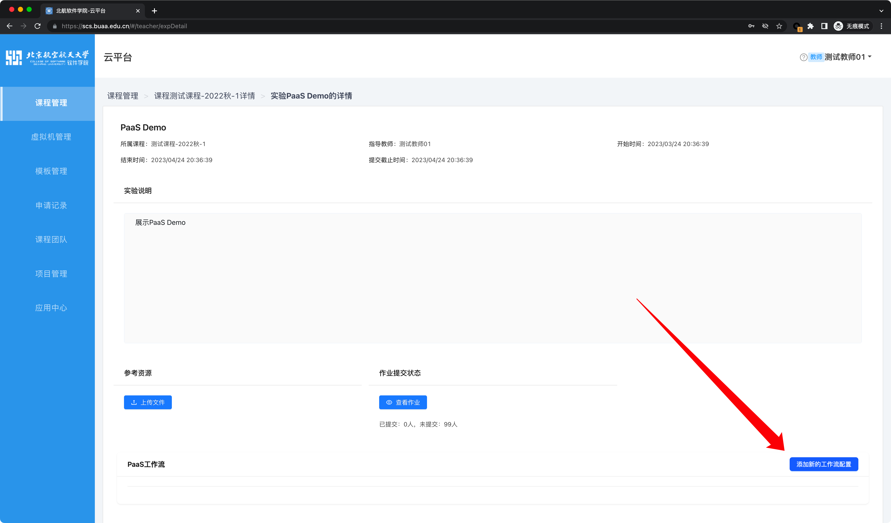

# 课程实验PaaS工作流使用介绍

为了进一步提升云平台资源对软件学院课程实验的服务能力，我们针对课程实验推出了“PaaS工作流”功能，借助该功能，你可以：

1. 方便地查看学生提交的作业代码的实际运行效果。在教师或助教发布实验或作业后，可以为当前的实验或作业添加“工作流配置”。在该工作流配置中，可以设置学生提交的代码的编译和运行环境。这样当学生提交自己的代码后，可以触发工作流自动运行，学生、助教和教师可以直接看到提交的作业的最终效果。该功能
	-  一方面，可以方便助教和教师检查作业；
	- 另一方面，可以为所有学生提供统一的代码运行环境，防止出现因个人编程环境差异而带来的错误。

2. 为参与实验的学生提供统一的实验环境。我们知道，在一项实验中，配置编程实验环境往往是非常头疼的。“PaaS工作流”可以帮助为每个学生一键生成独立的、相同的编程环境。比如：
	- 在数据库课程中，可以一键为每个学生生成一个独立的MySQL数据库，学生可以连接到该数据库环境完成实验；
	- 在系统编程中，可以一键为每个学生生成一个独立的Ubuntu环境，学生可以登录该环境熟悉LInux中的各种指令、学习使用GCC编译代码、学习使用GDB调试代码等。

下面，我们将通过两个具体的示例来展示上述两个功能的具体用法。



在配置和使用该功能前，请务必与我们事先取得联系，讨论资源使用量，以防止启动容器实例出错。



## 示例1：“走进软件”课程作业提交与展示

在“走进软件”课程中，最主要的作业提交形式是，学生提交一个包含若干HTML、CSS、JS文件的压缩包，已实现某种网页效果。

在传统情况下，教师或助教为了检查作业效果，需要挨个下载学生提交的压缩包，然后将其中的文件放到某个静态服务器下面运行和查看。借助“PaaS工作流”功能，这一过程可以变得非常简单和轻松。

下面详细介绍该示例功能的使用流程：

### 助教 / 教师配置学生提交的作业的运行环境

1. 新建一项实验，并导航至详情页底部，点击“添加新的工作流配置”

	

2. 按照下图所示选择工作流的类型和需要使用的工作流模板（即基础环境），基础环境请选择“静态网站（Nginx）”：
	

3. 在选择完模板后，可以看到，剩余大多数选项已经被自动填充了，通常情况下不需要作出进一步更改：
	

4. 随后，你可以配置哪些选项允许学生在提交作业的时候更改，一般情况下，这些选项保持默认即可：
	

5. 点击“提交”后（该步骤因为涉及到资源分配之类的工作，可能耗时较长），就完成了一个新的工作流配置，即完成了对学生提交的作业的运行环境的“预设”。随后，学生就可以在该预设的运行环境上提交和运行作业了。

### 学生提交作业

1. 学生进入实验的详情页，导航至最底部，即可看到刚刚教师创建的“作业提交与展示”的选项卡。点击该选项卡之下的“提交新的任务”按钮，即可在弹出的对话框中提交自己的作业：
	

2. 由于教师在之前的配置中默认不允许学生在提交时不能进行任何修改，所以，弹出的对话框中，绝大部分选项都是默认的，无法修改。学生只需要选择自己的作业压缩包提交即可：
	

3. 提交后，刷新当前页面，可以提交的代码已经开始进行编译构建和部署流程：
	

4. 等待部署完成后，再次刷新页面，可以看到提交的源代码的部署结果：
	

5. 在本例中，我们可以直接访问部署好的网站，看到提交的作业效果：
	

### 助教 / 教师查看作业

助教或教师可以在实验的详情页查看已经提交作业的学生的作业部署效果：

## 示例2：为学生部署MySQL实验环境

该示例展示如何为实验中的每位学生生成一个相互独立的MySQL实验环境。

### 助教或教师为学生部署MySQL实例

同样地，还是导航到实验的详情页底部：

注意，“工作流类型”需要选择“辅助实验环境”；工作流名称的填写没有明确的格式要求，主要用于标识和区分；基础环境请选择“MySQL 8”。

为了使学生能访问到为其创建的MySQL实例，需要为MySQL的root用户预设一个密码。

其他值保持默认，点击提交即可。

随后，我们可以在实验详情页查看为学生创建MySQL实例的进度：

等待一段时间后，可以看到，工作流基本执行完成，即已经为每位学生创建好了可以使用的独立的MySQL实例：

### 学生查看和使用MySQL实例

学生导航到实验详情页底部，可以看到一个名为“MySQL实验环境”的选项卡。在这个选项卡里，学生可以看到分配给他的MySQL实例的IP、端口号、登录用户名、登录密码等。

学生可以在校园网内使用任何工具连接该数据库进行实验。

## 总结

可以看到，PaaS工作流的实际功能强依赖于预设的实验环境模板。我们会不断添加和完善常用开发和运行环境模板，以提供更好的使用体验。

欢迎各位老师同学与我们联系，反馈自己的使用体验，或提出自己的使用诉求。让我们一起携手创建更好的软件学院云平台！