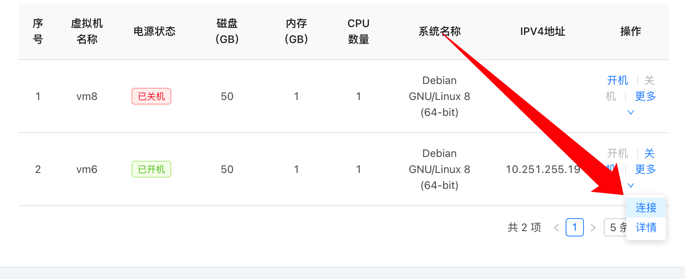

# 虚拟机使用说明

## 连接虚拟机

### Linux系统

首先从云平台中获取虚拟机的IP和登录名，之后即可在本地通过任意ssh客户端登录。




使用系统自带的Terminal.app登录即可。

为了更好的使用体验，推荐使用[iterm2](https://iterm2.com/)登录。

当然，你也可以使用[termius](https://termius.com/)进行多个ssh连接的管理。





如果你是Linux Desktop用户，那么你肯定已经有了自己喜爱的终端模拟器，此处不再赘述。





一般来讲，Windows 10（及以上）自带的cmd.exe都自带ssh client，打开cmd后直接`ssh foo@x.x.x.x`即可登录。

为了更好的使用体验，推荐下载使用[Windows Terminal](https://aka.ms/terminal)。

当然，你也可以使用[termius](https://termius.com/)或者其他工具（如 Xshell等）进行多个ssh连接的管理。











## 联网

### Linux系统

可以依次尝试以下两种方式。

#### 校园网登录脚本

这里推荐使用buaalogin（即[srun](https://github.com/Dr-Bluemond/srun)）。



2022年8月开始分配的虚拟机默认已经安装了`buaalogin`工具，可使用`which buaalogin`验证其是否存在，如果存在，则可以跳过此步骤。



下载并安装登录工具：

```bash
sudo wget https://scs.buaa.edu.cn/scsos/tools/linux/buaalogin -O /usr/local/bin/buaalogin
sudo chmod +x /usr/local/bin/buaalogin
```

配置校园网登录使用的用户名和密码：

```bash
buaalogin config
```

登录校园网：

```bash
buaalogin login
```

登出校园网：

```bash
buaalogin logout
```

#### wukuard 服务

鉴于校网络中心的某些限制，上述联网方式可能在某短时间内无法使用，这里特别给出软院信息化小组的基于[Wireguard](https://www.wireguard.com/)的曲线救国方案。其本质上是将虚拟机加入一个[wireguard](https://www.wireguard.com/)虚拟内网，然后覆盖默认路由指向一个可以联网的内网机器，从而实现虚拟机本身与互联网的联通。



2022年8月开始分配的虚拟机默认配置好了[wukuard](https://github.com/loheagn/wukuard)服务，可使用`systemctl status wukuard`验证之，如果运行正常，则可跳过下述的各个步骤，直接进行最后的配置`hostname`即可。





请注意，以下步骤是针对Debian系发行版（包括Debian、Ubuntu等）给出的，其他发行版请自行对照着修改命令。



首先需要安装wireguard-tools（这里需要短暂联网，但完整整个步骤之后就不需要了）：

```bash
export http_proxy=http://10.251.0.37:3128;export https_proxy=http://10.251.0.37:3128
sudo apt update && sudo apt install wireguard-tools -y
```



如果上述命令执行中，apt没有命中http_proxy，可以手动配置apt的proxy:
创建文件`/etc/apt/apt.conf.d/proxy.conf`，并在其中写入以下内容

```
Acquire::http::Proxy "http://10.251.0.37:3128";
Acquire::https::Proxy "http://10.251.0.37:3128";
```

然后重新执行 `apt update && apt install wireguard-tools -y`

**注意：完成所有配置后，请将该文件删除。**




然后安装[wukuard](https://github.com/loheagn/wukuard)（作为wireguard管理工具）

```bash
sudo wget https://scs.buaa.edu.cn/scsos/tools/linux/wukuard -O /usr/local/bin/wukuard
sudo chmod +x /usr/local/bin/wukuard
```

然后配置wukuard-client服务

```bash
sudo wget https://scs.buaa.edu.cn/scsos/tools/linux/wukuard-client.service -O /etc/systemd/system/wukuard-client.service
sudo systemctl enable --now wukuard-client
```

然后找管理员所要虚拟机应该使用的hostname，然后配置机器的hostname：

```bash
sudo hostnamectl set-hostname ${your_hostname}   # hostname的值找管理员要
```

## 传输文件

### Linux系统




可以使用使用SCP命令进行服务器与本地之间的文件交换。





除了在终端中使用SCP命令外，

还可以使用[WinSCP](https://winscp.net/eng/download.php)进行图形化的文件管理。





d.buaa.edu.cn 的Linux界面已经提供了比较完善的文件管理工具。



