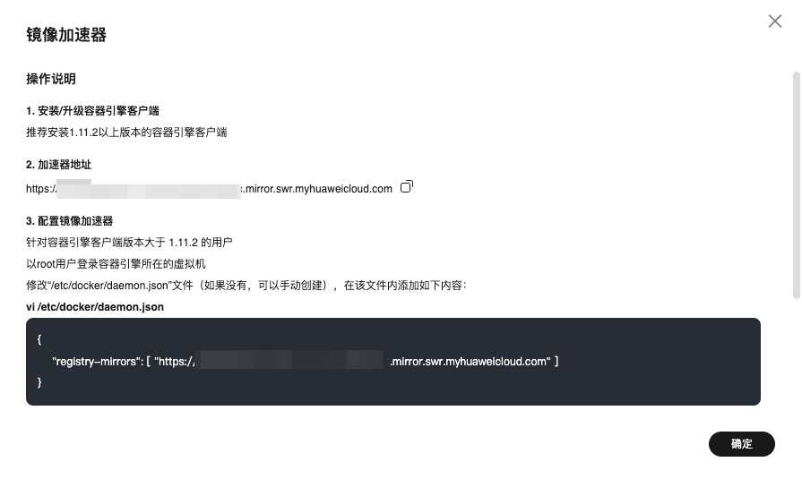
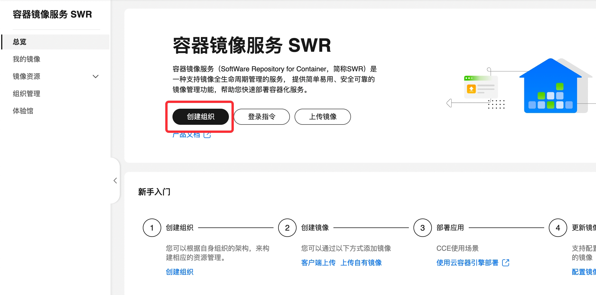
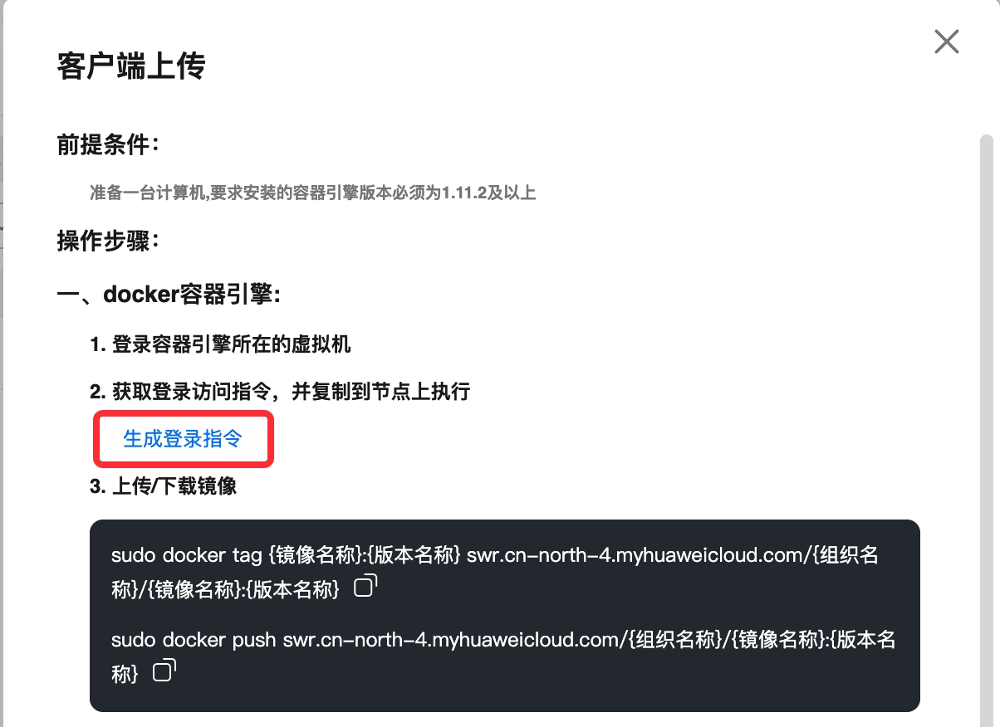

# 容器与Docker综合实验


💡 文档中对各个概念的定义和阐述并不是严谨的，文档中用语尽量通俗易懂，大多数只是为了让同学们明白这个概念大致在说什么东西，能在头脑中有个感性的认识（这对知识的掌握和学习非常重要）。概念的严格定义还请参考对应的官方文档。




💡 容器和Docker的内容非常繁杂，实验文档不可能面面俱到，因此很多内容以链接的形式给出。请同学们在阅读文档本身的同时，不要忘记学习链接中指出的内容。




💡 同学们在执行命令时，一定要认真阅读命令的输出和log，通过阅读这些输出，你很容易了解你所执行的命令具体执行了哪些操作，这非常有助于理解其背后的运行原理。




💡 目前流行的绝大多数容器运行时都是用Go语言编写，著名的容器编排工具Kubernetes也是用Go语言编写的，基于Docker和Kubernetes建立起来的整个云计算生态中的绝大部分项目也都是用Go语言实现的。因此，如果想深入了解和学习云计算相关内容的话，建议同学们学习和掌握Go语言。当然，这并**不是**本次实验和这门课的要求:)



## 实验目的

- 理解容器的概念，了解实现容器所使用的的底层技术，理解容器与虚拟机的区别

- 理解容器与 Docker 之间的关系

- 掌握 Docker 的基本使用方法和常见命令，可以使用 Dockerfile 构建镜像

## 实验要求

请参考本实验文档，并查阅相关资料，回答以下问题并**完整记录实验过程**：

1. **数据持久化**。容器是 **“一次性的”** 和 **“脆弱的”**（请大家务必牢记容器这一特性），容器很容易因为各种原因被kill（如资源不足等等）。而容器产生的数据文件是和容器绑定在一起的，当容器被删除时，这些数据文件也会被删除，这是我们不想看到的。

    比如，我们在机器上启动了一个mysql容器，在写入了一些重要数据后，因为某种原因该容器被意外删除了。此时即使重新启动一个mysql容器也找不会之前的数据了。**请结合实验文档中的内容和查阅相关资料，讨论应该通过何种方式启动容器来避免出现这一问题？你能得出几种方案？每种方案的优劣如何？并请分别使用这些方案模拟mysql容器 创建 - 写入数据 - 销毁 - 重新创建 - 重新读到之前写入的数据 的场景，以证明方案的有效性。**

2. 请从ubuntu镜像开始，构建一个新的包含Nginx服务的ubuntu镜像，并修改Nginx主页内容为你的学号，**请分别使用`docker commit` 和 `Dockerfile`两种方式完成，** 并将这个新构建的镜像推送到华为云容器镜像服务SWR中。其中，使用`docker commit`构建的镜像的`TAG`为`dockercommit`；使用`Dockerfile`构建的镜像的`TAG`为 `dockerfile`。推送后，对华为云“我的镜像”页面进行截图。

## Docker的安装

请参考[文档](https://yeasy.gitbook.io/docker_practice/install/ubuntu#shi-yong-jiao-ben-zi-dong-an-zhuang)，并从“使用脚本自动安装”开始读起。

安装前务必联网
```bash
curl -fsSL get.docker.com -o get-docker.sh
sudo sh get-docker.sh --mirror Aliyun
```

#### 配置镜像源

我们常用的Docker官方的镜像仓库在国内的连接非常不稳定，拉取镜像时很可能非常缓慢，这时可以配置镜像源，打开[华为云容器镜像服务](https://console.huaweicloud.com/swr/?region=cn-north-4#/swr/mirror)，点击“镜像中心”右上角的“镜像加速器”，并按照镜像加速器的提示，执行相应操作



## Docker的简单使用

我们首先启动一个非常简单的Ubuntu容器，下面这条命令可以将会在一个隔离Ubuntu环境中执行`/bin/bash`进程：

```bash
docker run -it --rm ubuntu /bin/bash
```


可以看到，docker成功为我们启动了一个Ubuntu环境中的`/bin/bash`进程，当前我们所在的命令行环境已经不是原来主机上的环境了。可以使用下面的命令进行验证。

容器环境拥有与宿主机不同的hostname：


容器环境的发行版标记与宿主机不同（容器环境是Ubuntu，而主机是Debian）：


容器环境中可以看到启动的进程只有`/bin/bash`，并且该进程为容器中的1号进程：


我们在容器中对文件的增删并不会对宿主机中的环境造成任何影响：


但是，当我们查看内核版本时，可以发现两者内核完全相同，这说明我们启动的容器不包含完整的操作系统，本质上只是一个被隔离的进程而已：


### Docker的架构


上图展示了一条docker命令是如何被执行的： 

1. 用户输入命令
2. docker cli解析这条命令，转化成相应格式的请求，通过读写 [Unix socket](https://en.wikipedia.org/wiki/Unix_domain_socket) 的方式与docker engine通信，告诉docker engine应该执行怎样的操作
3. 正如我们前面提到的，镜像是容器的模板，我们使用docker命令创建容器需要先得到容器对应的镜像才行。当docker engine发现本机上没有对应的容器镜像时，就会根据镜像的名称从远程仓库（image registry）（可以将其想象成一个网盘）中下载对应的镜像到本地。实际上，你可能注意到我们在前面启动Ubuntu容器时就发生过这个下载操作：
    
    
    
    图中标出来的这段log清晰地说明了发生了什么：无法在本地找到`image ‘ubuntu:latest’` ，于是从远程仓库中将这个镜像pull了下来。
    
4. 当镜像准备就绪后，docker engine就可以将任务向下传递，最终使用系统调用（namespace和cgroups）创建或管理容器



⚠️ 上述步骤只是对docker工作流程的一个非常非常简化的讨论。



综上，我们可以看到docker实际上主要由三部分组成**docker cli**、**docker engine**、**image registry**。在后面的实验中，我们将逐步加深对着三部分的理解。


💡 实际上，docker cli并不是必须的，任何可以读写docker engine所暴露的Unix socket（通常这个socket的文件名是`/var/run/docker.sock`）的程序都可以通过docker engine来实现docker的功能；甚至docker engine还可以对外暴露tcp端口，使外部程序通过该端口发起调用。



### docker image

镜像（Image）是容器的基础，所以我们先从镜像谈起。


💡 从这里开始，我们将会涉及到大量的命令，这些命令看似繁杂，但平时常用的就那么几个，并且大部分都有规律，请同学们注意体会。当忘记某条命令时，可以随时使用`docker —help`查看帮助；或者访问[Docker官网的文档](https://docs.docker.com/engine/reference/commandline/cli/)。**注意，本实验的目的不是死记硬背这些命令，而是理解相关概念并对容器技术和Docker有个感性认识。**



#### 基本命令

docker中镜像与相关的操作都包含在`image`子命令中，如：

- `docker image ls` 可以列出当前机器的所有容器镜像：
    
    ```bash
    root@template-debian11-base:/# docker image ls
    REPOSITORY   TAG       IMAGE ID       CREATED        SIZE
    ubuntu       latest    ba6acccedd29   5 months ago   72.8MB
    ```
    
- `docker image pull <image_name>` 可以从image registry中拉取名称为`image_name`的镜像：
    
    ```bash
    root@template-debian11-base:/# docker image pull scs.buaa.edu.cn:8081/library/mysql:8
    8: Pulling from library/mysql
    b380bbd43752: Pull complete
    f23cbf2ecc5d: Pull complete
    30cfc6c29c0a: Pull complete
    b38609286cbe: Pull complete
    8211d9e66cd6: Pull complete
    2313f9eeca4a: Pull complete
    7eb487d00da0: Pull complete
    a5d2b117a938: Pull complete
    1f6cb474cd1c: Pull complete
    896b3fd2ab07: Pull complete
    532e67ebb376: Pull complete
    233c7958b33f: Pull complete
    Digest: sha256:882e55f40d61034a2bb8a1abab1353571ad2a33866f382350788eb34740528b5
    Status: Downloaded newer image for scs.buaa.edu.cn:8081/library/mysql:8
    scs.buaa.edu.cn:8081/library/mysql:8
    ```
    

#### 镜像名

一般地，镜像名完整格式为`{image registry地址}/{仓库名}/{镜像名}:TAG`。

例如本例中使用的 `scs.buaa.edu.cn:8081/library/mysql:8` ，其中：

- `scs.buaa.edu.cn:8081/library/mysql`为镜像的地址，你可以将其简单理解为一个URL；
    - 通常情况下，这个地址分为三部分，分别是`image registry地址`、`仓库名`、`镜像名`；
- `8`是镜像的`TAG`，一般用来表示镜像的版本号。

你可能已经注意到，我们在最初创建Ubuntu容器的时候也没那么麻烦，直接用`ubuntu`就表示了镜像名。那是因为当仅使用一个单词表示镜像名时，docker自动为它补上仓库名`library`、自家的image registry地址`docker.io`，以及TAG`latest`；即`ubuntu`等同于`docker.io/library/ubuntu:latest`。

#### 镜像ID

你可能还注意到，当使用`docker image ls`时，有一列叫做`IMAGE ID`，这一列中的字符串其实就是每个镜像对应的独一无二的ID，它是一个镜像独一无二的标识。我们可以使用这个ID对镜像做各种操作，比如删除一个镜像：`docker image rm 3218b38490ce`。


为啥需要镜像ID呢？用镜像名标识镜像不好吗？不好。因为镜像名是可以任意改变的。我们可以使用`docker tag`命令来为镜像设置别名。比如，对上图中列出的ubuntu镜像，我们可以：


可以看到，`docker tag`之后，生成了一个新的镜像`areyouok`，但这个镜像拥有和原来的`ubuntu`一样的ID，说明`areyouok`和`ubuntu`这两个不同的镜像名指向同一个实体。

### image registry

在介绍镜像名称时，同学们可能会疑惑，image registry有很多个吗，为啥还需要地址来标识？是的，image registry有很多个。image registry有的是公开的，任何人都可以访问，并从中拉取镜像；也有私有的，需要特殊的口令访问。目前，世界上最大的几个公开的image registry有Docker公司提供的[docker.io](http://docker.io)（目前也是世界上最大、使用最广泛的image registry，如果你需要通过浏览器访问的话，需要使用这个地址：[hub.docker.com](https://hub.docker.com/)）、Redhat提供的[quay.io](https://quay.io/)、Google提供的[gcr.io](https://cloud.google.com/container-registry/)（很可惜，这个地址在国内被*了）；当然还有我们软院的image registry：[scs.buaa.edu.cn:8081](https://scs.buaa.edu.cn:8081)。

image registry不仅可以下载已经存在的镜像，还可以上传和保存自己制作的新的镜像。任何人都可以在上述registry网站创建账户和自己的仓库。对于用户上传到image registry中的镜像，用户可以自行选择是否对其他用户公开访问（公开或私有）。如果是私有镜像，则需要在每次上传和下载镜像前，在本地执行[docker login](https://docs.docker.com/engine/reference/commandline/login/)操作。

### 容器管理

可以使用`docker ps`命令查看当前机器上处于活跃状态的容器：


`docker ps -a` 可以列出所有状态的容器（包括活跃的和不活跃的）：


从上图中的输出可以看出，和镜像一样，每个容器也都有一个唯一的ID作为标识，我们对容器的各项操作也是通过该ID进行的。除了ID之外，每个容器也都有一个独一无二的name，我们也可以使用name来唯一指定一个容器。

在Docker的管理下，容器有以下6种状态：


1. 当用户输入`docker run`命令后，容器被创建，进入短暂的Created状态
2. 当容器进程启动完毕后，容器进入Running状态，这表示容器正在正常工作
3. 当用户使用`docker stop`显式地终止一个容器，或容器运行出错时，容器进入Exited状态。这个状态是不活跃的，处于这个状态的容器不会消耗任何资源
4. 对于处于Exited的容器，可以被手动使用`docker start`重启，重新进入Running状态；也可能被Docker管理服务重启，短暂进入Restarting状态后，重新回到Running状态
5. 可以手动使用`docker pause`暂停容器，此时容器将进入Paused状态。在这种状态中，容器将停止运行，即不会消耗任何CPU，但依旧会占据内存（以便随时从这个被pause的状态恢复运行）
6. 当使用`docker rm`删除容器，但容器中的一些资源依旧被外部进程使用时（即无法立即删除时），容器将进入Dead状态

关于容器状态的更加详细的讨论，可以参考[这篇文章](https://www.baeldung.com/ops/docker-container-states)。

### 启动容器

对于一般的用户，`docker run`命令是最常用也是最复杂的命令之一。`docker run`命令用于创建并运行容器。完整的命令参数及用法参见[Docker官方文档](https://docs.docker.com/engine/reference/commandline/run/)，下面我们会以两个例子来讨论一些常见的用法。

#### 基本结构

`docker run`命令的结构是

`docker run [一堆各种各样的参数] <image_name> [启动命令] [命令所使用的参数]`。

其中，只有镜像名`image_name`是必须的，其余全是可选的。

#### 启动命令

回想我们创建第一个docker镜像时使用的命令：`docker run -it --rm ubuntu /bin/bash`。这里的参数是`-it —rm`，镜像名是`ubuntu`，启动命令是`/bin/bash`，没有命令参数。

这里`/bin/bash`的含义是，启动ubuntu容器后，执行`/bin/bash`命令，即启动一个bash shell。

我们可以将这里的`/bin/bash`换成`ls /usr`看看效果：


这时，启动命令是`ls`，命令参数是`/usr`，表示启动ubuntu容器，并在其中执行`ls /usr`命令，即列出`/usr`目录下的所有目录和文件。可以看到，执行效果确实如此。并且，请注意，因为我们没有执行`/bin/bash`命令，在`ls`命令执行完返回后，并没有进入容器的命令行中，而是回到了宿主机。

不难发现，启动命令决定了容器启动后的具体行为。事实上，启动命令是可以省略的，如果省略的话，docker会执行镜像指定的启动命令（这个信息一般会作为元信息打包到镜像中）。

#### `-it`

参数`i`表示`interactive`，参数`t`表示创建一个虚拟的TTY（pseudo-TTY）。简单来说，`-it`参数可以让我们进入一个可以与容器进行交互的终端环境。

比如，如果我们在启动命令中去掉`-it`，启动的ubuntu容器将会在后台运行，我们将无法和它交互：


#### `—-rm`

参数`—-rm`表示当容器退出后，自动删除容器。

如果在执行容器时，不加`—-rm`参数，则当从容器退出后，容器进入`Exited`状态，继续存在在机器上（虽然此时为非活跃状态，不消耗任何资源），并且我们可以用`docker restart`等命令重启容器，或使用`docker exec`命令查看容器中的文件。


在上图中，我们首先使用`—rm`参数启动了一个ubuntu容器，在与其交互后，退出容器（即结束`/bin/bash`进程，此时容器进入`Exited`状态）。因为使用了`—rm`参数，所以此时容器会被Docker自动删除，使用`docker ps -a`命令找不到该容器的存在。

而如果启动命令中不加`—rm`参数，则容器退出后，将继续存在在机器上：


这时，只能使用`docker rm`命令手动删除容器。

#### `-v`

到现在为止，我们使用的容器的文件系统都是与宿主机完全隔离的。但在很多时候，容器需要与宿主机共享一些目录，比如位于宿主机上的一些进程希望能方便地看到容器运行中产生的文件，或者通过修改一些文件来影响容器的行为。

为了解决这一问题，我们可以使用-v参数将容器的某个目录和宿主机的某个目录绑定起来，使得容器在读写某个目录时，相当于在同时读写宿主机的某个目录。

参数`-v`的使用方法是`docker run -v <宿主机的目录>:<容器的目录> <image_name>`。还是以前面使用的ubuntu容器举例。比如，我们希望将宿主机的`/opt/mycontainer`和容器中的`/root`目录绑定起来：


可以看到，我们在容器的`/root`目录下创建了`test.txt`文件，然后在宿主机上的`/opt/mycontianer`确实观察到了该文件。同样地，在宿主机上对应目录的修改，也会被容器观察到：


注意，`-v`参数是可以重复的，也就是说，可以在一条`docker run`命令中同时指定多个共享目录，比如：`docker run -it --rm -v /opt/mycontainer:/root -v /another/host/dir:/another/contianer/dir ubuntu /bin/bash`

#### `—-name`

参数`—-name`可以为启动的容器添加名字。我们之前的`docker run`命令都没有使用该参数，那么这时docker自己会为该容器分配一个随机字符串作为name。

#### `-p, —-publish`

参数`—-publish`（可以简写为`-p`）表示将容器的某个端口暴露到宿主机的某个端口。

在详细讨论该参数之前，我们先从Nginx容器说起。[Nginx](https://www.nginx.com/)是目前应用非常广泛的网页服务器（当然它的用处不仅限于此），在一个启动了Nginx服务的系统中，可以通过80端口访问到网页。Nginx同样提供了开箱即用的docker镜像，只需要一条简单的命令`docker run nginx`就可以创建一个Nginx进程：


可以看到，Nginx进程已经成功启动了，这说明它能在80端口监听HTTP请求。我们可以打开一个新的终端，使用`curl`尝试访问一下：


访问失败！为啥呢？还记得课堂学过的网络命名空间吗？我们启动的Nginx容器进程和当前启动的`curl`进程不属于同一个网络命名空间！它们自然无法相互通信。当前这个Nginx进程对80端口的监听仅在它所在的网络命名空间有效。

但这不满足需求啊，我们启动Nginx容器的目的就是向外提供服务啊，Nginx在自己的容器里自娱自乐怎么行！这时就要用到参数`—-publish`（可以简写为`-p`）了，它可以将容器的端口“发布”（publish）到宿主机的某个端口。用法是`-p <宿主机端口>:<容器端口>`。

比如：


这样，Nginx容器的80端口就会和宿主机的80端口绑定，访问宿主机的80端口也就相当于访问Nginx容器的80端口。不信试试看：


成功🌶️！而且，对应的Nginx进程也打印出来请求日志：


注意！宿主机的端口不一定要和容器的端口相同（一般都是不同的），比如：


和`-v`参数类似，`-p`参数也可以同时有多个。

#### `-d, --detach`

大家可能注意到，上节中启动的Nginx容器都是在**前台**运行的，它在不断地输出日志，占据了整个终端，导致我们无法进一步和shell交互，以至于要执行curl操作时还得新打开一个终端。如果想终止这种输出，就得手动Ctrl+c终止Nginx容器。而且，如果此时关闭终端的话，也会同时退出这个容器。

在很多时候我们不希望容器运行在前台，而只是想让它安安静静地作为**后台**进程提供服务。这时，就可以使用`—-detach`（简写为`-d`）参数。比如：


可以看到，在输出了容器的ID后，Nginx安安静静地在后台运行了。

那么，我们有时候又需要查看容器的日志怎么办呢？很简单，使用`docker logs`命令：


### 进入容器内部

对于一个在后台运行的容器（如上节中的Nginx容器），如果想进入容器中查看当前容器的文件结构或执行一些命令用于debug，该怎么办呢？可以使用`docker exec`命令。

比如，如果需要进入容器中的bash shell的话，首先需要找到容器对应的ID


然后执行`docker exec`即可：


### 构建新镜像

到现在为止，我们只是在使用他人已经提前做好的镜像。如何制造我们自己的镜像呢？下面给出两种方法。

#### docker commit

假设我们正在使用一个ubuntu容器，并且在该容器的根目录下创建了一个非常重要的数据文件：


如果我想把当前容器的状态保存下来，以便下次启动容器的时候可以重新使用该文件；或者我想把当前容器发送给别人，让别人也看到我当前看到的容器的样子，该怎么办呢？可以使用`docker commit`命令将当前容器打包成一个新的镜像。

重新打开一个终端，查看一下当前容器的ID：


然后直接`docker commit <container_id> <new_image_name>`即可：


这时，使用`docker image ls`可以看到这个新生成的镜像：


我们尝试运行一下这个新生成的镜像，可以看到刚才创建的文件果然存在：



💡 实际上，`docker commit`还支持很多参数，详情请见[官方文档](https://docs.docker.com/engine/reference/commandline/commit/)。



#### Dockerfile

`docker commit`虽然可以非常直观地从当前容器创建一个新的镜像。但整个过程不够规范，也很难实现自动化，一般情况下，我们都是使用Dockerfile来构建镜像的。

所谓的Dockerfile，其实就是一个配置文件，里面描述了构建镜像的步骤。对于上一小节中构建出的镜像，如果使用Dockerfile来写的话，是这样的：

```docker
FROM ubuntu
RUN echo 'something important' > /important.data
```

很显然，上述文件内容是自解释的。一般Dockerfile的开头一条`FROM`语句，表示从以哪个镜像为基础进行构建。下面的RUN语句表示在容器中执行一条命令。

可以将上述Dockerfile保存在一个干净的目录中，然后在该目录中执行`docker build -t my_new_image_from_dockerfile -f ./Dockerfile .`（请注意，命令的最后有个`.`）：


可以看到，我们成功build了一个新的镜像。下面详细解释一下上面那条`docker build`命令的含义：

- -t表示要构建的新的镜像的名称
- -f表示Dockerfile文件的路径
- 命令中最后的单词表示表示构建镜像的上下文路径，上图中这个最后的单词是`.`，则表示上下文路径是当前目录。在镜像构建开始的时候，docker cli会把“上下文路径”指定的目录中的所有内容打包，然后整个发送给docker engine

事实上，Dockerfile还支持非常多的指令，具体请查阅[官方文档](https://docs.docker.com/engine/reference/builder/)。

#### 发布镜像

截止目前，我们构建的镜像全是在本机上，别人根本访问不到，也没法使用。我们可以将镜像推送到镜像仓库上，然后通知对方从该镜像仓库拉取即可。

本次实验我们使用[华为云容器镜像服务SWR](https://www.huaweicloud.com/product/swr.html)，进入控制台，创建组织名称为`buaa-你的学号`，如：`buaa-21210000`



进入“我的镜像”，点击右上角的“客户端上传”，点击生成登录指令，复制其中的登录指令到命令行中执行，登录到镜像仓库



使用`docker tag`命令给镜像打上镜像仓库前缀的标签
```bash
docker tag my_new_image_from_dockerfile swr.cn-north-4.myhuaweicloud.com/buaa-21210000/my_new_image_from_dockerfile
```

使用`docker push`命令将镜像推送到镜像仓库中
```bash
docker push swr.cn-north-4.myhuaweicloud.com/buaa-21210000/my_new_image_from_dockerfile
```

