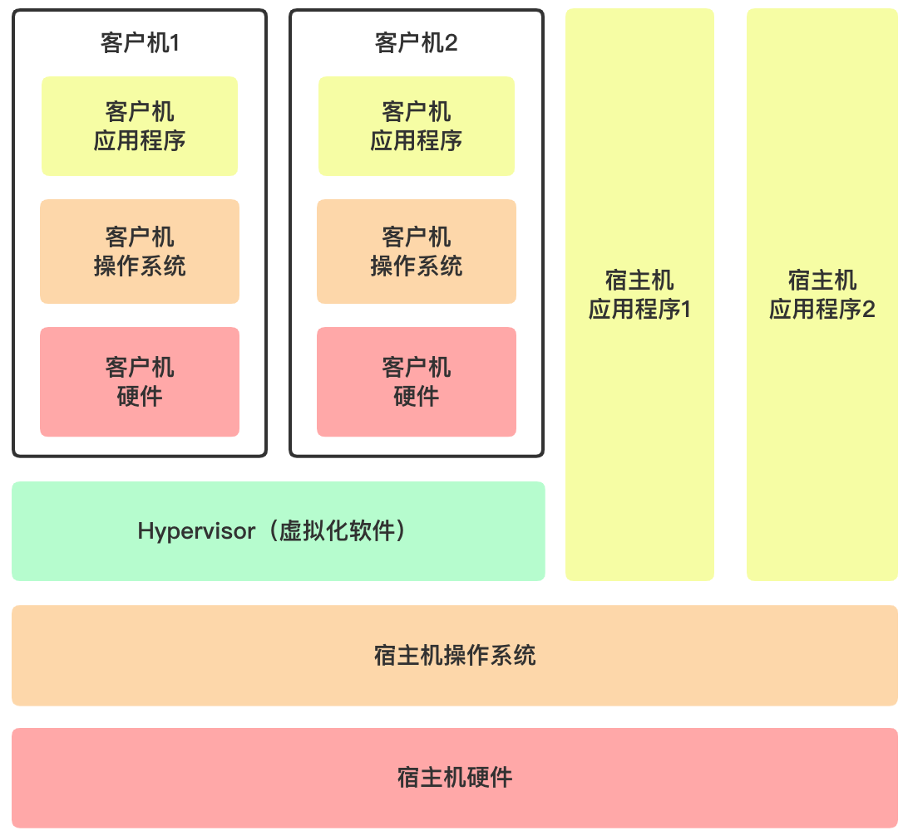
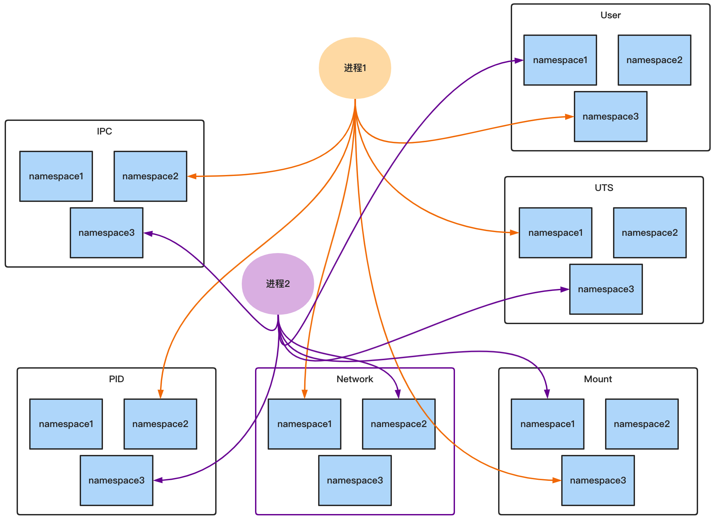
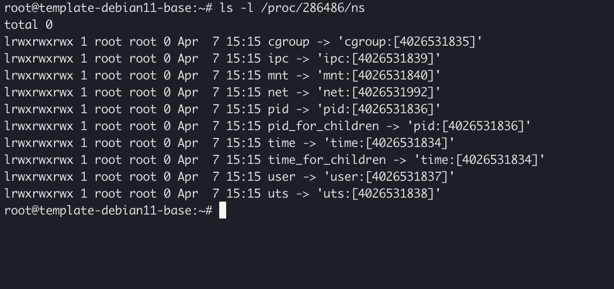

# 容器与Docker综合实验


💡 文档中对各个概念的定义和阐述并不是严谨的，文档中用语尽量通俗易懂，大多数只是为了让同学们明白这个概念大致在说什么东西，能在头脑中有个感性的认识（这对知识的掌握和学习非常重要）。概念的严格定义还请参考对应的官方文档。




💡 容器和Docker的内容非常繁杂，实验文档不可能面面俱到，因此很多内容以链接的形式给出。请同学们在阅读文档本身的同时，不要忘记学习链接中指出的内容。




💡 同学们在执行命令时，一定要认真阅读命令的输出和log，通过阅读这些输出，你很容易了解你所执行的命令具体执行了哪些操作，这非常有助于理解其背后的运行原理。




💡 目前流行的绝大多数容器运行时都是用Go语言编写，著名的容器编排工具Kubernetes也是用Go语言编写的，基于Docker和Kubernetes建立起来的整个云计算生态中的绝大部分项目也都是用Go语言实现的。因此，如果想深入了解和学习云计算相关内容的话，建议同学们学习和掌握Go语言。当然，这并**不是**本次实验和这门课的要求:)





**注意事项**  

1. 本次分配的机器的账户和密码为：

  ```
  buaa: &shieshuyuan21
  ```

  **务必首先修改机器的root和buaa账户的密码**

2. 请务必阅读[虚拟机使用说明](../../../01_common/virtual_machine_help.md)。

3. 分配的虚拟机中，已经安装了Docker，无需重复安装；并设置了Docker镜像地址（该地址指向校内地址），理论上docker.io中的镜像不用联网即可拉取。例如可以直接在虚拟机上`docker pull nginx`。



## 实验目的

- 理解容器的概念，了解实现容器所使用的的底层技术，理解容器与虚拟机的区别

- 理解容器与Docker之间的关系

- 掌握Docker的基本使用方法和常见命令，可以使用Dockerfile构建镜像

## 实验要求

请参考本实验文档，并查阅相关资料，回答以下问题并**完整记录实验过程**：

1. **数据持久化**。容器是 **“一次性的”** 和 **“脆弱的”**（请大家务必牢记容器这一特性），容器很容易因为各种原因被kill（如资源不足等等）。而容器产生的数据文件是和容器绑定在一起的，当容器被删除时，这些数据文件也会被删除，这是我们不想看到的。

    比如，我们在机器上启动了一个mysql容器，在写入了一些重要数据后，因为某种原因该容器被意外删除了。此时即使重新启动一个mysql容器也找不会之前的数据了。**请结合实验文档中的内容和查阅相关资料，讨论应该通过何种方式启动容器来避免出现这一问题？你能得出几种方案？每种方案的优劣如何？并请分别使用这些方案模拟mysql容器 创建 - 写入数据 - 销毁 - 重新创建 - 重新读到之前写入的数据 的场景，以证明方案的有效性。**

2. 请从ubuntu镜像开始，构建一个新的包含Nginx服务的ubuntu镜像，并修改Nginx主页内容为你的学号，**请分别使用`docker commit` 和 `Dockerfile`两种方式完成，** 并将这个新构建的镜像推送到软院的image registry中。这个镜像推送的地址应该是 `harbor.scs.buaa.edu.cn/<你的学号>/ubuntu-nginx:${TAG}`，其中，使用`docker commit`构建的镜像的`TAG`为`dockercommit`；使用`Dockerfile`构建的镜像的`TAG`为 `dockerfile`。

    在测评时，助教会分别对你push的两个镜像执行以下命令（假设镜像名称为`example_image_name`）：

    ```bash
    docker run -d -p 8899:80 example_image_name; sleep 5; curl localhost:8899
    ```
    
    **请保证上述命令的输出中包含你的学号**。



**Hint:**

1. harbor.scs.buaa.edu.cn 这个网页可以打开

2. harbor.scs.buaa.edu.cn 的用户名为你的学号，默认密码为`Newpass@2021`

3. 如果你使用的分配的校园网的虚拟机，默认是无法联网的。如果你的容器内部需要联网，可以在**启动容器前**执行 `export http_proxy=http://10.251.0.37:3128;export https_proxy=http://10.251.0.37:3128`

    上述方式本质上只是修改当前bash进程的`HTTP_PROXY`，如果你有要求更高的联网需求，可以按照[此说明](../../../01_common/virtual_machine_help.md#联网)进行配置（配置中，需要使用的hostname是本次分配的虚拟机的名称，即`docker_lab_学号`。完成此说明中的操作后，虚拟机将持续处于联网状态。



## 背景

我们知道，运行在操作系统中的软件，不仅包含我们实际编写的业务代码，还包含各种各样的**运行时（runtime）**（比如运行Java程序时需要依赖JRE，运行JS时需要依赖node、deno或浏览器环境，运行Python代码时需要Python环境，等等）和**依赖库（lib）**（比如，即使用C语言写个最简单的Hello World也得include一个stdio.h，以获取基本的向计算机屏幕打印字符串的能力）。在当前计算机性能普遍超越单个程序所需的性能的情况下，我们绝大多数情况下不会在一台机器中运行单个程序，而不同编程语言或不同类型的软件所需要的运行时和依赖库的类型和版本不尽相同，甚至同一个类型的运行时的不同版本之间还相互不兼容，这就需要我们在同一台机器中维护多个不同类型不同版本的运行时和依赖库，所以，大家在日常的学习和开发中，大概率会遇到下面这些问题：

- 我想下载和使用一个软件，所有步骤都按照官方Guide一步步执行，但最后就怎么也启动不了，总是会报这样或那样的错误（经常用npm的同学应该深有体会）。
- 我想下载和使用一个软件，结果总是提示依赖库缺失或版本冲突，最后好不容易解决了，结果把自己本地的环境搞的一团糟，甚至最后不得不重装系统。
- 我在本地写好的代码，明明我的机器上跑的好好的，怎么到你那里就有bug了？！！
- 从网上下载好的一个来源不明程序，莫名奇妙地向你申请各种系统权限，不给权限就罢工。
- ……等等

在传统情况下，我们可以使用虚拟机技术来解决这些问题。虚拟机技术允许我们在一台计算机中模拟多个**相互隔离**的**计算机硬件**环境。我们可以创建一台虚拟机，把与软件相关的所有东西都塞到这个虚拟机中。当其他人需要这个软件时，我们只需要将该虚拟机打包成特定格式的文件，然后分发给对方就可以了。对方只需要在兼容的虚拟机环境中导入该虚拟机文件，就能保证获得同样的运行效果。



虚拟机的解决方案简单有效，但有些简单粗暴：且不提Hypervisor层带来的性能损耗，为了运行一个应用程序就要虚拟化一整个计算机环境，并配套上一个完整的操作系统功能（维持客户机运行的各种守护进程、OS调度器等等），未免太奢侈了。

有没有一种能够隔离两个不同的应用程序的更轻量级的解决方案呢？有的，那就是本文的主角——容器（Container）。

## 容器（Container）

在具体讨论容器（Container）之前，我们先大致了解一下容器所依赖的两个Linux机制：**namespace**和**cgroups**。

### namepace

我们知道，隔离两个应用程序本质上其实是隔离这两个应用程序所属的两个（或两组）进程。而如果能把两个进程使用的各项系统资源（文件系统、进程ID、网络、用户组等） 都隔离开，实际上也就达到了隔离两个进程的目的。

Linux的namespace就提供了这样一种内核级别的资源隔离机制。它把系统的各项资源放到不同的namespace下，不同namespace下的资源是完全隔离的互不影响，而每个进程在使用某类资源时，只能归属于某个特定的namespace。这样就可以达到隔离不同进程所使用的的资源的目的。



实际上，我们可以通过proc文件系统看到当前机器上的每个进程使用的各项资源所属的namespace，下图中展示的就是286486号进程的namespace使用情况：



下面我们通过举例来进一步理解namespace机制。

#### PID Namespace

我们知道，在Linux中，所有进程都是从init进程（1号进程）或它的子进程fork出来的，进而，它们会组成一个树状结构：


每个进程都会被分配一个独一无二的进程号（PID），不同进程间的相互识别、通信也都是基于进程号进行的。

大家应该还记得Linux创建进程时使用的`clone`系统调用。我们可以用该函数写出下面简单的demo：

```c
#define _GNU_SOURCE
#include <sched.h>
#include <stdio.h>
#include <stdlib.h>
#include <sys/wait.h>
#include <unistd.h>

static char child_stack[1048576];

static int child_fn() {
    printf("子进程视角的父进程的PID: %ld\n", (long)getppid());
    printf("子进程视角的子进程的PID: %ld\n", (long)getpid());
    return 0;
}

int main() {
    printf("父进程视角的父进程的PID: %ld\n", (long)getpid());

    pid_t child_pid = clone(child_fn, child_stack+1048576, SIGCHLD, NULL);
    printf("父进程视角的子进程的PID: %ld\n", (long)child_pid);
    
    waitpid(child_pid, NULL, 0);
    return 0;
}
```

代码很简单，我们fork了一个子进程，并分别父进程和子进程中打印父进程和子进程的PID，得到的输出如下：

```c
父进程视角的父进程的PID: 53927
父进程视角的子进程的PID: 53928
子进程视角的父进程的PID: 53927
子进程视角的子进程的PID: 53928
```

结果完全符合我们的预期，对应的进程树的图景应该是：


下面我们修改代码，在调用clone函数时，添加`CLONE_NEWPID`标志。该标志表示在fork子进程时会创建一个新的PID Namespace，并将新创建的这个子进程放入该namespace中：

```c
#define _GNU_SOURCE
#include <sched.h>
#include <stdio.h>
#include <stdlib.h>
#include <sys/wait.h>
#include <unistd.h>

static char child_stack[1048576];

static int child_fn() {
    printf("子进程视角的父进程的PID: %ld\n", (long)getppid());
    printf("子进程视角的子进程的PID: %ld\n", (long)getpid());
    return 0;
}

int main() {
    printf("父进程视角的父进程的PID: %ld\n", (long)getpid());

    pid_t child_pid = clone(child_fn, child_stack+1048576, CLONE_NEWPID | SIGCHLD, NULL);
    printf("父进程视角的子进程的PID: %ld\n", (long)child_pid);
    
    waitpid(child_pid, NULL, 0);
    return 0;
}
```

这时程序的输出是这样的：

```c
父进程视角的父进程的PID: 54539
父进程视角的子进程的PID: 54540
子进程视角的父进程的PID: 0
子进程视角的子进程的PID: 1
```

可以看到，父进程输出的结果是符合预期的，但子进程却认为它的父进程PID为0，即它没有父进程；而认为自己的PID为1，即自己是1号进程。大致情形如下图所示：


可以看到，在调用`clone`函数时，同时创建了一个新的PID namespace，新创建的子进程成为这个新的PID namespace中的新的进程树的根（PID=1），这个子进程不知道操作系统上还存在其他进程。可以想到，如果父进程再使用同样的方法fork子进程2，那么新创建的子进程2也会被放入一个新的PID namespace中，并成为那个新的namespace中的进程树的根。这样，子进程1和子进程2都互相不知道对方的存在，实现了互相之间对进程号的隔离。


注意，上面仅仅是我们隔离进程的第一步。上面创建的子进程1和子进程2依然可以访问相同的文件系统、网络接口等其他资源。这些资源需要使用其他类型的namespace进行隔离。

#### Network Namespace

我们知道，Linux中的进程是通过网络接口（network interface）（可以理解为不同的网卡，这些网卡可能是物理存在的，也可以是虚拟的）进行网络通信的。网络接口的配置决定了进程可以以怎样的方式与网络上的哪些计算机进行通信（比如网络接口的配置包括了该接口的IP、DHCP、路由配置等）。

可以通过`ip link`命令来查看当前机器上的网络接口：

```c
1: lo: <LOOPBACK,UP,LOWER_UP> mtu 65536 qdisc noqueue state UNKNOWN mode DEFAULT group default qlen 1000
    link/loopback 00:00:00:00:00:00 brd 00:00:00:00:00:00
2: ens192: <BROADCAST,MULTICAST,UP,LOWER_UP> mtu 1500 qdisc mq state UP mode DEFAULT group default qlen 1000
    link/ether 00:50:56:92:39:60 brd ff:ff:ff:ff:ff:ff
    altname enp11s0
```

可以看到，当前机器上有一个名为`ens192`的物理网卡和一个`loopback`网络接口，这些网络接口属于全局默认的network namespace；默认情况下，从init进程fork出来的进程都属于这个全局的network namespace，意即每个进程都可以访问这些网络接口进行网络通信。而如果我们在使用clone函数fork进程的时候传递`CLONE_NEWNET`标志，就可以在fork进程的同时，创建一个新的network namespace，并使新进程使用这个新的network namespace中的网络接口。


💡 loopback是一个特殊的虚拟网络接口，用于进程与本机的其他server进程通信。



我们通过下面的示例代码来说明这个问题：

```c
#define _GNU_SOURCE
#include <sched.h>
#include <stdio.h>
#include <stdlib.h>
#include <sys/wait.h>
#include <unistd.h>

static char child_stack[1048576];

static int child_fn() {
    printf("子进程所在的network namespace:\n");
    system("ip link");
    printf("\n\n");
    return 0;
}

int main() {
    printf("父进程所在的network namespace:\n");
    system("ip link");
    printf("\n\n");

    pid_t child_pid = clone(child_fn, child_stack+1048576, CLONE_NEWPID | CLONE_NEWNET | SIGCHLD, NULL);

    waitpid(child_pid, NULL, 0);
    return 0;
}
```

代码很简单，我们使用`clone`函数创建了子进程，并分别在父子进程中使用`ip link`获取当前进程能使用的网络接口。程序输出如下：

```c
父进程所在的network namespace:
1: lo: <LOOPBACK,UP,LOWER_UP> mtu 65536 qdisc noqueue state UNKNOWN mode DEFAULT group default qlen 1000
    link/loopback 00:00:00:00:00:00 brd 00:00:00:00:00:00
2: ens192: <BROADCAST,MULTICAST,UP,LOWER_UP> mtu 1500 qdisc mq state UP mode DEFAULT group default qlen 1000
    link/ether 00:50:56:92:39:60 brd ff:ff:ff:ff:ff:ff
    altname enp11s0

子进程所在的network namespace:
1: lo: <LOOPBACK> mtu 65536 qdisc noop state DOWN mode DEFAULT group default qlen 1000
    link/loopback 00:00:00:00:00:00 brd 00:00:00:00:00:00
```

可以看到，子进程和父进程可以访问的网络接口是不同的（虽然两者都有`lo`网络接口，但本质上是不同的loopback接口）。network namespace 成功实现了网络资源的隔离。

#### Mount Namespace

Linux的文件系统一般会包含多个挂载点。我们可以在Linux的目录树中的指定位置挂载或卸载特定的文件系统来达到修改整个文件系统结构的目的。

比如，在现有的目录树上挂载一个右侧的文件系统：


就可以得到下图这样的目录树：


Linux的mount namespace可以保证不同namespace的挂载点不受影响。在使用`clone`函数时，可以传递`CLONE_NEWNS`标志。这时在创建子进程时，操作系统会自动创建一个新的mount namespace，并把该子进程加入到这个新的namespace中。这样，子进程可以任意修改自己的挂载点而不会影响其他进程。

比如，我们从上图的目录树开始，使用`CLONE_NEWNS`标志fork一个子进程：


子进程所处的mount namespace虽然会直接继承父进程的mount namespace中的挂载点信息，但子进程对挂载点的修改不会影响到父进程的mount namespace。比如，如果我们这时可以在`/root/a`处再挂载一个文件系统：


这时，子进程将获得与其他进程都不相同的一个目录树，如果方框中的文件系统只挂载在子进程的该节点上的话，那么这部分文件系统对子进程来说就是独享的。从这个角度来说，Linux通过mount namespace实现了不同进程之间文件系统的“隔离”。

#### 其他的Namespace

除了PID namespace，network namespace，mount namespace之外，Linux还提供了以下3类namespace：

- `UTS`: 隔离主机名和域名信息
- `IPC`: 隔离进程间通信
- `User`: 隔离用户和用户组的ID

综合使用以上6种namespace，可以实现对进程所涉及的各项资源的隔离，进而达到隔离不同的进程的目的。


💡 本节中的代码都是用C语言演示的，代码中使用的系统调用是Linux Kernel提供的，原则上可以使用任意语言实现（当然可能需要使用C语言绑定），包括但不限于Go，Rust等。



### cgroups

使用namespace机制进行隔离的进程，虽然可以被限制只能使用哪些资源，但没有被限制资源用量。比如，被隔离的进程依旧可以不受限制地执行大量CPU密集任务（消耗大量CPU时间），或占用消耗大量的内存。要想做到这种限制，就需要使用另一个Linux机制：cgroups。

cgroups全称是“Control Groups”，顾名思义，cgroups可以将进程分组，并为每个进程组分配设定特定的CPU和内存限额，该进程组中的每个进程的CPU和内存用量都不能超过这个限额。

简单来讲，namespace控制进程能看到什么（what can see），cgroups控制进程能用什么（what can use）。

### 容器（Container）

到现在为止，我们知道，在Linux中，可以使用namespace和cgroups机制隔离一个或一组进程。我们把这样的一个或一组被隔离的进程称作“容器（Container）”。当我们提到“启动（或创建）一个容器”时，其实就是在说“使用namespace和cgroups机制创建一个或一组进程”。


💡 从这个角度看，容器的实现并不复杂，实际上，互联网上有很多相关的教程教你怎么“自己写一个Docker”。比如，这个[视频](https://www.youtube.com/watch?v=8fi7uSYlOdc)展示了怎么用Go语言从零开始实现一个简单的容器。



### 容器与虚拟机


虚拟机和容器的最大的区别在于，虚拟机模拟了一整个计算机环境，其上有一个完整的操作系统，它有自己的进程调度、内存管理等；而容器仅仅是被隔离的一个或一组进程，这些进程和在宿主操作系统看来跟其他普通进程没什么区别，他们会被Kernel以同样的方式调度，以同样的方式使用内存管理。

### 镜像（Image）

正如本文开头提到的，容器的运行依赖进程命令本身的可执行文件、运行时、依赖库和相关资源文件。为了使不同的容器所使用的这些文件之间能够相互隔离，我们可以利用在“mount namespace”一节中提到的那个“特殊的文件系统”，即，把可执行文件、运行时、依赖库和相关资源文件等都放到该“特殊的文件系统”中，当容器启动后，它只需要读写这部分“特殊的文件系统”即可。

不难发现，这个“特殊的文件系统”包含了对容器行为的各种描述，可以认为它就是容器的“模板”，即，这个“特殊的文件系统”长啥样，对应的容器就应该表现出啥样。这个“特殊的文件系统”与容器的关系可以类比为类和对象之间的关系。更进一步地，即使我们在不同的机器上启动容器，只要这个“特殊的文件系统”相同，那么总会得到运行效果完全相同的容器。

在日常使用中，这个“特殊的文件系统”会被打包成压缩包以方便在不同的机器中传递，而这个压缩包被称作“**镜像（Image）**”。通常情况下，容器总是从一个镜像启动的。


💡 真正生产环境中所用的镜像不止包含上面提到的这些文件，还会包含一些元信息文件，包括但不限于环境变量、容器启动的入口、容器对外暴露的端口等等。



### 容器运行时（Container Runtime）

到目前为止，我们启动的被隔离的子进程都是非常简单（只是一个非常简单的函数），在实际生产中，容器的启动过程要复杂的多：

- 解析容器镜像
- 设置进程的启动入口
- 挂载读写卷
- ……等等

更进一步地，同一台机器上可能会启动多个不同的容器，有些容器需要动态地停止和启动。这些工作显然不可能通过手动操作来完成。这时，就需要一个工具来帮我们完成对这些容器的管理工作，我们称这种工具为“**容器运行时（Container Runtime）**”。

容器运行时一般都提供了非常简洁的指令入口，只需要非常简短的命令就可以启动一个复杂的容器，或者随时停止和重启一个容器。

目前应用最广泛的容器运行时是[runc](https://github.com/opencontainers/runc)，我们常见的各种容器管理工具，如Docker、Podman、containerd等都是以runc为基础构建的。


💡 在通常情况下，我们认为Docker、Podman、containerd等容器管理工具是广义的容器运行时。




在上面列举的这些容器运行时中，Docker是使用最广泛的容器管理工具，甚至在很多人的认识中，Docker和容器简直就是同义词。虽然Kubernetes将在1.24版本中不再支持使用Docker作为容器运行时，Podman和Containerd也在逐步蚕食Docker的市场，但Docker依然处于垄断地位，很多其他的容器运行时甚至也特意将自己的使用方法设计地和Docker一模一样（如Podman）。所以，我们本次课程实验还是将主要讲解Docker的原理、架构和使用方法。入门了Docker后，了解和学习其他容器运行时也会变得非常简单。

## Docker


上图是Docker的经典Logo，一个白鲸载着集装箱的形象。“Docker”这个词是从“Dock”演变来的。Dock意为“码头”，Docker自然可以引申为“承载集装箱的工具”。“Container”本身也有“集装箱”的含义，Docker作为一个容器（Container）管理工具，这样的logo可谓是非常生动形象了。

我们平常所说的“Docker”，其实是一个巨大的结合体。从下图中可以看出，当用户使用Docker时，要经过多层组件的调用。虽然它们中的很多部分都可以单独作为一个独立软件来用（比如Containerd、runc），但我们在谈论Docker时，通常认为它们是整个Docker软件的一部分。在安装Docker时，这些组件也会被同时默认安装。


Docker本身自诩是开源软件，它的上游构建组件确实是开源的，可以在这里找到它的代码[moby/moby](https://github.com/moby/moby)。


💡 对于Dodcker的学习，互联网上有很多完整可靠的教程，比如Docker官方的[Docker 101 tutorial](https://www.docker.com/101-tutorial/)。这些都是非常不错的学习资料。



### Docker的安装


💡 如果你是使用本次实验分配的虚拟机，请忽略本节所有内容。由于实验人数较多，云平台压力较大，可能出现虚拟机卡顿的情况，因此，建议同学们**优先使用本地环境进行实验**。



#### macOS

直接下载[Docker Desktop](https://www.docker.com/products/docker-desktop/)安装即可

#### Windows

- 如果你正在使用WSL2，直接按照该[指南](https://docs.docker.com/desktop/windows/install/)安装Docker Desktop即可
- 如果你没有使用WSL2，可以选择先安装或升级到WSL2，然后执行上一步；也可以直接安装一个Linux虚拟机，然后在Linux中安装Docker

#### Linux

请参考[文档](https://yeasy.gitbook.io/docker_practice/install/ubuntu#shi-yong-jiao-ben-zi-dong-an-zhuang)，并从“使用脚本自动安装”开始读起。

#### 线上环境

实际上，有很多网站提供了免费的线上Docker环境供大家学习和体验，免去了在本地配置环境的繁琐，而且没有网络问题，在浏览器中就可以学习Docker各种概念。比如，你可以注册并登录[Play with Docker](https://labs.play-with-docker.com/)尝试看看。**在这些线上环境中同样可以完成本次实验。**

#### 配置镜像源

我们常用的Docker官方的image registry在国内的连接非常不稳定，拉取镜像时很可能非常缓慢，这时可以配置镜像源，请参考[国内镜像加速](https://yeasy.gitbook.io/docker_practice/install/mirror)。另外，如果你在校园网内，可以考虑使用软院的镜像加速器地址：http://10.251.0.37:5000


⚠️ 请再次注意，我们在本次实验中讨论的容器是使用namespace和cgroups隔离的进程。所以理论上，这些容器只能在有Linux内核的操作系统上启动并运行。虽然可以通过Docker Desktop在macOS或Windows上启动容器，但本质上是因为Docker Desktop自动在你的机器上安装了一个Linux虚拟机，这些容器是启动在这个虚拟机里的。



### Docker的简单使用

我们首先启动一个非常简单的Ubuntu容器，下面这条命令可以将会在一个隔离Ubuntu环境中执行`/bin/bash`进程：

```bash
docker run -it --rm ubuntu /bin/bash
```


可以看到，docker成功为我们启动了一个Ubuntu环境中的`/bin/bash`进程，当前我们所在的命令行环境已经不是原来主机上的环境了。可以使用下面的命令进行验证。

容器环境拥有与宿主机不同的hostname：


容器环境的发行版标记与宿主机不同（容器环境是Ubuntu，而主机是Debian）：


容器环境中可以看到启动的进程只有`/bin/bash`，并且该进程为容器中的1号进程：


我们在容器中对文件的增删并不会对宿主机中的环境造成任何影响：


但是，当我们查看内核版本时，可以发现两者内核完全相同，这说明我们启动的容器不包含完整的操作系统，本质上只是一个被隔离的进程而已：


### Docker的架构


上图展示了一条docker命令是如何被执行的： 

1. 用户输入命令
2. docker cli解析这条命令，转化成相应格式的请求，通过读写 [Unix socket](https://en.wikipedia.org/wiki/Unix_domain_socket) 的方式与docker engine通信，告诉docker engine应该执行怎样的操作
3. 正如我们前面提到的，镜像是容器的模板，我们使用docker命令创建容器需要先得到容器对应的镜像才行。当docker engine发现本机上没有对应的容器镜像时，就会根据镜像的名称从远程仓库（image registry）（可以将其想象成一个网盘）中下载对应的镜像到本地。实际上，你可能注意到我们在前面启动Ubuntu容器时就发生过这个下载操作：
    
    
    
    图中标出来的这段log清晰地说明了发生了什么：无法在本地找到`image ‘ubuntu:latest’` ，于是从远程仓库中将这个镜像pull了下来。
    
4. 当镜像准备就绪后，docker engine就可以将任务向下传递，最终使用系统调用（namespace和cgroups）创建或管理容器



⚠️ 上述步骤只是对docker工作流程的一个非常非常简化的讨论。



综上，我们可以看到docker实际上主要由三部分组成**docker cli**、**docker engine**、**image registry**。在后面的实验中，我们将逐步加深对着三部分的理解。


💡 实际上，docker cli并不是必须的，任何可以读写docker engine所暴露的Unix socket（通常这个socket的文件名是`/var/run/docker.sock`）的程序都可以通过docker engine来实现docker的功能；甚至docker engine还可以对外暴露tcp端口，使外部程序使用特定的HTTP接口发起调用。



### docker image

镜像（Image）是容器的基础，所以我们先从镜像谈起。


💡 从这里开始，我们将会涉及到大量的命令，这些命令看似繁杂，但平时常用的就那么几个，并且大部分都有规律，请同学们注意体会。当忘记某条命令时，可以随时使用`docker —help`查看帮助；或者访问[Docker官网的文档](https://docs.docker.com/engine/reference/commandline/cli/)。**注意，本实验的目的不是死记硬背这些命令，而是理解相关概念并对容器技术和Docker有个感性认识。**



#### 基本命令

docker中镜像与相关的操作都包含在`image`子命令中，如：

- `docker image ls` 可以列出当前机器的所有容器镜像：
    
    ```bash
    root@template-debian11-base:/## docker image ls
    REPOSITORY   TAG       IMAGE ID       CREATED        SIZE
    ubuntu       latest    ba6acccedd29   5 months ago   72.8MB
    ```
    
- `docker image pull <image_name>` 可以从image registry中拉取名称为`image_name`的镜像：
    
    ```bash
    root@template-debian11-base:/## docker image pull harbor.scs.buaa.edu.cn/library/mysql:8
    8: Pulling from library/mysql
    b380bbd43752: Pull complete
    f23cbf2ecc5d: Pull complete
    30cfc6c29c0a: Pull complete
    b38609286cbe: Pull complete
    8211d9e66cd6: Pull complete
    2313f9eeca4a: Pull complete
    7eb487d00da0: Pull complete
    a5d2b117a938: Pull complete
    1f6cb474cd1c: Pull complete
    896b3fd2ab07: Pull complete
    532e67ebb376: Pull complete
    233c7958b33f: Pull complete
    Digest: sha256:882e55f40d61034a2bb8a1abab1353571ad2a33866f382350788eb34740528b5
    Status: Downloaded newer image for harbor.scs.buaa.edu.cn/library/mysql:8
    harbor.scs.buaa.edu.cn/library/mysql:8
    ```
    

#### 镜像名

一般地，镜像名完整格式为`{image registry地址}/{仓库名}/{镜像名}:TAG`。

例如本例中使用的 `harbor.scs.buaa.edu.cn/library/mysql:8` ，其中：

- `harbor.scs.buaa.edu.cn`为image registry的地址，用来告诉docker去哪里pull这个镜像；
- `library`表示仓库名，表示这个镜像的所有者是谁；
- `mysql`表示镜像的名称；
- `8`是镜像的`TAG`，一般用来表示镜像的版本号。如果一个镜像名没有`TAG`，那么将会被认为`TAG`为`latest`，即`harbor.scs.buaa.edu.cn/library/mysql`等同于`harbor.scs.buaa.edu.cn/library/mysql:latest`。

你可能已经注意到，我们在最初创建Ubuntu容器的时候也没那么麻烦，直接用`ubuntu`就表示了镜像名。那是因为当仅使用一个单词表示镜像名时，docker自动为它补上仓库名`library`、自家的image registry地址`docker.io`，以及TAG`latest`；即`ubuntu`等同于`docker.io/library/ubuntu:latest`。

#### 镜像ID

你可能还注意到，当使用`docker image ls`时，有一列叫做`IMAGE ID`，这一列中的字符串其实就是每个镜像对应的独一无二的ID，它是一个镜像独一无二的标识。我们可以使用这个ID对镜像做各种操作，比如删除一个镜像：`docker image rm 3218b38490ce`。


为啥需要镜像ID呢？用镜像名标识镜像不好吗？不好。因为镜像名是可以任意改变的。我们可以使用`docker tag`命令来为镜像设置别名。比如，对上图中列出的ubuntu镜像，我们可以：


可以看到，`docker tag`之后，生成了一个新的镜像`areyouok`，但这个镜像拥有和原来的`ubuntu`一样的ID，说明`areyouok`和`ubuntu`这两个不同的镜像名指向同一个实体。

### image registry

在介绍镜像名称时，同学们可能会疑惑，image registry有很多个吗，为啥还需要地址来标识？是的，image registry有很多个。image registry有的是公开的，任何人都可以访问，并从中拉取镜像；也有私有的，需要特殊的口令访问。目前，世界上最大的几个公开的image registry有Docker公司提供的[docker.io](http://docker.io)（目前也是世界上最大、使用最广泛的image registry，如果你需要通过浏览器访问的话，需要使用这个地址：[hub.docker.com](https://hub.docker.com/)）、Redhat提供的[quay.io](https://quay.io/)、Google提供的[gcr.io](https://cloud.google.com/container-registry/)（很可惜，这个地址在国内被*了）；当然还有我们软院的image registry：[harbor.scs.buaa.edu.cn](https://harbor.scs.buaa.edu.cn)。

image registry不仅可以下载已经存在的镜像，还可以上传和保存自己制作的新的镜像。任何人都可以在上述registry网站创建账户和自己的仓库。对于用户上传到image registry中的镜像，用户可以自行选择是否对其他用户公开访问（公开或私有）。如果是私有镜像，则需要在每次上传和下载镜像前，在本地执行[docker login](https://docs.docker.com/engine/reference/commandline/login/)操作。

### 容器管理

可以使用`docker ps`命令查看当前机器上处于活跃状态的容器：


`docker ps -a` 可以列出所有状态的容器（包括活跃的和不活跃的）：


从上图中的输出可以看出，和镜像一样，每个容器也都有一个唯一的ID作为标识，我们对容器的各项操作也是通过该ID进行的。除了ID之外，每个容器也都有一个独一无二的name，我们也可以使用name来唯一指定一个容器。

在Docker的管理下，容器有以下6种状态：


1. 当用户输入`docker run`命令后，容器被创建，进入短暂的Created状态
2. 当容器进程启动完毕后，容器进入Running状态，这表示容器正在正常工作
3. 当用户使用`docker stop`显式地终止一个容器，或容器运行出错时，容器进入Exited状态。这个状态是不活跃的，处于这个状态的容器不会消耗任何资源
4. 对于处于Exited的容器，可以被手动使用`docker start`重启，重新进入Running状态；也可能被Docker管理服务重启，短暂进入Restarting状态后，重新回到Running状态
5. 可以手动使用`docker pause`暂停容器，此时容器将进入Paused状态。在这种状态中，容器将停止运行，即不会消耗任何CPU，但依旧会占据内存（以便随时从这个被pause的状态恢复运行）
6. 当使用`docker rm`删除容器，但容器中的一些资源依旧被外部进程使用时（即无法立即删除时），容器将进入Dead状态

关于容器状态的更加详细的讨论，可以参考[这篇文章](https://www.baeldung.com/ops/docker-container-states)。

### 启动容器

对于一般的用户，`docker run`命令是最常用也是最复杂的命令之一。`docker run`命令用于创建并运行容器。完整的命令参数及用法参见[Docker官方文档](https://docs.docker.com/engine/reference/commandline/run/)，下面我们会以两个例子来讨论一些常见的用法。

#### 基本结构

`docker run`命令的结构是

`docker run [一堆各种各样的参数] <image_name> [启动命令] [命令所使用的参数]`。

其中，只有镜像名`image_name`是必须的，其余全是可选的。

#### 启动命令

回想我们创建第一个docker镜像时使用的命令：`docker run -it --rm ubuntu /bin/bash`。这里的参数是`-it —rm`，镜像名是`ubuntu`，启动命令是`/bin/bash`，没有命令参数。

这里`/bin/bash`的含义是，启动ubuntu容器后，执行`/bin/bash`命令，即启动一个bash shell。

我们可以将这里的`/bin/bash`换成`ls /usr`看看效果：


这时，启动命令是`ls`，命令参数是`/usr`，表示启动ubuntu容器，并在其中执行`ls /usr`命令，即列出`/usr`目录下的所有目录和文件。可以看到，执行效果确实如此。并且，请注意，因为我们没有执行`/bin/bash`命令，在`ls`命令执行完返回后，并没有进入容器的命令行中，而是回到了宿主机。

不难发现，启动命令决定了容器启动后的具体行为。事实上，启动命令是可以省略的，如果省略的话，docker会执行镜像指定的启动命令（这个信息一般会作为元信息打包到镜像中）。

#### `-it`

参数`i`表示`interactive`，参数`t`表示创建一个虚拟的TTY（pseudo-TTY）。简单来说，`-it`参数可以让我们进入一个可以与容器进行交互的终端环境。

比如，如果我们在启动命令中去掉`-it`，启动的ubuntu容器将会在后台运行，我们将无法和它交互：


#### `—-rm`

参数`—-rm`表示当容器退出后，自动删除容器。

如果在执行容器时，不加`—-rm`参数，则当从容器退出后，容器进入`Exited`状态，继续存在在机器上（虽然此时为非活跃状态，不消耗任何资源），并且我们可以用`docker restart`等命令重启容器，或使用`docker exec`命令查看容器中的文件。


在上图中，我们首先使用`—rm`参数启动了一个ubuntu容器，在与其交互后，退出容器（即结束`/bin/bash`进程，此时容器进入`Exited`状态）。因为使用了`—rm`参数，所以此时容器会被Docker自动删除，使用`docker ps -a`命令找不到该容器的存在。

而如果启动命令中不加`—rm`参数，则容器退出后，将继续存在在机器上：


这时，只能使用`docker rm`命令手动删除容器。

#### `-v`

到现在为止，我们使用的容器的文件系统都是与宿主机完全隔离的。但在很多时候，容器需要与宿主机共享一些目录，比如位于宿主机上的一些进程希望能方便地看到容器运行中产生的文件，或者通过修改一些文件来影响容器的行为。

为了解决这一问题，我们可以使用-v参数将容器的某个目录和宿主机的某个目录绑定起来，使得容器在读写某个目录时，相当于在同时读写宿主机的某个目录。

参数`-v`的使用方法是`docker run -v <宿主机的目录>:<容器的目录> <image_name>`。还是以前面使用的ubuntu容器举例。比如，我们希望将宿主机的`/opt/mycontainer`和容器中的`/root`目录绑定起来：


可以看到，我们在容器的`/root`目录下创建了`test.txt`文件，然后在宿主机上的`/opt/mycontianer`确实观察到了该文件。同样地，在宿主机上对应目录的修改，也会被容器观察到：


注意，`-v`参数是可以重复的，也就是说，可以在一条`docker run`命令中同时指定多个共享目录，比如：`docker run -it --rm -v /opt/mycontainer:/root -v /another/host/dir:/another/contianer/dir ubuntu /bin/bash`

#### `—-name`

参数`—-name`可以为启动的容器添加名字。我们之前的`docker run`命令都没有使用该参数，那么这时docker自己会为该容器分配一个随机字符串作为name。

#### `-p, —-publish`

参数`—-publish`（可以简写为`-p`）表示将容器的某个端口暴露到宿主机的某个端口。

在详细讨论该参数之前，我们先从Nginx容器说起。[Nginx](https://www.nginx.com/)是目前应用非常广泛的网页服务器（当然它的用处不仅限于此），在一个启动了Nginx服务的系统中，可以通过80端口访问到网页。Nginx同样提供了开箱即用的docker镜像，只需要一条简单的命令`docker run nginx`就可以创建一个Nginx进程：


可以看到，Nginx进程已经成功启动了，这说明它能在80端口监听HTTP请求。我们可以打开一个新的终端，使用`curl`尝试访问一下：


访问失败！为啥呢？还记得“network namespace”吗？我们启动的Nginx容器进程和当前启动的`curl`进程不属于同一个network namespace！它们自然无法相互通信。当前这个Nginx进程对80端口的监听仅在它所在的network namespace有效。

但这不满足需求啊，我们启动Nginx容器的目的就是向外提供服务啊，Nginx在自己的容器里自娱自乐怎么行！这时就要用到参数`—-publish`（可以简写为`-p`）了，它可以将容器的端口“发布”（publish）到宿主机的某个端口。用法是`-p <宿主机端口>:<容器端口>`。

比如：


这样，Nginx容器的80端口就会和宿主机的80端口绑定，访问宿主机的80端口也就相当于访问Nginx容器的80端口。不信试试看：


成功🌶️！而且，对应的Nginx进程也打印出来请求日志：


注意！宿主机的端口不一定要和容器的端口相同（一般都是不同的），比如：


和`-v`参数类似，`-p`参数也可以同时有多个。

#### `-d, --detach`

大家可能注意到，上节中启动的Nginx容器都是在**前台**运行的，它在不断地输出日志，占据了整个终端，导致我们无法进一步和shell交互，以至于要执行curl操作时还得新打开一个终端。如果想终止这种输出，就得手动Ctrl+c终止Nginx容器。而且，如果此时关闭终端的话，也会同时退出这个容器。

在很多时候我们不希望容器运行在前台，而只是想让它安安静静地作为**后台**进程提供服务。这时，就可以使用`—-detach`（简写为`-d`）参数。比如：


可以看到，在输出了容器的ID后，Nginx安安静静地在后台运行了。

那么，我们有时候又需要查看容器的日志怎么办呢？很简单，使用`docker logs`命令：


### 进入容器内部

对于一个在后台运行的容器（如上节中的Nginx容器），如果想进入容器中查看当前容器的文件结构或执行一些命令用于debug，该怎么办呢？可以使用`docker exec`命令。

比如，如果需要进入容器中的bash shell的话，首先需要找到容器对应的ID


然后执行`docker exec`即可：


### 构建新镜像

到现在为止，我们只是在使用他人已经提前做好的镜像。如何制造我们自己的镜像呢？下面给出两种方法。

#### docker commit

假设我们正在使用一个ubuntu容器，并且在该容器的根目录下创建了一个非常重要的数据文件：


如果我想把当前容器的状态保存下来，以便下次启动容器的时候可以重新使用该文件；或者我想把当前容器发送给别人，让别人也看到我当前看到的容器的样子，该怎么办呢？可以使用`docker commit`命令将当前容器打包成一个新的镜像。

重新打开一个终端，查看一下当前容器的ID：


然后直接`docker commit <container_id> <new_image_name>`即可：


这时，使用`docker image ls`可以看到这个新生成的镜像：


我们尝试运行一下这个新生成的镜像，可以看到刚才创建的文件果然存在：



💡 实际上，`docker commit`还支持很多参数，详情请见[官方文档](https://docs.docker.com/engine/reference/commandline/commit/)。



#### Dockerfile

`docker commit`虽然可以非常直观地从当前容器创建一个新的镜像。但整个过程不够规范，也很难实现自动化，一般情况下，我们都是使用Dockerfile来构建镜像的。

所谓的Dockerfile，其实就是一个配置文件，里面描述了构建镜像的步骤。对于上一小节中构建出的镜像，如果使用Dockerfile来写的话，是这样的：

```docker
FROM ubuntu
RUN echo 'something important' > /important.data
```

很显然，上述文件内容是自解释的。一般Dockerfile的开头一条`FROM`语句，表示从以哪个镜像为基础进行构建。下面的RUN语句表示在容器中执行一条命令。

可以将上述Dockerfile保存在一个干净的目录中，然后在该目录中执行`docker build -t my_new_image_from_dockerfile -f ./Dockerfile .`（请注意，命令的最后有个`.`）：


可以看到，我们成功build了一个新的镜像。下面详细解释一下上面那条`docker build`命令的含义：

- -t表示要构建的新的镜像的名称
- -f表示Dockerfile文件的路径
- 命令中最后的单词表示表示构建镜像的上下文路径，上图中这个最后的单词是`.`，则表示上下文路径是当前目录。在镜像构建开始的时候，docker cli会把“上下文路径”指定的目录中的所有内容打包，然后整个发送给docker engine

事实上，Dockerfile还支持非常多的指令，具体请查阅[官方文档](https://docs.docker.com/engine/reference/builder/)。

#### 发布镜像

截止目前，我们构建的镜像全是在本机上，别人根本访问不到，也没法使用。我们可以将镜像push到image registry上，然后通知对方从该image registry拉取即可。具体可以参考[docker push的文档](https://docs.docker.com/engine/reference/commandline/push/)。
