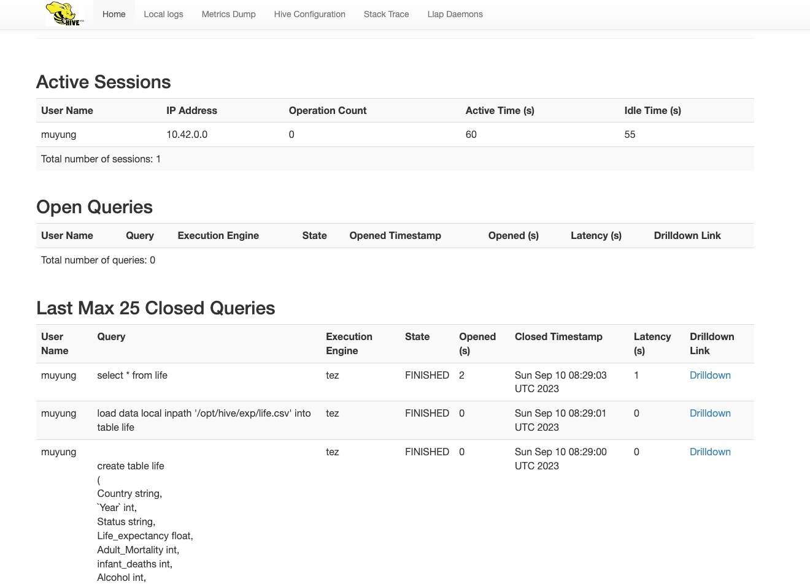

# 大数据分析实践 #

## 背景 ##
虽然过去人们研究了与预期寿命相关的多个因素，包括人口统计、收入构成和死亡率等，但免疫和人类发展指数等因素并未被充分考虑。此外，过去的研究多数基于全国范围内一年的数据集进行多元线性回归分析。因此，世界卫生组织（WHO）下属的全球卫生观察站（GHO）数据库跟踪了全球众多国家的健康状况以及许多其他相关因素，现向公众开放一份关于免疫、健康、经济、社会和其他因素的数据集。数据集中综合了 2000 年至 2015 年 193 个国家的数据，由于一些不太知名的国家的数据查找较困难，如瓦努阿图、汤加、多哥、佛得角等，因此该数据集中已排除这些国家，最终由 22 列、2938行组成，特征如表 1 所示。


本次实践需要你在 k8s 上搭建一个 Hadoop 平台，并使用 Hive 等工具对上述数据集进行分析。数据集在 [这里](https://scs.buaa.edu.cn/scsos/public/life.csv) 下载，数据集来源：[Kaggle](https://www.kaggle.com/datasets/kumarajarshi/life-expectancy-who)。

## 实验要求 ##
在 k8s 上搭建一个 Hadoop 平台，并通过 Hive 对上述数据集进行分析，下面列举了一些值得关注的问题：
1. 数据集中各种因素是否都会影响预期寿命？实际上影响寿命的是哪些变量？
2. 一个预期寿命较低的国家（<65岁）是否应增加其医疗支出以提高平均寿命？
3. 婴儿和成年人的死亡率如何影响寿命？
4. 预期寿命与饮食习惯、生活方式、锻炼、吸烟、饮酒等因素之间是否存在正相关或负相关？
5. 教育对人类寿命有何影响？
6. 预期寿命与饮酒之间是否存在正相关或负相关关系？
7. 人口密集的国家是否倾向于具有较低的预期寿命？
8. 免疫接种覆盖率对预期寿命的影响是什么？

你也可以自行选择一些自己感兴趣的问题来研究，要求至少写出 2 个问题的分析过程。

## 实验步骤 ##
使用助教团队提供的镜像启动一个 Hive 容器组，其中 `hive-deployment.yaml` 文件在 [这里](https://scs.buaa.edu.cn/scsos/public/hive-deployment.yaml) 获取
```bash
kubectl apply -f hive-deployment.yaml
```

暴露端口到宿主机上，这个文件是把 Hive 容器的 10000 端口映射到主机的 30000 端口，10002 端口映射到主机的 30002 端口，你可以根据需要修改，其中 `hive-service.yaml` 文件在 [这里](https://scs.buaa.edu.cn/scsos/public/hive-service.yaml) 获取
```bash
kubectl apply -f hive-service.yaml
```

访问宿主机的 30002 端口，可以看到 Hive 的 web 监控台



在 `hive-deployment.yaml` 中，将容器的 `/opt/hive/exp` 目录映射到宿主机的 `/root/exp` 目录下，你需要把数据集 csv 文件放在宿主机的这一目录下，以便后续使用

接下来在自己的电脑上安装 PyHive 环境，这是一个可以通过 python 命令行操作 Hive 的库
```bash
pip install sasl
pip install thrift 
pip install thrift-sasl 
pip install pyhive
```

下面是一个使用 `pyhive` 进行数据分析的示例，完整代码通过 [这里](https://scs.buaa.edu.cn/scsos/public/hive.ipynb) 获取

先封装两个方法，分别用于 Hive SQL 查询结果和指令执行
```python
def hive_read_hql(sql_code, connection):
    cur = connection.cursor()
    cur.execute(sql_code)
    headers = [col[0] for col in cur.description]
    df= pd.DataFrame(cur.fetchall(), columns=headers)
    cur.close()
    return df

def hive_exec_hql(sql_code, connection):
    cur = connection.cursor()
    cur.execute(sql_code)
    cur.close()
```

开启动态分区、开启允许所有分区都是动态的（非严格模式）、开启本地模式、设置允许的动态分区的最大数量为 1000、设置允许的每个 maper 或 reducer 创建的动态分区的最大数量为 1000 和设置本地模式运行 mapreduce。操作完成后即可进行动态分区的使用。
```python
hive_exec_hql('set hive.exec.dynamic.partition=true', conn)
hive_exec_hql('set hive.exec.dynamic.partition.mode=nonstrict', conn)
hive_exec_hql('set hive.exec.mode.local.auto=true', conn)
hive_exec_hql('set hive.exec.max.dynamic.partitions=1000', conn)
hive_exec_hql('set hive.exec.max.dynamic.partitions.pernode=1000', conn)
hive_exec_hql('set mapreduce.framework.name=local', conn)
```

创建 life 表，导入原始数据
```python
create_table_life_hql = '''
create table life
(
Country string,
`Year` int,
...
Income_composition_of_resources float,
Schooling float
)
row format delimited fields terminated by ','
'''

hive_exec_hql(create_table_life_hql, conn)
# 从 csv 文件导入数据
hive_exec_hql("load data local inpath '/opt/hive/exp/life.csv' into table life", conn)
```

创建分区表和分区数据（动态分区是按照最后 n 列进行的，n 取决于有几个分区，所以应该将分区数据放在最后 n 列）。这里是用年份来分区，你也可以用国家来分区。当然也可以多个列进行分区，或者和之前的静态分区相关联，都是可以的，大家可以自行尝试。
```python
create_table_part3_hql = '''
create table part3
(
Country string,
`Year` int,
...
Income_composition_of_resources float,
Schooling float
)
partitioned by (period int)
row format delimited fields terminated by ','
'''

hive_exec_hql(create_table_part3_hql, conn)

hive_exec_hql('insert overwrite table default.part3 partition(period) select *, Year from life', conn)
```

进行数据分析，下面这个例子分析了发达国家和发展中国家人均寿命分别随着时间变化的趋势。


```python
import matplotlib.pyplot as plt

query_hql = 'select avg(Life_expectancy) as avg_life, Year as year, Status as status from part3 group by Year, Status'
df = hive_read_hql(query_hql, conn)

df.index = df["year"]
df = df.sort_index(ascending=True)
groups = df.groupby(df["status"])
developing_df = groups.get_group("Developing")
developed_df = groups.get_group("Developed")

fig = plt.figure(figsize=(6,4))
ax = fig.add_subplot(1,1,1)

ax = developing_df.plot(x='year', kind='line', y='avg_life', label='Developing', ax=ax)
ax = developed_df.plot(x='year', kind='line', y='avg_life', label='Developed', ax=ax)
plt.show()
```
