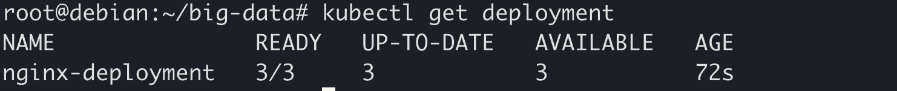
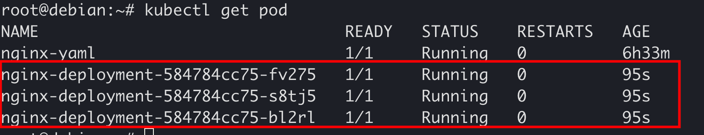
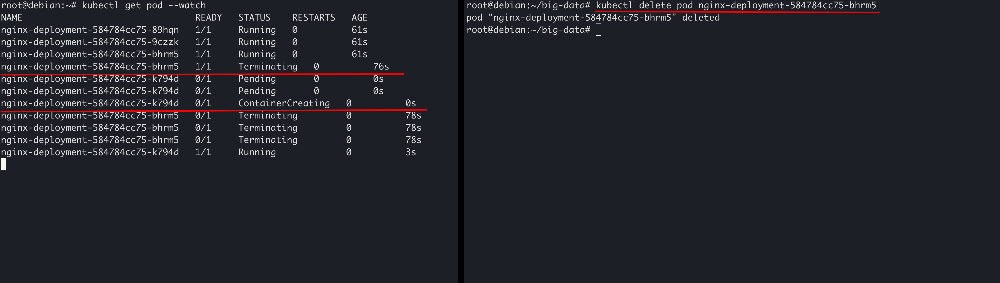
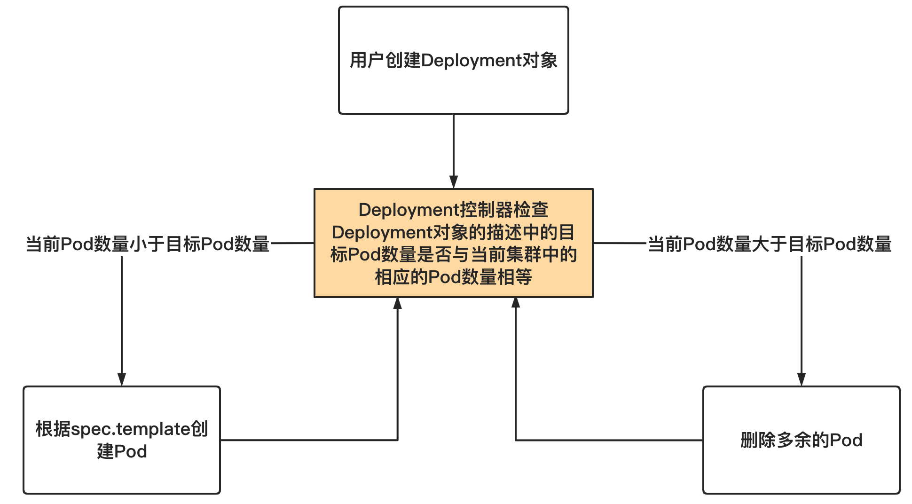
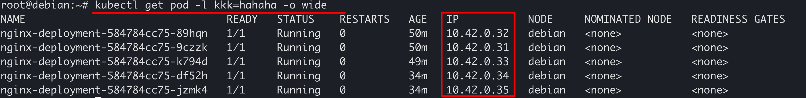
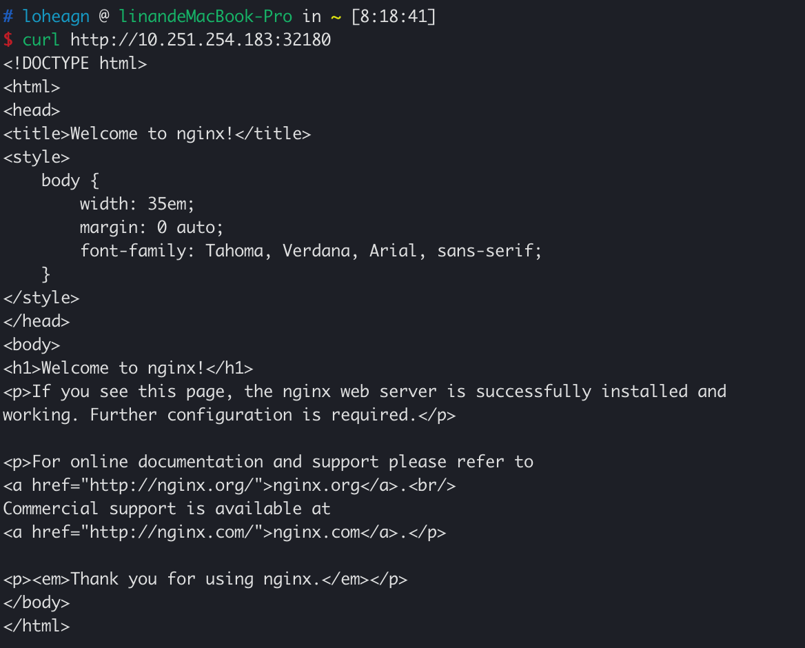
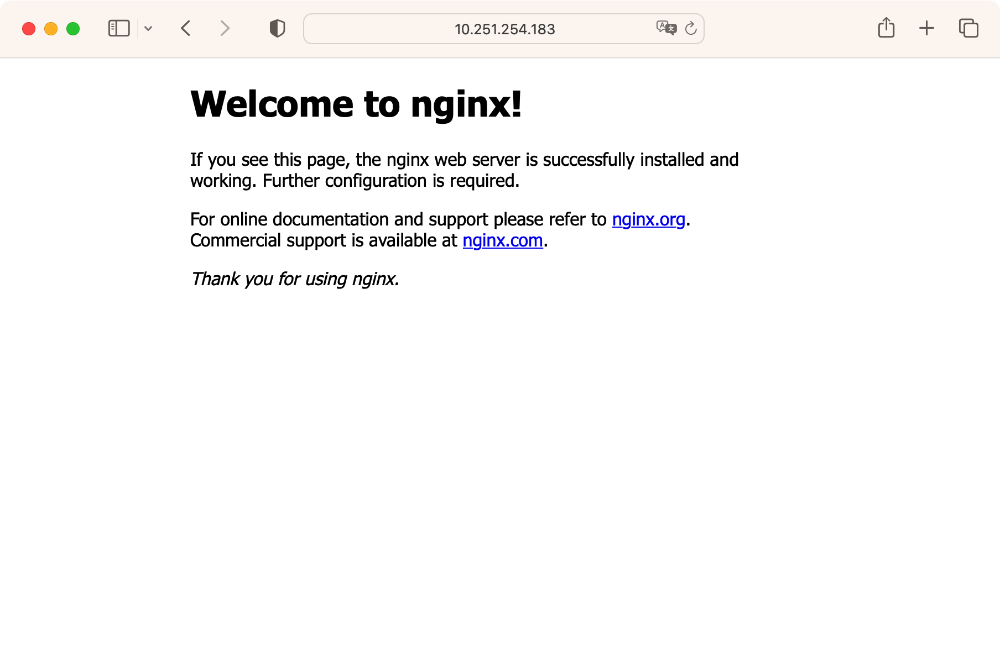

# Kubernetes基础实验

## 实验目的

- 了解Kubernetes的各种特性
- 掌握Kubernetes的常用功能



**注意事项**  

1. 本次分配的机器的账户和密码为：

  ```
  buaa: &shieshuyuan21
  ```

  **务必首先修改机器的buaa账户的密码**

2. 请务必阅读[虚拟机使用说明](../../../01_common/virtual_machine_help.md)。



## 背景

上次实验中，我们主要了解了什么是容器，以及目前最流行的容器运行时和容器管理工具Docker；并且在此过程中体会了容器技术给软件开发和部署带来的极大的便利性。

但到此为止，我们对容器的使用和管理依旧处于非常“手工”的状态，难以胜任实际生产环境中对容器管理的要求。在实际生产环境中，

1. 通常一个应用包含多个容器；即，一个应用的部署，需要按照一定的顺序启动多个容器。例如，即便是一个最简单的前后端应用，我们也需要**依次**启动三个容器：数据库容器（例如一个MySQL容器）、后端应用容器、前端应用容器（通常是一个Nginx容器）。特别是在微服务场景中，后端可能涉及到几十个微服务模块，每个模块都对应着一个容器，不同服务之间又有复杂的依赖调用关系。
2. 每个类别的服务通常会有多个容器实例。对于一些负载较高的服务，通常会部署多个相同的容器实例达到负载均衡的效果，从而提高服务整体的吞吐量。
3. 容器是不稳定的，随时可能会因为各种各样的原因挂掉，因此，需要时刻监控容器的状态，在它挂掉的时候及时重新启动服务，保证服务整体的高可用。
4. 大部分应用都是分布式的。即，一个应用中的不同服务是部署在不同机器上的，即使是一个服务的不同实例往往也会部署在多个机器上。如何在多台机器上做好资源（内存、CPU、磁盘）的负载均衡（即，避免出现某些机器负载过高的同时，其他机器负载空闲的情况）也是棘手的问题。

如果仅靠我们已经学到的几个docker命令显然是难以完成上述任务的。这就需要一个专门的容器编排调度工具帮我们处理这些事情。自Docker兴起后，很多厂商都进入该领域并推出了自己的容器编排调度解决方案，例如Docker Swarm、Mesos等，都想在新兴的容器市场中分一杯羹，但最终Kubernetes笑到了最后，并且作为CNCF的毕业项目，成为了当下容器编排调度领域的事实标准。本次实验我们就来认识一下Kubernetes，学习并实践其中一些基本概念。


Kubernetes以其复杂难懂著称，在本次实验中，我们主要学习其中最基本的部分，培养大家对Kubernetes的感性认识，帮助大家开始入门云计算领域。


## 初识Kubernetes

### Kubernetes简介

Kubernetes在希腊语中的含义是船长/领航员，这个名字生动地体现了它在容器集群管理中的作用——调度和监控全局的集装箱（container，容器）。由于Kubernetes这个单词太长，人们通常会用k8s来作为简称（Kubernetes的首尾两个字母之间正好有8个字母）。

请始终记住，Kubernetes和Docker之类的容器运行时不是互相替代的关系，也不是包含与被包含的关系，而是互补的关系。Kubernetes仅仅是一个容器编排和调度工具，其必须运行在“容器运行时（container runtime）”之上。它能做的仅仅是接收用户的命令，然后通知其下层的容器运行时做具体的工作。


上图可以看出，在之前，我们是直接通过Docker命令行或Docker HTTP接口来与Docker容器运行时通信，控制其构建镜像、推送或拉取镜像、启动或停止容器，等等。

而现在，我们可以通过Kubernetes的命令行工具（即Kubectl）或Kubernetes的HTTP接口来控制Kubernetes，然后，Kubernetes会根据我们发出的命令，“翻译”成对应的Docker容器运行时的调用，从而控制Docker容器运行时构建镜像、推送或拉取镜像、启动或停止容器等等。

另外，请注意，Kubernetes是一个非常模块化的系统，它定义了一套“容器运行时接口（CRI）”，凡是实现了这套接口的容器运行时都可以作为Kubernetes运行容器的后端。目前比较流行的有Containerd和CRI-O，实际上，从1.20版本开始，Kubernetes官方已经弃用Docker引擎作为容器运行时。


> 所谓“Kubernetes官方已经不再支持使用Docker作为容器运行时”，其实指的是Kubernetes官方不再维护Docker的CRI层。但由于历史惯性等原因，很多Kubernetes的下游发行版都会选择继续提供对Docker的支持（当然，这得益于Kubernetes本身与容器运行时的解耦）。
> 在本次实验中，为了前后知识的连贯性，我们依旧选择使用Docker作为Kubernetes的容器运行时。

### 创建Kubernetes集群

在Kubernetes官网的[Get Started](https://kubernetes.io/docs/setup/)中，分别给出了面向个人初学者的学习测试环境和一线生产环境的若干Kubernetes集群部署方法。对于生产环境，[Kubernetes官方推荐使用`kubeadm`来启动集群](https://kubernetes.io/docs/setup/production-environment/tools/kubeadm/)。但实际上，`kubeadm`对非专业的运维，特别是初学者来说并不十分友好（需要用户事先完成对主机的一系列配置，如开放防火墙端口、关闭swap、安装容器运行时等），再加上国内特殊的网络环境，因此不推荐初学者直接使用`kubeadm`启动集群。


云计算生态非常繁荣，社区中已经有很多成熟的工具帮助用户快速启动一个标准的Kubernetes集群用于学习、测试等目的。本实验文档分别针对集群版和本地版提供创建Kubernetes集群的选项，供大家参考和使用。

#### 集群版

**推荐使用此种方式创建集群**，这样有利于在后续章节中学习和实践Kubernetes“集群”的相关特性。如确实有问题，可以切换到个人电脑上使用“单机版”的方式。

在本次实验中，我们将部署一个简单的[k3s](https://k3s.io)（注意，不是“k8s”哦！）集群。k3s是通过CNCF认证的Kubernetes的一个发行版，是基于上游的“原生”的Kubernetes的代码进一步构建的。k3s和Kubernetes的关系可以简单类比为Ubuntu、CentOS等于Linux之间的关系。你可以在这里找到k3s官方维护的[k3s的中文文档](https://docs.rancher.cn/k3s/)。

> 实际上，还有很多其他的Kubernetes发行版，比如k0s之类的。只不过k3s的中国化做得非常好，在国内的网络环境下使用非常便利，也有大量的资料可以使用，所以我们选用其作为本次实验的主要工具。当然，不同Kubernetes发行版之间存在着各种各样的差异，但这并不影响我们学习Kubernetes的基础知识。

1. 准备一台能够连接互联网的Linux机器。如果你选择使用软院云平台分配的机器，可以直接进行下一步；否则，请查看[安装要求](https://docs.rancher.cn/docs/k3s/installation/installation-requirements/_index/)，确保你的机器满足其中所述条件。

2. 保证你的机器已经连接互联网。

3. **切换到root用户**（如果你觉得root操作危险，请保证自己有足够的能力使用普通用户权限完成所有操作）
    ```shell
    sudo -i
    ```

4. 安装 Docker（需提前用 `buaalogin` 联网）
    ```shell
    curl -fsSL https://get.docker.com/ -o get-docker.sh && sh get-docker.sh --mirror Aliyun
    ```

5. 确保机器已经安装Docker，并且其版本高于或等于 `19.03`，可以使用 `docker info` 命令验证，请注意是否正确配置 Docker Registry 镜像地址，以保证可以顺利从 `docker.io` 中拉取镜像。（当然，如果你已经比较熟悉 Kubernetes，可以忽略此步骤，选择使用 k3s 默认集成安装的 containerd 作为容器运行时。）

6. 执行以下命令以初始化一个k3s的master节点（当前不理解什么是“master节点”没有关系，在后续章节中我们会进行详细介绍）：
    ```shell
    curl -sfL https://rancher-mirror.oss-cn-beijing.aliyuncs.com/k3s/k3s-install.sh | INSTALL_K3S_MIRROR=cn sh -s - --docker
    ```
    如果你选择使用containerd作为容器运行时，请去除上述命令中的`--docker`参数。

7. 等待上述命令执行结束后，实际上我们的k3s已经安装完成，即，我们已经得到了一个可用的Kubernetes集群。在继续后续操作前，我们先完善一下配置：

    ```shell
    echo 'export KUBECONFIG=/etc/rancher/k3s/k3s.yaml' >> ~/.bashrc
    source ~/.bashrc
    ```
    注意，如果你使用的不是bash，请注意更改上述命令。

8. 使用`kubectl get node`验证一下Kubernetes集群是否就绪，一般可以得到如下结果：
    ```txt
    NAME     STATUS   ROLES                  AGE    VERSION
    debian   Ready    control-plane,master   2d1h   v1.24.4+k3s1
    ```
    `kubectl get node`这条命令是自解释的，含义是，获取当前Kubernetes集群中的所有节点信息。可以看到，当前我们这个Kubernetes集群中，仅有一个节点，并且：
    - 其名字（`NAME`）是`debian`（这个名字一般是当前机器的hostname）；
    - 其状态（`STATUS`）是`Ready`（`Ready`表示节点状态健康，如果你刚刚完成集群创建，这里的状态显示可能是`Not Ready`，不要着急，等一会儿再看看）；
    - 其在Kubernetes集群中的角色（`ROLES`）是`control-plane,master`，即两个角色：控制面（`control-plane`）、master；
    - 其加入当前Kubernetes集群的时间（`AGE`）是2天1小时（`2d1h`）前；
    - 其当前运行的Kubernetes版本号（`VERSION`）是`v1.24.4+k3s1`。

到目前为止，我们已经得到了一个可用的Kubernetes集群。但我们注意到，当前该集群中，仅包含一个节点，并且该节点的角色为`control-plane,master`。在实际生产环境中，很少会有这样的场景，但这对我们完成一些基础的学习和实践任务是完全足够的。如果你想拓展自己的这个单节点集群为真正的生产可用的多节点集群（可以和其他同学合作完成，例如3位同学一起组件一个由3个节点组成的集群。当然，这不是本次实验的强制要求），可以参考[k3s的文档](https://docs.rancher.cn/docs/k3s/installation/ha-embedded/_index)。

#### 本地版

Kubernetes集群从一开始就是为大规模的生产环境准备的（其最早就起源于Google内部的Borg），因此，我们推荐在本实验中使用集群版的方法创建集群。

但实际上在很多场景中，我们并不关心Kubernetes的多节点特性，而更关心如何快速在本地机器上启动一个Kubernetes集群用于简单的学习和测试目的。在这里，我们使用[minikube](https://minikube.sigs.k8s.io/docs/)介绍如何在你 **本地的电脑（Windows或macOS）** 中启动一个简单的Kubernetes集群。

> 从名字上可以看出minikube表示“mini kubernetes”。

> 需要提前说明的是，minikube本质上是在你的Windows或macOS上启动了一个虚拟机，并在这个虚拟机中配置了Kubernetes的相关组件。因此，minikube用起来不会和k3s那样“直接”，在需要的时候，请及时查阅[其文档](https://minikube.sigs.k8s.io/docs/)。

本节内容只能保证你能成功启动一个minikube实例，如果你需要进一步的个性化配置，请参考[安装文档](https://minikube.sigs.k8s.io/docs/start/)。

理论上，minkube的安装非常简单，按照其官方文档的介绍进行即可。但由于众所周知的网络问题，我们这里对官方文档的步骤进行了一些修改。

1. 确保已经安装Docker，并且自己的计算机已经联网。

2. 安装minikube二进制文件。请进入[这个地址](https://minikube.sigs.k8s.io/docs/start/)，进入“Installation”一节，选择自己合适的选型，按照提示，进行下载和安装。完成该步骤后，无需进行该网页中的后续步骤，请回到本文档。
    

3. 使用minikube启动一个Kubernetes集群（注意根据自己电脑配置的实际情况调整命令中`--cpus`和`--memory`的值）：
    ```shell
    minikube start --driver=docker --cpus=4 --memory=4096mb --registry-mirror=https://mirror.baidubce.com --image-repository=registry.cn-hangzhou.aliyuncs.com/google_containers
    ```
    然后，你大概会得到如下的输出：
    ```txt
    😄  Darwin 13.0 上的 minikube v1.26.1
    ✨  根据用户配置使用 docker 驱动程序
    ✅  正在使用镜像存储库 registry.cn-hangzhou.aliyuncs.com/google_containers
    📌  Using Docker Desktop driver with root privileges
    👍  Starting control plane node minikube in cluster minikube
    🚜  Pulling base image ...
    🔥  Creating docker container (CPUs=4, Memory=4096MB) ...
    🐳  正在 Docker 20.10.17 中准备 Kubernetes v1.24.3…
    🔎  Verifying Kubernetes components...
        ▪ Using image registry.cn-hangzhou.aliyuncs.com/google_containers/storage-provisioner:v5
    🌟  Enabled addons: default-storageclass, storage-provisioner
    🏄  Done! kubectl is now configured to use "minikube" cluster and "default" namespace by default
    ```
    从输出信息可以看出，我们的Kubernetes集群已经成功在我们自己的电脑上启动好了。

4. 集群启动完成后，我们该如何访问集群呢？在k3s部分的介绍中，我们使用的是`kubectl`这个工具（还记得那个`kubectl get nodes`命令吗？）k3s在安装的时候默认会安装`kubectl`，minikube也会自动下载`kubectl`这个工具，但使用起来比较麻烦。因此，我们推荐手动安装一下`kubectl`。具体安装方法在[Kubernetes的文档](https://kubernetes.io/docs/tasks/tools/#kubectl)中写得非常详细，按照其说明自行安装即可，此处不再赘述。
    

5. 最后，我们还是使用`kubectl get node`来验证集群的安装情况：

    ```shell
    $ kubectl get node
    NAME       STATUS   ROLES           AGE   VERSION
    minikube   Ready    control-plane   22h   v1.24.3
    ```

### 使用Kubernetes启动第一个容器

前面提到，Kubernetes最大的作用就是用来“管理容器”。因此，我们的第一个Kubernetes操作就从“创建一个容器”开始。

执行：

```shell
kubectl run first-container --image=docker.io/library/nginx --port=80
```

上述命令是自解释的，表示使用`kubectl`创建一个名为`first-contaier`的容器，创建该容器使用的镜像是`docker.io/library/nginx`，并在创建完容器后，暴露出容器的`80`端口。

> 上述的“创建一个名为`first-contaier`的容器”的表述并不准确，后面会详细解释。


执行完上述命令后，我们可以接着使用`kubectl get pod`查看当前所创建的容器的状态：


可以看到，当前这个`fist-container`的`STATUS`是`ContainerCreating`，表示容器正在被创建。稍等一会儿我们再看一下：


此时容器的`STATUS`是`Running`，表示容器已经成功运行了。

前面我们还提到，Kubernetes并不会替代Docker容器运行时的工作，而只是作为一个管理者在上层存在。那么，我们刚才创建的这个`first-contaienr`本质上应该是Docker容器运行时“代劳”的，那么我们应该可以使用`docker ps`看到刚才的创建的容器。事实也确实如此。


我们再来对比一下使用Kubernetes创建容器和使用Docker创建容器的异同：


至此，想必大家已经对Kubernetes有了非常朴素的初步认知，接下来就让我们深入了解一下Kubernetes的一些基础概念。

## Pod

想必细心的同学已经发现了，前面在使用`kubectl run`创建容器的时候，命令返回的提示信息是`pod/first-container created`：


意思是，一个名为`first-container`的pod被创建了。我们创建的不是容器吗？这个“pod”是什么东西？

Pod是Kubernetes中的基本执行单元，即管理、创建、计划的最小单元（而不是**容器**）。一个Pod中可以包含多个容器，可以把Pod理解为“容器组”。在英文中，pod的意思是“豆荚”，豆荚中一般会包含多个豆子，豆荚和豆子的关系就类似于Pod和容器的关系。Pod内的各个容器共享网络和存储。比如可以使用localhost互相通信。


在上一小节的“使用Kubernetes启动第一个容器”中，我们实际上是创建了一个名为“first-container”的Pod，这个Pod中包含了一个Nginx Container，而这个container，恰恰是我们使用`docker ps`看到的那个容器。


### 查看Pod

Kubernetes的接口非常`RESTful`，即对其进行的任何操作都可以归结为对各种资源的增删改查。因此，当我们想查看当前集群中的Pod时，只需要使用`get`方法`kubectl get pod`：


如果你已经知道了自己要查看的Pod名字，可以直接指定名称，例如`kubectl get pod first-container`：


可以使用`-o wide`参数查看Pod更详细的内容：


可以看到，上述命令的输出中，包含了Pod的IP，这个IP是我们访问容器的重要工具。由于我们在`first-container`中启动的是一个Nginx Container，并且暴露了80端口，因此，可以通过该IP的80端口访问到Nginx Container：


### 删除Pod

删除Pod很简单：

```txt
$ kubectl delete pod first-container
pod "first-container" deleted
```

### Pod的生命周期

`kubectl get pod`中使用`--watch`参数可以监控集群中Pod的变化。接下来，我们通过使用`--watch`参数来学习Pod的生命周期。

首先打开两个终端窗口。在其中一个终端中，输入`kubectl get pod --watch`。该命令不会立即返回，而是会持续一段时间，在此过程中，集群中Pod发生的变化都会在该终端中输出：


然后，我们在另一个终端窗口中，依次执行Pod的创建操作：


耐心等待一会儿，注意观察左侧终端窗口的变化。可以发现，名为`first-container`的Pod被创建，其状态
1. 最开始是`Pending`，表示Pod已经被Kubernetes系统接受，正在等待被创建。
2. 然后`ContainerCreating`，表示Pod中的容器正在被创建中，这个过程可能会从网络拉取镜像，所以可能花费较长时间，特别是网络状态不好的时候。
3. 最后是`Running`，并且其状态将最终停留在`Running`。当Pod状态为`Running`时，说明其已经被成功创建并正常运行了。

下面，我们在右侧的终端窗口中，删除刚创建的Pod：


可以看到，Pod的状态变成了`Terminating`（中止），并最终不再变化（被删除了）。

### 使用YAML文件管理Pod

通畅情况下，我们不会直接使用`kubectl run`这样的命令行来管理容器，而是使用一个[YAML格式](https://yaml.org/)的文件来描述Pod。比如，下面是一个典型的Pod的YAML描述：

```yaml
apiVersion: v1
kind: Pod
metadata:
  name: nginx-yaml
spec:
  containers:
  - name: nginx
    image: nginx:1.14.2
    ports:
    - containerPort: 80
```

[YAML格式](https://yaml.org/)和JSON、XML一样，是一种用于配置描述语言（简单来说就是这种语言一般用来写配置文件）。YAML的语法非常简单，基本由KV键值对组成，并且使用缩进来表示嵌套关系。下面，我们就来详细说明一下上述这个Pod的YAML文件中各个字段的含义。

- `apiVersion: v1`表示该Pod描述适用的Kubernetes的Pod的API版本是v1（如果不理解也问题不大，不影响后续的学习）
- `kind: Pod`表示当前这个YAML描述，描述的对象是一个Pod
- `metadata`表示“元信息”，一般会在这里描述Pod的名字、命名空间等“身份识别信息”。注意，`metadata`后面没有值，而且第二行缩进，表示`metadata`的值是一个对象，这个对象包含下面缩进中的若个键值对
    - `name: nginx-yaml`表示，该Pod的名字是`nginx-yaml`。它位于`metadata`的缩进中，表示其是`metadata`的值的一部分。
- `spec`是对Pod的具体描述
    - `containers`描述了Pod中会包含哪些容器。可以看到，其第二行的`- name: nginx`是以`- `开头的，这说明，containers的值是一个数组，这个数组中的每个元素都是一个对象，这个对象包含了`name`、`image`、`ports`等键值对
        - `name: nginx`表示容器的名字是`nginx`。这个名字其实没有特殊含义，符合命名规范的情况下，随便写就行
        - `image: nginx:1.14.2`表示这个容器使用的镜像是`nginx:1.14.2`
        - `ports`表示容器会向外暴露哪些端口

将上述Pod的YAML描述保存到一个YAML文件中，如`pod-demo.yaml`，然后执行`kubectl apply -f pod-demo.yaml`，即可将该Pod`apply`到Kubernetes集群中。

`apply`的含义是，
- 如果当前集群中不存在存在文件中对描述的资源，那将创建该资源；
- 如果已经存在了，则根据YAML文件中的描述对资源进行更新。

因此，在我们执行完`kubectl apply -f pod-demo.yaml`，Kubernetes将会创建一个名为`nginx-yaml`的Pod。


类似地，`kubectl delete -f pod-demo.yaml`将会把`pod-demo.yaml`文件中定义的资源删除。

> `apply`操作体现的是Kubernetes的**声明式编程**的思想，即，我告诉你我想要啥（我只提供一个YAML文件，即我希望最终这个Pod的样子是什么），具体怎么做由你来负责（你怎么创建Pod，怎么启动Container，是你Kubernetes的事，跟我无关）。其实，我们经常使用的SQL就有声明式编程的影子。比如一条`SELECT`语句，我们只是告诉数据库我们想查什么东西，但具体怎么查，使用哪个索引还是别的什么东西，作为用户的我们并不关心。与声明式编程相对的是命令式编程，即需要用户自己将问题拆解，告诉执行器该怎样一步步地解决问题。

> 在我们后续的学习中，几乎所有的资源都会使用YAML文件来描述。YAML在Kubernetes中使用非常广泛，因此有些云计算工程师经常自嘲自己是“YAML工程师”。


## Label

Kubernetes支持给资源对象打标签（Label）。Pod是Kubernetes中最基本的资源对象，自然也支持打标签（Label）。

这里所说的标签，其实就是一组键值对（key-value），内容没有限制，只要key不重复，写啥都行；并且Label需要写在`metadata`里。

比如，给上一小节用到的`nginx-yaml`加上标签的话，应该是：

```yaml
apiVersion: v1
kind: Pod
metadata:
  name: nginx-yaml
  labels:
    kkk: hahaha
    hhh: hahaha
    kubernetes: yyds
spec:
  containers:
  - name: nginx
    image: nginx:1.14.2
    ports:
    - containerPort: 80
```

上面的代码给Pod加上了三个标签，`kkk: hahaha`，`hhh: hahaha`，`kubernetes: yyds`。

我们将修改后的`pod-demo.yaml`重新`apply`一下，即可给Pod打上这三个标签：


从输出内容可以看出，`nginx-yaml`这个pod被更新了。

如何验证我们设置的标签生效了呢？可以在`kubectl get pod`的时候使用`-l`参数，例如`kubectl get pod -l kkk=hahaha`就将返回那些被打上`kkk: hahaha`标签的Pod：


可以想到，如果使用`kubectl get pod -l kkk=hiahiahia`，那将没有任何结果：


基于Label选取对应的资源，是Kubernetes中非常重要的在不同类型的资源对象间建立联系的方式。

## Pod Controller

在介绍容器的时候我们提到过，container是脆弱的。在实际的生产环境中，container中运行的进程很可能因为各种各样的原因挂掉（比如JVM进程OOM），这时候，快速恢复业务的方法是重新启动一个新的容器实例。

另一方面，为了实现负载均衡或并行计算，我们需要维护相同的多个容器实例，来共同完成任务。

上述两方面的讨论，归结起来可以表示为：**在集群中维护一定数量的容器实例**。

纯粹由人工来维护一定数量的容器实例当然是可以的，但那将是十分低效和不可靠的。Kubernetes给出了一种新的解决方法——Pod Controller，来解决这一问题。

在学习Pod Controller之前，我们先来了解一下Kubernetes中的Controller机制。

### Controller

在这里引用Kubernetes文档中给出的关于控制器的讨论：

> 在机器人技术和自动化领域，控制回路（Control Loop）是一个非终止回路，用于调节系统状态。
这是一个控制环的例子：房间里的温度自动调节器。
当你设置了温度，告诉了温度自动调节器你的**期望状态（Desired State）**。 房间的实际温度是**当前状态（Current State）**。 通过对设备的开关控制，温度自动调节器让其当前状态接近期望状态。


和上述提到的“温度自动调节器”类似，Kubernetes中的控制器（Controller）将会**监控当前集群中的状态，并努力使集群的当前状态满足用户设置的目标状态**。

### Pod Controller

Pod Controller，顾名思义，就是用于调节集群中当前Pod状态的Controller。下面，我们依次来介绍几种Kubernetes最常用的Pod Controller。

### Deployment

Deployment的主要作用是努力使当前集群中的Pod数量与用户期望的状态相同。

我们先来看一个简单的Deployment的YAML定义：

```yaml
apiVersion: apps/v1
kind: Deployment
metadata:
  name: nginx-deployment
spec:
  replicas: 3
  selector:
    matchLabels:
      kkk: hahaha
  template:
    metadata:
      labels:
        kkk: hahaha
        kubernetes: yyds
    spec:
      containers:
      - name: nginx
        image: nginx:1.14.2
        ports:
        - containerPort: 80
```

`apiVersion`、`kind`、`metadata`都是Deployment的元信息配置，与Pod中的写法非常类似，不再赘述。

`spec`中包含以下字段：
- `replicas`：表示“副本数”。即该Deployment将会管理多少个Pod。
- `selector`：选择器。表示该Deployment如何在集群中查找到它需要管理的Pod。`matchLabels`表示被打上`kkk: hahaha`这个标签的Pod将会被管理。
- `template`中的内容想必大家都很眼熟，这其实就是我们上面提到的一个典型的Pod的描述。

（可能上面的描述有点抽象，下面我们将举例说明）

将上述代码保存到本地文件中，例如`deployment.yaml`，然后执行`kubectl apply -f deployment.yaml`：


可以看到，一个名为`nginx-deployment`的Deployment被创建了。可以使用`kubectl get deployment`查看：



如果你得到的`AVAILABLE`的数量不是3，请耐心等一会儿。

同时，我们可以查看一下当前集群里的Pod：



可以看到，集群新启动了3个Pod，其名称前缀都是`nginx-deployment`，说明它们就是被我们刚刚创建的Deployment创建的。下面具体讨论一下这个过程是怎样发生的：

1. `kubectl apply -f nginx-deployment.yaml`在Kubernetes集群中创建了一个名为`nginx-deployment`的Deployment。
2. 集群中的Deployment控制器发现了新创建的名为`nginx-deployment`的Deployment，然后尝试解析其中的内容。
3. Deployment控制器对Deployment的`spec.template`部分做hash，得到`pod-template-hash`的值，例如该值为`584784cc75`。
4. Deployment控制器发现这个Deployment中描述的Pod的副本数是3，并且发现选择器（`selector`）选取那些带有标签`kkk:hahahha`的Pod。于是，Deployment控制器尝试检索集群中同时带有标签`kkk:hahahha`和`pod-template-hash:584784cc75`的Pod数量，检查其是否是3个。
5. Deployment控制器发现上述Pod数量0，于是，根据`spec.template`中的定义创建3个Pod。

我们可以尝试删除其中上述Deployment中的某一个Pod，来模拟该Pod意外崩溃的情况：



可以在到，在其中一个Pod被删除后（进入`Terminating`状态后），一个新的Pod立即被创建，补上了缺位。也就是说，Deployment将永远保证集群中，被打上`kkk:hahahha`和`pod-template-hash:584784cc75`标签的Pod的数量是3。


#### 更新Deployment

更新Deployment（比如更改Deployment中的副本数）非常简单，只需要编辑YAML文件，重新`apply`一下即可，例如修改`deployment.yaml`中的副本数为5：

```yaml
apiVersion: apps/v1
kind: Deployment
metadata:
  name: nginx-deployment
spec:
  replicas: 5
  selector:
    matchLabels:
      kkk: hahaha
  template:
    metadata:
      labels:
        kkk: hahaha
        kubernetes: yyds
    spec:
      containers:
      - name: nginx
        image: nginx:1.14.2
        ports:
        - containerPort: 80
```

`kubectl apply -f deployment.yaml`之后可以发现Pod数量增加到了5：


当然你也可以减小`spec.replicas`的值，比如从3减小到1，这时Deployment控制器会删除多余的Pod。

总结一下，Deployment控制器的工作原理与本节开头提到的温度控制器工作原理非常相似：



### 其他Pod Controller

#### Job

Job会创建一个或多个Pod，并确保指定数量的Pod成功终止。当Pod成功完成时，Job将追踪成功完成的情况。当达到指定的成功完成次数时，Job就完成了。删除一个Job将清除它所创建的Pod。Job一般用于定义并启动一个批处理任务。批处理任务通常并行（或串行）启动多个计算进程去处理一批工作项，处理完成后，整个批处理任务结束。

Kubernetes支持一下几种Job:

- 非并行Job: 通常创建一个Pod直至其成功结束
- 固定结束次数的Job: 设置`.spec.completions`，创建多个Pod，直到`.spec.completions`个Pod成功结束
- 带有工作队列的并行Job: 设置`.spec.Parallelism`但不设置`.spec.completions`，当所有Pod结束并且至少一个成功时，Job就认为是成功。

#### DaemonSet

DaemonSet用于管理在集群中每个Node上运行且仅运行一份Pod的副本实例，一般来说，在以下情形中会使用到DaemonSet：

- 在每个Node上都运行一个存储进程
- 在每个Node上都运行一个日志采集程序
- 在每个Node上都运行一个性能监控程序

#### StatefulSet

StatefulSet用来搭建有状态的应用集群（比如MySQL、MongoDB等）。Kubernetes会保证StatefulSet中各应用实例在创建和运行的过程中，都具有固定的身份标识和独立的后端存储；还支持在运行时对集群规模进行扩容、保障集群的高可用等功能。

## Service

Service可以将运行在一组Pods上的应用程序公开为网络服务，简单地实现服务发现、负载均衡等功能。

k8s的Pods具有自己的生命周期，同一时刻运行的Pod集合与稍后运行的Pod集合很有可能不同（如发生更新、node故障等），Pods的IP地址可能会随时发生变化。这就会导致一个问题：如果一组后端Pods为集群内其他前端Pods提供功能，那么前端Pods该如何找出并跟踪需要连接的IP地址？通过Service，能够解耦这种关联，方便的通过Service地址访问到相应的Pods，前端不应该也没必要知道怎么访问、访问到的具体是哪一个Pod。

Service一共有4种类型：

- ClusterIP：通过集群的内部 IP 暴露服务，选择该值，服务只能够在集群内部可以访问，这也是默认的 `ServiceType`。
- NodePort： 通过每个 Node 上的 IP 和静态端口（NodePort）暴露服务。NodePort 服务会路由到 ClusterIP 服务，这个 ClusterIP 服务会自动创建。通过请求 \<NodeIP\>:\<NodePort\>，可以从集群的外部访问一个 NodePort 服务。
- LoadBalancer：使用云提供商的负载局衡器，可以向外部暴露服务。外部的负载均衡器可以路由到 NodePort 服务和 ClusterIP 服务。仅作了解。
- ExternalName：通过返回 CNAME 和它的值，可以将服务映射到 externalName 字段的内容（例如，在集群内查找`my-service.my-namespace.svc`时，k8s DNS service只返回`foo.bar.example.com`这样的CNAME record）。没有任何类型代理被创建，网络流量发生在DNS层面。由于ExternalName要求kube-dns而我们使用的是coredns，也只作了解。

### 创建Service

Service通常通过selector（比如通过选取标签）来选择被访问的Pod。

继续沿用我们之前所创建的nginx-deployment。可以通过下列YAML文件创建Service (将下面的内容写入`service.yaml`)

```yaml
#service.yaml

apiVersion: v1
kind: Service
metadata:
  name: nginx-service
spec:
  ports:
    - port: 80
      targetPort: 80
      protocol: TCP
      name: anyway
  selector:
    kkk: hahaha
```

注意到，我们在`selector`中使用了标签`kkk: hahaha`。

解释一下`spec.ports`中的各个字段：

- port：Service暴露在集群IP上的端口。集群内通过\<clusterIP\>:\<port\>可以访问Service。
- targetPort：被代理的Pod上的端口。默认与port相同。
- protocol：Service暴露出来的这个端口所支持的通信协议，通常是`TCP`或`UDP`。
- name：端口名称，当Service具有多个端口时必须为每个端口提供唯一且无歧义的端口名称，具体内容写啥都行。

创建Service：

```
kubectl apply -f service.yaml
```

查看service `kubectl get svc` 或 `kubectl get service`


可以看到，第二个就是我们刚才创建的service，其中，它有一个cluster-ip：`10.43.95.143`。

验证是否可以通过Service访问Pod，注意，上述这个IP是“cluster-ip”，也就是说，它是一个集群内ip，因此，只能在集群中的机器上访问：

```shell
curl 10.43.95.143:80
```


查看当前5个Pod的IP地址 `kubectl get pod -l kkk=hahaha -o wide`



删除这5个Pod并等待Deployment重新创建`kubectl delete pod -l kkk=hahaha`。

可以看到重新创建的5个Pods的IP地址都已经发生变化：


但通过Service，仍能访问对应的Pod：

```bash
curl 10.97.91.103:80
```


### 暴露端口

之前创建的Service并没有指定类型，因此为默认的ClusterIP，只能在集群内部访问。如果需要将服务端口暴露在公网，可以使用NodePort类型。

将`service.yaml`修改为下面的内容

```yaml
#service.yaml

apiVersion: v1
kind: Service
metadata:
  name: nginx-service
  labels:
    svc: nginx-svc
spec:
  type: NodePort
  ports:
    - port: 80
      nodePort: 32180
      protocol: TCP
      name: anyway
  selector:
    kkk: hahaha
```

修改Service `kubectl apply -f service.yaml`

查看service `kubectl get svc nginx-service`


此时，从集群内任一节点IP的`32180`端口均可访问到该Service指定的Pod的80端口。

比如，你现在所使用的虚拟机的IP是`10.251.254.183`，那么，你在校园网内的任何一台机器上，执行`curl http://10.251.254.183:32180`，都能得到如下的输出：



当然，你也可以使用浏览器访问：



可以尝试删除Pods并等待新的Pods创建完成，仍可以通过上述方式访问。

## 实验报告模板

```md
# Kubernetes基础实验报告

## 个人信息

姓名：
学号：

## 实验内容

### 启动Kubernetes集群

<!-- 可以根据自身情况选择集群版或单机版，选择其一即可 -->
<!-- 请详细写出自己的操作步骤，并截图说明 -->

### 使用Kubernetes启动第一个容器

<!--  使用kubectl run启动一个容器，并与docker run进行比较 -->
<!-- 请详细写出自己的操作步骤，并截图说明 -->

### 观察Pod的生命周期

<!-- 结合 kubectl get pod --watch 和pod的创建、删除操作，观察Pod的生命周期 -->
<!-- 请详细写出自己的操作步骤，并截图说明 -->

### 使用YAML文件管理Pod

<!-- 使用YAML文件的方式创建Pod、查看Pod、删除Pod -->
<!-- 请详细写出自己的操作步骤，并截图说明 -->

### 为Pod添加Label

<!-- 使用YAML文件创建Pod后，编辑YAML文件，为Pod添加Label，并验证之 -->
<!-- 请详细写出自己的操作步骤，并截图说明 -->

### 使用Deployment管理Pod

#### 创建Deployment

<!-- 创建Deployment，观察Deployment创建的Pod -->
<!-- 请详细写出自己的操作步骤，并截图说明 -->

#### 模拟Pod崩溃

<!-- 手动删除Pod，观察集群中Pod的变化 -->
<!-- 请详细写出自己的操作步骤，并截图说明 -->

#### 弹性伸缩

<!-- 修改Deployment中的副本数，观察集群中Pod的变化 -->
<!-- 请详细写出自己的操作步骤，并截图说明 -->

### 使用Service暴露Pod的服务

#### 创建Service

<!-- 创建Service，并访问Service的IP，尝试分析Service和Pod的IP之间的关系 -->
<!-- 请详细写出自己的操作步骤，并截图说明 -->

#### 模拟Pod变化

<!-- 删除Pod后重新创建，观察Service的行为变化 -->
<!-- 请详细写出自己的操作步骤，并截图说明 -->
```