# Kubernetes进阶实验

## 实验目的

- 了解Kubernetes的各种特性
- 熟悉Kubernetes的进阶使用

## Pod Controller

在介绍容器的时候我们提到过，container是脆弱的。在实际的生产环境中，container中运行的进程很可能因为各种各样的原因挂掉（比如JVM进程OOM），这时候，快速恢复业务的方法是重新启动一个新的容器实例。

另一方面，为了实现负载均衡或并行计算，我们需要维护相同的多个容器实例，来共同完成任务。

上述两方面的讨论，归结起来可以表示为：**在集群中维护一定数量的容器实例**。

纯粹由人工来维护一定数量的容器实例当然是可以的，但那将是十分低效和不可靠的。Kubernetes给出了一种新的解决方法——Pod Controller，来解决这一问题。

在学习Pod Controller之前，我们先来了解一下Kubernetes中的Controller机制。

### Controller

在这里引用Kubernetes文档中给出的关于控制器的讨论：

> 在机器人技术和自动化领域，控制回路（Control Loop）是一个非终止回路，用于调节系统状态。
这是一个控制环的例子：房间里的温度自动调节器。
当你设置了温度，告诉了温度自动调节器你的**期望状态（Desired State）**。 房间的实际温度是**当前状态（Current State）**。 通过对设备的开关控制，温度自动调节器让其当前状态接近期望状态。

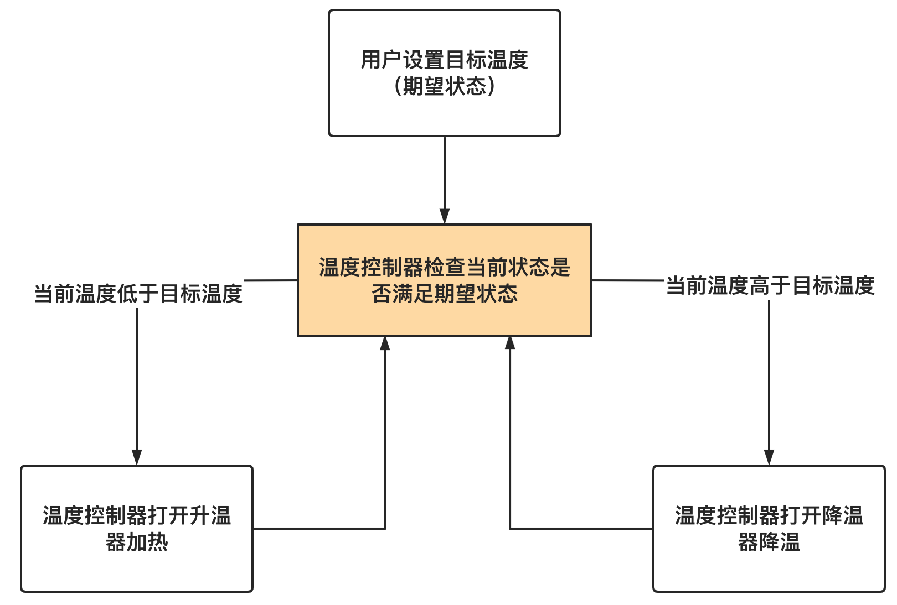

和上述提到的“温度自动调节器”类似，Kubernetes中的控制器（Controller）将会**监控当前集群中的状态，并努力使集群的当前状态满足用户设置的目标状态**。

### Pod Controller

Pod Controller，顾名思义，就是用于调节集群中当前Pod状态的Controller。下面，我们依次来介绍几种Kubernetes最常用的Pod Controller。

### Deployment

Deployment的主要作用是努力使当前集群中的Pod数量与用户期望的状态相同。

我们先来看一个简单的Deployment的YAML定义：

```yaml
apiVersion: apps/v1
kind: Deployment
metadata:
  name: nginx-deployment
spec:
  replicas: 3
  selector:
    matchLabels:
      kkk: hahaha
  template:
    metadata:
      labels:
        kkk: hahaha
        kubernetes: yyds
    spec:
      containers:
      - name: nginx
        image: nginx:1.14.2
        ports:
        - containerPort: 80
```

`apiVersion`、`kind`、`metadata`都是Deployment的元信息配置，与Pod中的写法非常类似，不再赘述。

`spec`中包含以下字段：
- `replicas`：表示“副本数”。即该Deployment将会管理多少个Pod。
- `selector`：选择器。表示该Deployment如何在集群中查找到它需要管理的Pod。`matchLabels`表示被打上`kkk: hahaha`这个标签的Pod将会被管理。
- `template`中的内容想必大家都很眼熟，这其实就是我们上面提到的一个典型的Pod的描述。

（可能上面的描述有点抽象，下面我们将举例说明）

将上述代码保存到本地文件中，例如`deployment.yaml`，然后执行`kubectl apply -f deployment.yaml`：

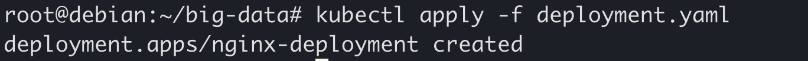

可以看到，一个名为`nginx-deployment`的Deployment被创建了。可以使用`kubectl get deployment`查看：

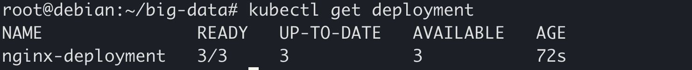

如果你得到的`AVAILABLE`的数量不是3，请耐心等一会儿。

同时，我们可以查看一下当前集群里的Pod：

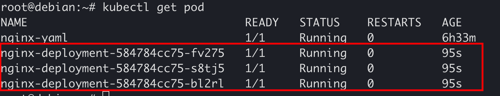

可以看到，集群新启动了3个Pod，其名称前缀都是`nginx-deployment`，说明它们就是被我们刚刚创建的Deployment创建的。下面具体讨论一下这个过程是怎样发生的：

1. `kubectl apply -f nginx-deployment.yaml`在Kubernetes集群中创建了一个名为`nginx-deployment`的Deployment。
2. 集群中的Deployment控制器发现了新创建的名为`nginx-deployment`的Deployment，然后尝试解析其中的内容。
3. Deployment控制器对Deployment的`spec.template`部分做hash，得到`pod-template-hash`的值，例如该值为`584784cc75`。
4. Deployment控制器发现这个Deployment中描述的Pod的副本数是3，并且发现选择器（`selector`）选取那些带有标签`kkk:hahahha`的Pod。于是，Deployment控制器尝试检索集群中同时带有标签`kkk:hahahha`和`pod-template-hash:584784cc75`的Pod数量，检查其是否是3个。
5. Deployment控制器发现上述Pod数量0，于是，根据`spec.template`中的定义创建3个Pod。

我们可以尝试删除其中上述Deployment中的某一个Pod，来模拟该Pod意外崩溃的情况：

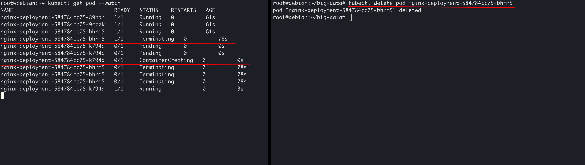

可以在到，在其中一个Pod被删除后（进入`Terminating`状态后），一个新的Pod立即被创建，补上了缺位。也就是说，Deployment将永远保证集群中，被打上`kkk:hahahha`和`pod-template-hash:584784cc75`标签的Pod的数量是3。

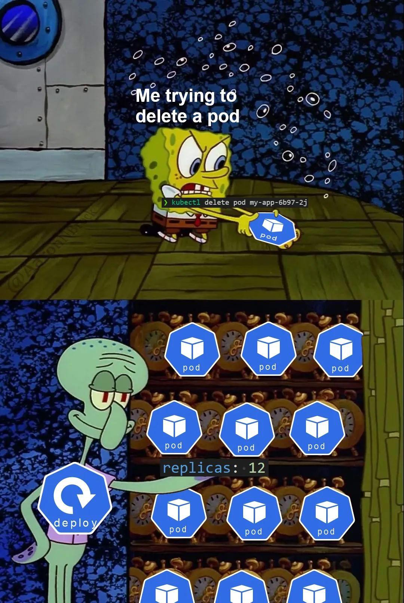

#### 更新Deployment

更新Deployment（比如更改Deployment中的副本数）非常简单，只需要编辑YAML文件，重新`apply`一下即可，例如修改`deployment.yaml`中的副本数为5：

```yaml
apiVersion: apps/v1
kind: Deployment
metadata:
  name: nginx-deployment
spec:
  replicas: 5
  selector:
    matchLabels:
      kkk: hahaha
  template:
    metadata:
      labels:
        kkk: hahaha
        kubernetes: yyds
    spec:
      containers:
      - name: nginx
        image: nginx:1.14.2
        ports:
        - containerPort: 80
```

`kubectl apply -f deployment.yaml`之后可以发现Pod数量增加到了5：

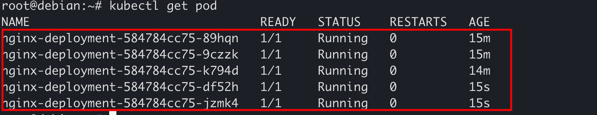

当然你也可以减小`spec.replicas`的值，比如从3减小到1，这时Deployment控制器会删除多余的Pod。

总结一下，Deployment控制器的工作原理与本节开头提到的温度控制器工作原理非常相似：

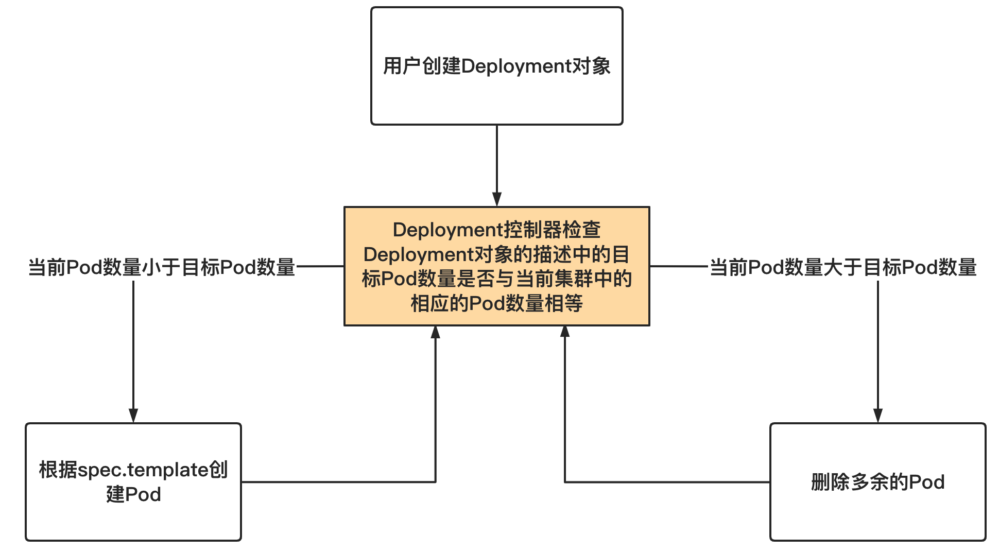

### 其他Pod Controller

#### Job

Job会创建一个或多个Pod，并确保指定数量的Pod成功终止。当Pod成功完成时，Job将追踪成功完成的情况。当达到指定的成功完成次数时，Job就完成了。删除一个Job将清除它所创建的Pod。Job一般用于定义并启动一个批处理任务。批处理任务通常并行（或串行）启动多个计算进程去处理一批工作项，处理完成后，整个批处理任务结束。

Kubernetes支持一下几种Job:

- 非并行Job: 通常创建一个Pod直至其成功结束
- 固定结束次数的Job: 设置`.spec.completions`，创建多个Pod，直到`.spec.completions`个Pod成功结束
- 带有工作队列的并行Job: 设置`.spec.Parallelism`但不设置`.spec.completions`，当所有Pod结束并且至少一个成功时，Job就认为是成功。

#### DaemonSet

DaemonSet用于管理在集群中每个Node上运行且仅运行一份Pod的副本实例，一般来说，在以下情形中会使用到DaemonSet：

- 在每个Node上都运行一个存储进程
- 在每个Node上都运行一个日志采集程序
- 在每个Node上都运行一个性能监控程序

#### StatefulSet

StatefulSet用来搭建有状态的应用集群（比如MySQL、MongoDB等）。Kubernetes会保证StatefulSet中各应用实例在创建和运行的过程中，都具有固定的身份标识和独立的后端存储；还支持在运行时对集群规模进行扩容、保障集群的高可用等功能。

## Service

Service可以将运行在一组Pods上的应用程序公开为网络服务，简单地实现服务发现、负载均衡等功能。

k8s的Pods具有自己的生命周期，同一时刻运行的Pod集合与稍后运行的Pod集合很有可能不同（如发生更新、node故障等），Pods的IP地址可能会随时发生变化。这就会导致一个问题：如果一组后端Pods为集群内其他前端Pods提供功能，那么前端Pods该如何找出并跟踪需要连接的IP地址？通过Service，能够解耦这种关联，方便的通过Service地址访问到相应的Pods，前端不应该也没必要知道怎么访问、访问到的具体是哪一个Pod。

Service一共有4种类型：

- ClusterIP：通过集群的内部 IP 暴露服务，选择该值，服务只能够在集群内部可以访问，这也是默认的 `ServiceType`。
- NodePort： 通过每个 Node 上的 IP 和静态端口（NodePort）暴露服务。NodePort 服务会路由到 ClusterIP 服务，这个 ClusterIP 服务会自动创建。通过请求 \<NodeIP\>:\<NodePort\>，可以从集群的外部访问一个 NodePort 服务。
- LoadBalancer：使用云提供商的负载局衡器，可以向外部暴露服务。外部的负载均衡器可以路由到 NodePort 服务和 ClusterIP 服务。仅作了解。
- ExternalName：通过返回 CNAME 和它的值，可以将服务映射到 externalName 字段的内容（例如，在集群内查找`my-service.my-namespace.svc`时，k8s DNS service只返回`foo.bar.example.com`这样的CNAME record）。没有任何类型代理被创建，网络流量发生在DNS层面。由于ExternalName要求kube-dns而我们使用的是coredns，也只作了解。

### 创建Service

Service通常通过selector（比如通过选取标签）来选择被访问的Pod。

继续沿用我们之前所创建的nginx-deployment。可以通过下列YAML文件创建Service (将下面的内容写入`service.yaml`)

```yaml
#service.yaml

apiVersion: v1
kind: Service
metadata:
  name: nginx-service
spec:
  ports:
    - port: 80
      targetPort: 80
      protocol: TCP
      name: anyway
  selector:
    kkk: hahaha
```

注意到，我们在`selector`中使用了标签`kkk: hahaha`。

解释一下`spec.ports`中的各个字段：

- port：Service暴露在集群IP上的端口。集群内通过\<clusterIP\>:\<port\>可以访问Service。
- targetPort：被代理的Pod上的端口。默认与port相同。
- protocol：Service暴露出来的这个端口所支持的通信协议，通常是`TCP`或`UDP`。
- name：端口名称，当Service具有多个端口时必须为每个端口提供唯一且无歧义的端口名称，具体内容写啥都行。

创建Service：

```
kubectl apply -f service.yaml
```

查看service `kubectl get svc` 或 `kubectl get service`

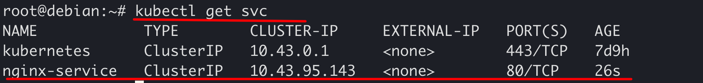

可以看到，第二个就是我们刚才创建的service，其中，它有一个cluster-ip：`10.43.95.143`。

验证是否可以通过Service访问Pod，注意，上述这个IP是“cluster-ip”，也就是说，它是一个集群内ip，因此，只能在集群中的机器上访问：

```shell
curl 10.43.95.143:80
```

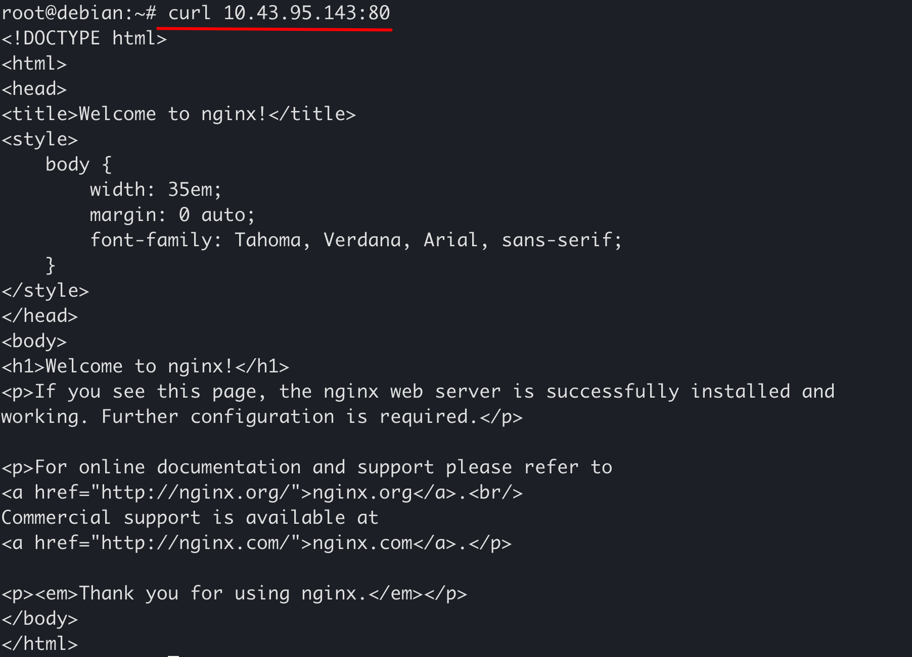

查看当前5个Pod的IP地址 `kubectl get pod -l kkk=hahaha -o wide`

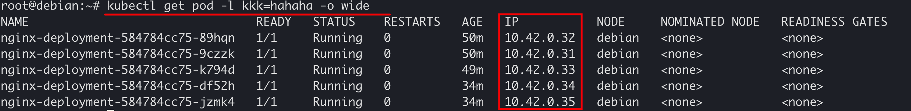

删除这5个Pod并等待Deployment重新创建`kubectl delete pod -l kkk=hahaha`。

可以看到重新创建的5个Pods的IP地址都已经发生变化：


但通过Service，仍能访问对应的Pod：

```bash
curl 10.97.91.103:80
```


### 暴露端口

之前创建的Service并没有指定类型，因此为默认的ClusterIP，只能在集群内部访问。如果需要将服务端口暴露在公网，可以使用NodePort类型。

将`service.yaml`修改为下面的内容

```yaml
#service.yaml

apiVersion: v1
kind: Service
metadata:
  name: nginx-service
  labels:
    svc: nginx-svc
spec:
  type: NodePort
  ports:
    - port: 80
      nodePort: 32180
      protocol: TCP
      name: anyway
  selector:
    kkk: hahaha
```

修改Service `kubectl apply -f service.yaml`

查看service `kubectl get svc nginx-service`

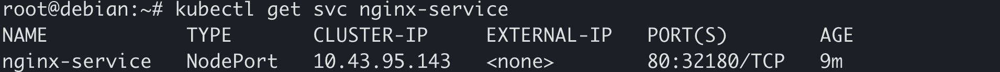

此时，从集群内任一节点IP的`32180`端口均可访问到该Service指定的Pod的80端口。

比如，你现在所使用的虚拟机的IP是`10.251.254.183`，那么，你在校园网内的任何一台机器上，执行`curl http://10.251.254.183:32180`，都能得到如下的输出：

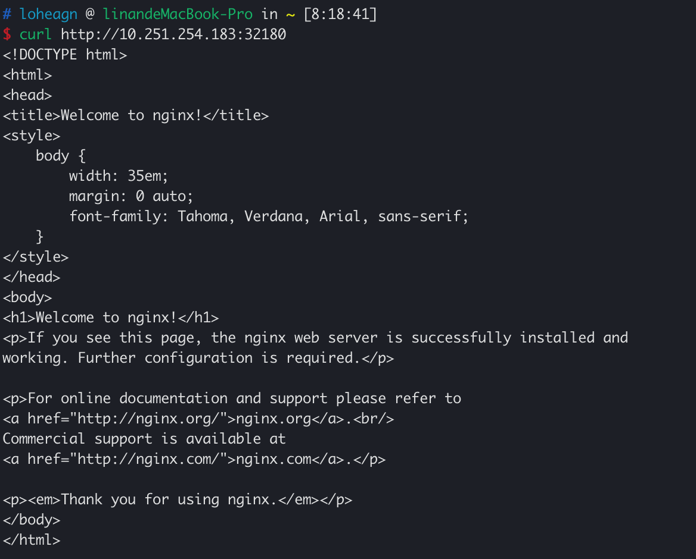

当然，你也可以使用浏览器访问：

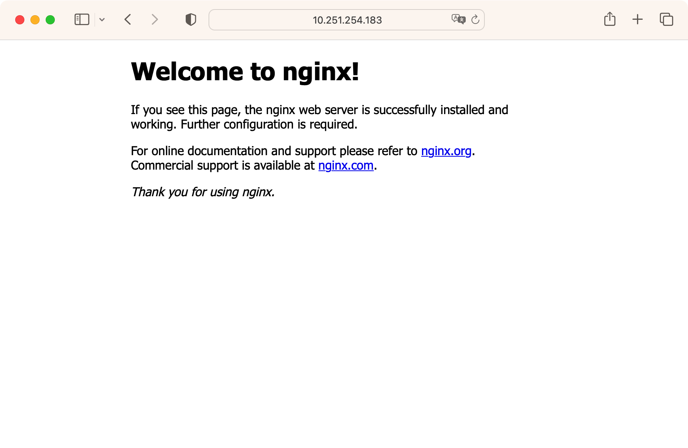

可以尝试删除Pods并等待新的Pods创建完成，仍可以通过上述方式访问。

## 实验报告模板

```md
# Kubernetes进阶实验报告

## 个人信息

姓名：
学号：

## 实验内容

### 使用Deployment管理Pod

#### 创建Deployment

<!-- 创建Deployment，观察Deployment创建的Pod -->
<!-- 请详细写出自己的操作步骤，并截图说明 -->

#### 模拟Pod崩溃

<!-- 手动删除Pod，观察集群中Pod的变化 -->
<!-- 请详细写出自己的操作步骤，并截图说明 -->

#### 弹性伸缩

<!-- 修改Deployment中的副本数，观察集群中Pod的变化 -->
<!-- 请详细写出自己的操作步骤，并截图说明 -->

### 使用Service暴露Pod的服务

#### 创建Service

<!-- 创建Service，并访问Service的IP，尝试分析Service和Pod的IP之间的关系 -->
<!-- 请详细写出自己的操作步骤，并截图说明 -->

#### 模拟Pod变化

<!-- 删除Pod后重新创建，观察Service的行为变化 -->
<!-- 请详细写出自己的操作步骤，并截图说明 -->
```