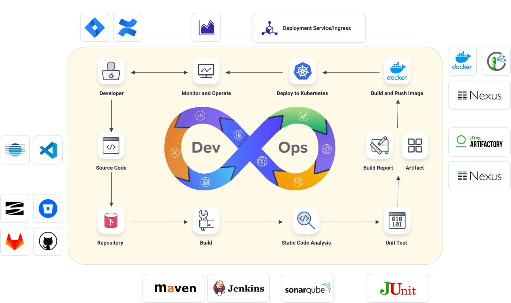

# PaaS 云平台课程设计 #

## 背景 ##

今天，大型单体应用正被逐渐分解成小的、可独立运行的组件，我们称之为微服务。微服务彼此之间解耦，所以它们可以被独立开发、部署、升级、伸缩。这使得我们可以对每一个微服务实现快速迭代，并且迭代的速度可以和市场需求变化的速度保持一致。每个微服务所需的资源都不会太多，也解决了日渐庞大的单体应用难以部署的问题。

然而，随着微服务的数目越来越多，管理和部署它们就变得越来越困难，不同的微服务还可能依赖不同的组件库。于是，容器技术和容器编排平台 k8s 横空出世。k8s 是集群的操作系统，帮助开发者纳管底层基础设施，内部实现的调度算法帮助运维团队获取更高的资源利用率。使用 k8s，开发者可以更方便地部署应用，并且可以通过设置副本来保持应用的高可用，k8s 还会对出错的容器组自动修复。

诚然 k8s 给运维带来了巨大的便利，但 k8s 在实际使用中仍然存在着一些痛点：
1. 搭建 k8s 集群的步骤比较繁琐
2. k8s 的操作接口仍不够友好，编辑并应用多个 yaml 文件，有时只为了完成一个操作
3. 功能不够全，还不足以满足实际使用的需要



如图所示，一个完整的开发流程应该包括：应用开发、代码托管、CI/CD、镜像托管、运行部署、观测告警等，k8s 主要提供的是“运行部署”的这部分功能。因此很多企业也根据 k8s 的以上痛点，在 k8s 之上搭建一些 PaaS 平台，借助 k8s 强大的资源管理能力，封装出更加人性化的用户接口，提供更多拓展的功能，以满足企业级应用的需要。比较有代表性的 PaaS 平台是 [kubesphere](https://www.kubesphere.io/zh/) 和 [openshift](https://docs.openshift.com/)。

在本次实践中，你们将负责为软件学院的老师同学们设计和实现一个云 PaaS 平台，它将容器化技术与 k8s 结合，为同学们提供一个便捷的方式来提交、编译、部署和运行他们的作业。这个平台的基本功能是将整个作业的生命周期从源代码提交到可运行的服务都自动化。除此之外，你也可以添加额外的租户管理、存储管理、DevOps、日志与监控告警等功能。

## 实验要求 ##

下面描述了 PaaS 平台的一些基础功能点和进阶功能点，希望同学们先专注于设计实现基础功能，等基础功能完成后再去挑战进阶功能，进阶功能为选做。

对于基础功能点，完成它的要求为：

编码实现，提供前端页面和后台逻辑，可以完整流畅地使用这个功能

对于进阶功能点，除了编码实现外，你也可以选择以下两种方式完成它：
1. 给出技术选型，可以使用原型图、架构图、流程图等形式，说明这一功能端到端的流程是怎样工作的。
2. 给出需求分析，编写用例表，并在表格中详细描述主要流程和子流程，给出数据规约，必要时提供活动图。

### 基础功能 ###

* **镜像管理**
  
  平台需要提供镜像管理功能，具体应包含以下用例：
  1. 学生可以在平台创建一个私有镜像，可以提供包含 Dockerfile 的源代码（可以是代码的压缩包，也可以是一个代码仓库地址等等），或可以提供镜像的压缩包，或可以直接让平台去拉取公共仓库里的镜像
  2. 学生可以浏览、删除自己的镜像，也可以提供一个 Dockerfile 修改某个镜像
  3. 平台还应该提供一个公共镜像库，内置一些非常常用的镜像，如：Nginx、MySQL、Redis、WordPress 等，让用户可以直接使用它们

    **Hint**：在镜像管理部分，可以自己在本地通过 Docker Image 管理，也可以考虑搭建一个私有的 [Docker Registry](https://docs.docker.com/registry/)

* **工作负载管理**
   
   学生将自己需要的镜像上传到平台后，还需要把它作为工作负载运行起来，应包含以下用例：
   1. 学生可以指定它们的名称、镜像、容器端口、环境变量，然后启动它们
   2. 学生可以查看工作负载列表，可以停止和删除一个工作负载，可以更新某个工作负载的镜像
   3. 通过 NodePort 或者 LoadBalancer 的方式将服务暴露给老师和助教，让他们可以通过外部地址来访问
   4. （进阶）在启动一个工作负载时，可以指定探针（Probe）、CPU内存配额、启动命令（CMD）、安全（Capabilities、SELinux、Apparmor）等高级设置

    **Hint**：从业务的角度来看，一个工作负载就是系统中的一层（前端、后端、数据库或者中间件）；从计算的角度来看，工作负载是集群调度的最小单位，对应 k8s 里面容器组（Pod）这个概念。k8s 为不同的工作负载提供不同的运行模式（Deployment、StatefulSet、Job 等），在你的平台中可以简单地用 Deployment 来统一概括它们。

* **大数据分析**
  
  这不是需要实现的功能用例，而是本次实践的一个子任务。在底层 k8s 上搭建一个 Hadoop 平台，并使用 Hive 等工具对指定的数据集进行分析。[指导书](/doc/cloud-labs/cloud/data_analysis/) 中给出了一个示例，以及本任务的实验要求。

### 进阶功能 ###

* **多租户管理**
  
  当平台用户越来越多后，就需要思考一些问题：如果用户镜像、容器命名冲突该如何解决？不同用户的容器之间网络是否连通，如果它们相互攻击该怎么办？
  为了解决这些问题，你可以实现以下功能：
  1. 老师和学生可以申请创建团队，每一位学生可以加入一个团队，各个团队的命名空间是相互隔离的，即：团队 A 和团队 B 都可以有名称为`nginx:latest`的镜像，而同一个团队内不能出现多个同名资源。
  2. 不同团队之间的 pod 应默认不可相互访问，用户可以主动对外暴露服务；在同一团队内，更细粒度的网络限制也可以实现。

    **Hint**：组织之间的命名隔离可以通过命名空间（namespace）实现，而网络隔离可以通过 k8s 提供的 NetworkPolicy 实现。

* **存储管理**
  
  默认情况下，容器内产生的数据是不会持久化保留的，而是随着容器的销毁而删除。平台可以为用户提供一些存储空间，并支持将用户的存储挂载到他的工作负载内。你可以实现以下功能：
  1. 用户可以创建持久卷（PersistentVolume）供容器使用，用户可以查看他的所有存储卷，也可以删除空闲的存储卷。
  2. 可以为用户提供一个树形的文件系统，作为他的个人空间，用户在这之中创建目录和文件，可以把子目录挂载到他的容器中。
    
    **Hint**：持久卷这个功能需要额外搭建一个 NFS 服务器来提供，而个人空间可以用 hostPath 的挂载方式来实现。

* **DevOps**
  
  上面提到，软件开发的完整流程还应该包括代码托管、CI/CD 等功能，可以使用户`git push`到部署上线的全流程自动化。
  1. 提供一个代码托管平台，应包含代码托管、版本控制等功能，并能够在 push、merge 等操作时主动触发一些操作。
  2. 提供一个webhook，当用户 push 或 merge 代码时，可以触发集成测试或者编译打包成 Docker 镜像的功能。
    
    **Hint**：Gitlab 可以私有化部署，它包含基本功能，也能够触发 webhook；Jenkins 可以对外提供 webhook，当被调用时就会自动拉取仓库代码并开始执行集成测试或编译操作。

* **日志与监控告警**
  
  用户不可能每时每刻都了解到应用的运行情况，因此平台要能够自动监测到异常情况，并实时通知用户。应用运行过程中会产生大量的日志，平台应当能够收集这些日志供用户过滤和查询。
  1. 提供宿主机和 Pod 的实时性能检测，包括 CPU 使用率、内存等指标，设置一些阈值，达到阈值则生成告警信息发送给管理员或用户。
  2. 平台可以收集并存储容器主进程的运行输出，以及 Pod 的各种事件；把它们作为日志提供给用户查看。
    
    **Hint**：主机的性能观测可以通过查看`/proc`目录实现，Pod 的性能观测可以通过 k8s 提供的功能实现；`kubectl logs`命令查看容器的输出。

希望同学们在实现上述功能的过程中加深对 k8s 各项概念的理解，并体会云计算为应用的发布和运维带来的便利。

开发过程中，需要使用到 k8s 和 Docker Engine 对外提供的 API，可以直接调用他们的 OpenAPI，也可以使用官方或第三方封装好的Client SDK。

[K8S 的 OpenAPI](https://kubernetes.io/zh/docs/concepts/overview/kubernetes-api/) 描述文件可以在 [这里](https://github.com/kubernetes/kubernetes/blob/master/api/openapi-spec/swagger.json) 找到，[这里](https://kubernetes.io/zh/docs/reference/using-api/client-libraries/) 列出了比较流行的一些 k8s 客户端库。

Docker 的 OpenAPI 描述文件可以在 [这里](https://docs.docker.com/engine/api/v1.41/#) 找到，[这里](https://docs.docker.com/engine/api/sdk/) 列出了比较流行的一些 Docker 客户端库。


## 总结 ##

通过这个云 PaaS 平台的设计和实现，希望大家能够深入理解云计算、容器化技术和 Kubernetes 的应用，同时提供一个方便的方式来管理和运行应用。这将为大家提供实际的技术和工程经验，为云原生领域的职业发展打下坚实的基础。

## 附录 ##
本次实验的虚拟机是一个纯净的 Ubuntu 20.04，因此附录中提供一个从零搭建多节点 k3s 集群的教程。

### 安装 Docker
在三台机器上，下载脚本来安装 docker
```bash
curl -o get-docker.sh https://get.docker.com/
sh get-docker.sh --mirror Aliyun
sudo usermod -aG docker buaa
```

重新打开终端，检测是否能正常使用 docker 命令
```bash
docker ps
```

后续启动 k3s 时使用 `--docker` 选项激活。

### 安装 k3s
#### 主节点
选定一台机器为主节点（server），切换至 root 用户，执行以下步骤安装 k3s

通过环境变量设置主节点的安装配置，注意需要将下面命令的`MASTER_IP`改成你自己的
```bash
# 指定主节点 ip 地址
export MASTER_IP="10.251.xx.xx"

# 暴露主节点 ip 地址，指定 docker 为容器运行时
export INSTALL_K3S_EXEC="--tls-san $masterIP --node-external-ip $masterIP --docker"

# https://docs.rancher.cn/docs/k3s/installation/installation-requirements/_index#先决条件
# 为您添加到集群的每个节点设计一个独特的名称
export K3S_NODE_NAME=k3s-node-01
```

执行安装命令
```bash
curl -sfL https://rancher-mirror.oss-cn-beijing.aliyuncs.com/k3s/k3s-install.sh | INSTALL_K3S_MIRROR=cn sh -s -
```

#### 从节点
在主节点上查看集群秘钥（token）
```bash
cat /var/lib/rancher/k3s/server/node-token
# K10b39ba4810ab35694b4997c13279343e4648fae3a9313dc7d9ed8f2fcc7e0a6e6::server:59fd23c48038432c44dfe5abcabf4b41
```
通过环境变量设置从节点（agent）的安装配置，注意需要将下面命令的`MASTER_IP`改成你自己的，修改`<编号>`，再将上面这个密钥填入`K3S_TOKEN`中
```bash
# 指定主节点 ip 地址
export MASTER_IP="10.251.xx.xx"

# 指定 docker 为容器运行时
export INSTALL_K3S_EXEC="--docker"

# https://docs.rancher.cn/docs/k3s/installation/installation-requirements/_index#先决条件
# 为您添加到集群的每个节点设计一个独特的名称
export K3S_NODE_NAME=k3s-node-<编号>

###
# agent 需加上，其他保持一致
###
# 设置主节点的 ip 地址
export K3S_URL=https://$MASTER_IP:6443
# 用于将 server 或 agent 加入集群的共享秘钥
export K3S_TOKEN=""
```

执行安装命令
```bash
curl -sfL https://rancher-mirror.oss-cn-beijing.aliyuncs.com/k3s/k3s-install.sh | INSTALL_K3S_MIRROR=cn sh -s -
```

#### 验证安装
在主节点上查看集群的信息，可以看到三个节点都显示在列表中
```bash
$ kubectl get nodes -owide
NAME          STATUS   ROLES                  AGE   VERSION        INTERNAL-IP      EXTERNAL-IP   OS-IMAGE             KERNEL-VERSION     CONTAINER-RUNTIME
k3s-node-03   Ready    <none>                 28m   v1.27.4+k3s1   10.251.253.231   <none>        Ubuntu 20.04.2 LTS   5.4.0-65-generic   docker://24.0.6
k3s-node-02   Ready    <none>                 33m   v1.27.4+k3s1   10.251.253.184   <none>        Ubuntu 20.04.2 LTS   5.4.0-65-generic   docker://24.0.6
k3s-node-01   Ready    control-plane,master   57m   v1.27.4+k3s1   10.251.253.216   <none>        Ubuntu 20.04.2 LTS   5.4.0-65-generic   docker://24.0.6
```

#### 失败回滚
如果在安装的过程中，不慎操作失误使安装失败，可以执行以下脚本来卸载已安装组件

在主节点上执行
```bash
/usr/local/bin/k3s-uninstall.sh
```

在从节点上执行
```bash
/usr/local/bin/k3s-agent-uninstall.sh
```

如果提示该脚本不存在，则组件已经卸载完毕

### 安装 Helm

下载二进制包并安装
```bash
# 下载 helm 的安装包
wget https://scs.buaa.edu.cn/scsos/public/helm-v3.12.3-linux-amd64.tar.gz
# 解压缩
tar xzf helm-v3.12.3-linux-amd64.tar.gz
# 安装 helm
sudo cp ./linux-amd64/helm /usr/local/bin
```

测试 `helm` 命令是否可用
```bash
$ helm ls --all-namespaces
NAME            NAMESPACE       REVISION        UPDATED                                 STATUS          CHART                           APP VERSION
traefik         kube-system     1               2023-09-08 08:26:06.219522631 +0000 UTC deployed        traefik-21.2.1+up21.2.0         v2.9.10    
traefik-crd     kube-system     1               2023-09-08 08:26:03.997633578 +0000 UTC deployed        traefik-crd-21.2.1+up21.2.0     v2.9.10 
```
