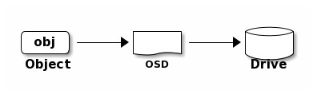

# Lab03 Ceph 存储集群实践

## 实验目的

1. 了解 Ceph 存储的基本工作原理

2. 建立对分布式存储的初步认识

## 实验说明

1. 按照实验指南的指导，完成实验。

2. 按照实验报告模板，撰写实验报告，将重要的实验步骤截图，填入实验报告中，并回答相应问题。

本次实验以小组形式进行，虚拟机已分发至每位同学的账户中，**每组三台**虚拟机，实验报告由每组一位同学提交即可。

请在云平台作业提交截止时间之前，将作业提交到云平台，命名为：`lab03-组号.pdf`的格式。

建议每组同学共同完成本次实验。

**实验中遇到的困难请及时在课程微信群中抛出。** 除本指导书外，实验的主要的参考资料还包括：[Ceph 官方文档](https://docs.ceph.com/en/pacific/)、[Ceph 部署指南](https://access.redhat.com/documentation/en-us/red_hat_ceph_storage/5/html/installation_guide/index)、互联网上的技术博客等。

## 概述

Ceph(读音 /ˈsɛf/) 是一个分布式的存储集群。什么是分布式存储？我们为什么需要它？

试想，你在搭建了一个网站对外提供服务。用户在使用网站的过程中会存储大量的数据，网站运行过程中也会产生大量的日志信息。

最初，你将网站部署在一个装有 500G 硬盘的服务器上。随着时间的流逝，500G 的硬盘逐渐被填满。现在你有两种选择。

1. 纵向拓展。在服务器上加装硬盘，甚至你可以使用 LVM 将硬盘无缝拓展到原来的文件系统中，上层应用和用户根本看不出来有任何差别。但随着数据量的进一步积累，加装的硬盘还会被填满。即使你将服务器的硬盘槽位都插满，最终还是无法解决数据量逐渐增大的问题。数据是无限的，一台机器能承受的数据量总是有限的，氪金也无法解决这个问题。

2. 横向拓展。买一台新的服务器，用网线把它和原来的服务器连起来，把原来的服务器存不下的数据存储到这台新的服务器上。当需要使用到这些数据时，再从新的服务器上取出来。当第二台服务器被填满后，再添加新的服务器。

第二种看起来是最可行的方法：随着业务的扩展，继续加机器就可以了。这种由多台网络互通的机器组成的存储系统即可被理解为“分布式存储系统”。

但随着机器数量的增加，整个系统的复杂度也在上升。新的多机器系统会表现出与原来的单机系统很多不同的特性，会带来更多的问题，比如：

- 如何划分数据？也就是说，如何决定网站接收的某份数据该存储到哪台机器上？每台机器的存储容量可能不同，存储性能也可能不同，如何平衡每台机器的存储容量？

- 如何获取数据？我们将数据保存在不同的机器上时，通常保存的不是一个完整的文件，而是经过一个个切分后的数据块，每个数据块可能保存在不同的机器上。当获取数据时，我们需要知道要获取的文件包含哪些数据块，每个数据块存放在哪台机器的哪个位置。随着机器数量和数据量的增加，这不是一个简单的任务。

- 随着机器数量的增加，系统发生故障的概率也在增加。仅对硬盘而言，我们假设每块硬盘在一年中发生故障的概率是 1%，对于普通消费者而言，这似乎不是什么问题，这种故障可能在硬盘的整个使用周期内都不会发生；但对于一个包含几百块硬盘的存储系统来说，这意味着几乎每天都会有若干块硬盘发生故障，而每块硬盘的故障都有可能造成系统的宕机和数据损失。因此，分布式存储系统必须有较强的容错能力，能够在一定数量的机器崩溃时，仍能对外提供服务。

- ……

上面这些问题，正是 Ceph 这类分布式存储系统所要解决的问题。简单来说，Ceph 是一个能将大量廉价的存储设备统一组织起来，并对外提供统一的服务接口的，提供**分布式**、**横向拓展**、**高度可靠性**的存储系统。



对分布式系统感兴趣的同学，可以趁下学期或大四空闲的时候听一下[MIT 6.824](https://pdos.csail.mit.edu/6.824/)的课程，并尽量完成它的全部实验。

在互联网上搜索“MIT 6.824”能得到大量的资料，比如，B 站上有[翻译好的熟肉](https://www.bilibili.com/video/BV1R7411t71W)。



除此之外，Ceph 的独特之处还在于，它在一个存储系统上，对外提供了三种类型的访问接口：

- 文件存储。简单来说，你可以将 Ceph 的存储池抽象为一个文件系统，并挂载到某个目录上，然后像读写本地文件一样，在这个新的目录上创建、读写、删除文件。并且该文件系统可以同时被多台机器同时挂载，并被同时读写。从而实现多台机器间的存储共享。

- 对象存储。Ceph 提供了对象存储网关，并同时提供了 S3 和 Swift 风格的 API 接口。你可以使用这些接口上传和下载文件。

- 块存储。Ceph 还能提供块存储的抽象。即客户端（集群外的机器）通过块存储接口访问的“所有数据按照固定的大小分块，每一块赋予一个用于寻址的编号。”客户端可以像使用硬盘这种块设备一样，使用这些块存储的接口进行数据的读写。（一般这种块设备的读写都是由操作系统代劳的。操作系统会对块设备进行分区等操作，并在其上部署文件系统，应用程序和用户看到直接看到的是文件系统的接口（也就是文件存储））。


需要注意的是，虽然 Ceph 对外提供了上面这三种不同类型的存储接口，但其底层会使用相同的逻辑对接收的数据进行分块和存储。

**思考题1：查阅资料，谈谈对象存储和文件系统之间有哪些区别？**

## 重要概念

一个 Ceph 集群必须包含三种类型的进程：Monitor、OSD 和 Manager。其中，Monitor 和 OSD 是最核心的两类进程。

### Monitor 和 OSD

Monitor 进程负责维护整个系统的状态信息，这些状态信息包括当前的 Ceph 集群的拓扑结构等，这些信息对 Ceph 集群中各个进程的通信来说非常关键。除此之外，Monitor 进程还负责充当外界与 OSD 进程交流的媒介。

OSD 进程则负责进行真正的数据存储。如下图所示，外界传送给 Ceph 集群的数据（不管是通过文件存储、对象存储还是块存储的接口）都将被转化为一个个对象（object）。这些 object 将经由 OSD 进程存储到磁盘中。



简单来说，当一个 Client 试图向 Ceph 集群读写数据时，将发生以下步骤：

1. Client 向 Monitor 进程请求一个 token 校验信息

2. Monitor 生成 token 校验信息，并将其返回给 Client

3. Monitor 同时会将 token 校验信息同步 OSD 进程

4. Client 携带着 Monitor 返回的 token 校验信息向对应的 token 发送数据读写请求

5. OSD 进程将数据存储到合适的位置，或从合适的位置读出数据

6. OSD 进程向 Client 返回数据



以上读写数据的流程是经过极致简化的，主要是为了帮助大家建立对 Monitor 进程和 OSD 进程所起的作用的感性认识。

想要了解详情，请阅读[Ceph 的文档 - Architecture](https://docs.ceph.com/en/pacific/architecture/)。



### Manager

Manager 进程主要负责跟踪当前集群的运行时状况，包括当前集群的存储利用率、存储性能等等。同时，它还负责提供 Ceph Dashboard、RESTful 接口的外部服务。



需要注意的是，Ceph 集群中有**三类**这样的进程，但不是每个进程只有**一个**。

我们之前提到过，Ceph 是一个有很高容错性的分布式系统，而达到高容错性的一个很重要的方式就是“**冗余**”。

比如，对于 Monitor 进程来讲，集群中仅有一个就够用了。但如果运行这一个 Monitor 进程的机器挂了，那么整个集群就会瘫痪（Client 将不知道该跟谁通信来拿到校验信息和集群状态信息等）。因此，一个高可用的 Ceph 集群中会包含多个执行几乎相同任务的运行在不同机器上的 Monitor 进程；这样挂了一个，Client 还可以跟剩下的通信，整个集群依旧可以正常对外提供服务。同样的道理，OSD 进程和 Manager 进程也有多个副本。

另外，Ceph 为了保证数据的可靠性（也就是说 Client 存储进来的数据不能丢失）——注意区分其与整个系统可靠性的区别——在默认情况下，会将每份数据存储**3 份**，每份都会存储在不同的 OSD 上（鸡蛋不能放到同一个篮子里）。这样，即使有部分 OSD 挂掉，也能保证大部分数据不会丢失。因此，一个健康的 Ceph 集群要求至少同时存在三个健康的 OSD 进程（当然，这个默认的数值可以更改）。



请查阅 Ceph 的相关文档。

## 实验环境介绍
本次实验发给大家了三台 Centos 7 虚拟机。它们的命名格式为`ceph-<学号>`，如`ceph-20210000`。



在实验开始前，你需要保证这三台虚拟机处于开机状态、用`buaalogin`连接互联网，并且设置它们的主机名与名称一致。

例如在`ceph-20210000`机器上，你需要执行（设置后必须重启生效）
```bash
echo 'ceph-20210000' > /etc/hostname
reboot
```

注意每台机器的主机名**不能相同**。



## Ceph 部署

本节内容的目标是创建一个可用的 Ceph 集群。其中包括，至少一个 Monitor 进程、至少一个 Manager 进程、至少三个 OSD 进程。

Ceph 官方提供了[多种部署方式](https://docs.ceph.com/en/pacific/install/)。

在本实验文档中，我们采用 [Cephadm](https://docs.ceph.com/en/pacific/cephadm/#cephadm) 作为部署工具。Cephadm 也是官方推荐的部署和管理 Ceph 集群的工具，它不仅可以用来部署 Ceph，还可以在安装完成后，用来管理集群（添加和移除节点、开启 rgw 等）。

### Cephadm 介绍

Cephadm 是基于“容器技术（Container）”进行工作的，每个 Ceph 的工作进程都运行在相互隔离的容器中。Cephadm 支持使用 Docker 和 Podman 作为容器运行时。在部署时，Cephadm 将首先检查本机中安装的容器运行时类型，当 Docker 与 Podman 并存时，将首先使用 Podman（毕竟 Podman 也是 Red Hat 的产品）。

在部署时，Cephadm 会首先在本地启动一个 mini 的 Ceph 集群，其中包括 Ceph 集群最基本的 Monitor 进程和 Manager 进程（当然，这两个进程都是通过容器形式运行起来的）。这个 mini 集群在某种程度上来说也是合法的，只不过其基本不能对外提供任何功能。随后，我们将继续使用 Cephadm 提供的工具，将其他机器（后文中也会称之为“节点”）加入到集群中（也就是在其他节点中启动 Ceph 的 Monitor、Manager、OSD 等进程），从而构建一个完整可用的集群。

下面是 Red Hat 给出使用 Cephadm 构建的集群的架构图。


图中的“Container”指的就是我们上面所说的“容器”。

图中最左边的 Bootstrap Host 就是我们执行 Cephadm 相关命令的机器（事实上，在整个集群的构建过程中，除了修改 IP 和联网等操作外，我们都只会在这个 Bootstrap Host 上进行操作）。我们在 Bootstrap Host 执行的针对其他节点的操作，都是 Cephadm 通过 ssh 的方式发送给对应节点的。

这个图目前大家心里有个印象就好，在后续的实验操作中，可以反复回来对照检查。



给大家提供的机器上已经安装好Cephadm，大家无需自行安装

在后续操作前，请务必保证所有机器已经连接**互联网**。

基于 Cephadm 的便捷性，后续的操作只需要在**选定的一台**机器（我们把这台机器称为 Bootstrap Host、主节点）上执行即可。



### BootStrap

我们首先需要在一台选定的机器上，使用`cephadm`启动一个 mini 集群。

```bash
cephadm --image scs.buaa.edu.cn:8081/library/ceph:v16 bootstrap  --mon-ip *<mon-ip>*
```

请将`*<mon-ip>*`替换为你执行这命令的机器的 IP。如：

```bash
cephadm --image scs.buaa.edu.cn:8081/library/ceph:v16 bootstrap  --mon-ip 10.251.252.182
```

上面这条命令中，`--image`制定了 Cephadm 启动容器时使用的镜像名称，`--mon-ip`指定了 Cephadm 要在哪个机器上启动一个 mini 集群。

更详细地，这条命令将会做如下事情：

> - Create a monitor and manager daemon for the new cluster on the local host.
>
> - Generate a new SSH key for the Ceph cluster and add it to the root user's /root/.ssh/authorized_keys file.
>
> - Write a copy of the public key to /etc/ceph/ceph.pub.
>
> - Write a minimal configuration file to /etc/ceph/ceph.conf. This file is needed to communicate with the new cluster.
>
> - Write a copy of the client.admin administrative (privileged!) secret key to /etc/ceph/ceph.client.admin.keyring.
>
> - Add the \_admin label to the bootstrap host. By default, any host with this label will (also) get a copy of /etc/ceph/ceph.conf and /etc/ceph/ceph.client.admin.keyring.

命令执行完成后，我们可以通过`ceph -s`查看当前集群的状态。


可以看到，确实启动了一个 Monitor 进程和一个 Manager 进程。

另外，我们还注意到，当前集群的健康状态是`HEALTH_WARN`，原因下面也列出来了：`OSD count 0 < osd_pool_default_size 3`。这是因为当前 Ceph 集群默认的每个 Pool 的副本数应该是 3（即，Ceph 中存储的每份数据必须复制 3 份，放在 3 个不同的 OSD 中），但我们 OSD 的进程数是 0。不用着急，马上我们就会创建足够的 OSD 进程（主节点和另外两台主机都为他们创建 OSD 进程）。

### Ceph Dashboard

注意看`bootstrap`指令的输出，你可以看到一段这样的内容：


显然，这是在告诉我们，cephadm 同样启动了一个`Ceph Dashboard`，这是一个 Ceph 的管理前端。通过访问这个页面，我们就可以以可视化的方式观察到当前集群的状态。

在内网环境中，签发 SSL 证书的过程太过繁琐，我们可以手动禁用 SSL：

```bash
ceph config set mgr mgr/dashboard/ssl false
```

禁用 SSL 后，Dashboard 服务将默认监听 8080 端口。但在 CentOS 中，8080 端口默认是被防火墙屏蔽的。

你可以选择手动打开防火墙的 8080 端口；也可以像下面这样，将 Dashboard 服务的监听端口手动改为 8443（因为这个端口就是使用 HTTPS 时 Dashboard 的监听端口，在刚才的 Bootstrap 时已经在防火墙中打开了）：

```bash
ceph config set mgr mgr/dashboard/server_port 8443
```

然后，重启该 Dashboard 服务，使刚才的配置生效。

```bash
ceph mgr module disable dashboard
ceph mgr module enable dashboard
```

然后，查看当前的服务状态（如果输出为空的话，耐心多等一会儿）：

```bash
ceph mgr services
```


访问`"dashboard"`后面的网址，如果它仍为`https`开头，则需要手动改成`http`开头。

现在，你应该可以正常访问 Dashboard 服务了。注意，用户名和密码是我们前面提到的 Bootstrap 命令输出的那堆信息中提到的。


如果你忘记了密码，则可以用以下方式将 admin 账户的密码重置为`@buaa21`
```bash
echo '@buaa21' > passwd.txt
ceph dashboard set-login-credentials admin -i passwd.txt
```

### 添加其他节点

接下来，我们将把其他机器添加到现有的这个 mini 集群中来。



再次提醒：执行接下来步骤之间，请保证其他节点已连接互联网。以下命令均在主节点上执行。



前面提到过，cephadm 是通过 ssh 协议与其他机器通信的。所以，这里需要首先把主节点的公钥 copy 到其他的所有机器：

```bash
ssh-copy-id -f -i /etc/ceph/ceph.pub root@*<new-host>*
```

例如，你的另一台机器的 IP 是`10.251.252.177`，那么这条命令应该是：

```bash
ssh-copy-id -f -i /etc/ceph/ceph.pub root@10.251.252.177
```

处理完所有的机器后，就可以正式将它们加入到 mini 集群中来了：

```bash
ceph orch host add *<newhost>* [*<ip>*] [*<label1> ...*]
```

例如，你另一台机器的主机名是`ceph-20210001`，IP 是`10.251.252.177`，那么这条命令应该是：

```bash
ceph orch host add ceph-20210001 10.251.252.177
```

添加完成后，你可以通过`ceph -s`查看当前集群状态的变化。也可以通过 Ceph Dashboard 看到变化。

### 创建 OSD 进程

我们知道，OSD 进程是真正用来做数据读写的进程。我们可以用一块专门的磁盘交给 OSD 进程来读写数据，ceph 集群所存储的数据就将保存在这些磁盘中。

这些被用来交给 OSD 进程管理的磁盘，应该满足以下条件：

> - The device must have no partitions.
>
> - The device must not have any LVM state.
>
> - The device must not be mounted.
>
> - The device must not contain a file system.
>
> - The device must not contain a Ceph BlueStore OSD.
>
> - The device must be larger than 5 GB.

简单来说，就是将一块干净的磁盘插入机器后，什么都不用做就好。

在实验提供的虚拟机中，每台机器都额外插入了一块这样干净的磁盘。

可以通过`fdisk -l`来查看：


注意看上面这两块磁盘：

- 第一个名称是`/dev/sda`，容量是 16G，有两个分区：`/dev/sda1`，`/dev/sda2`。这就是我们现在在使用的这个系统所用的磁盘，系统数据都存储在这个磁盘中。

- 第二个名称是`/dev/sdb`，容量是 10G，没有任何分区。这就是我们即将交给 OSD 管理的磁盘。

使用下面的命令来创建 OSD 进程：

```bash
ceph orch daemon add osd *<hostname>*:*<device-name>*
```

比如，你要在主机 `ceph-20210000` 的名称为`/dev/sdb`的磁盘上创建 OSD 进程，那么命令应该是：

```bash
ceph orch daemon add osd ceph-20210000:/dev/sdb
```



这条命令默认不会有输出创建 OSD 进程的详细信息，也就是说，如果该命令很耗时的话，那么你将在什么输出都没有的情况下等待较长时间，这可能令人发慌。你可以加上`--verbose`参数，来让它输出详细信息。

比如：

```bash
ceph orch daemon add osd ceph-20210000:/dev/sdb --verbose
```



使用同样的方法，将所有节点的附加硬盘都加入进来。至此，我们可以再使用 `ceph -s` 查看当前集群的状态。

**任务1：集群安装完毕后，将 Dashboard 和 `ceph -s` 的结果截图**


大量保存在 Ceph 中的文件、对象、块数据会被分割成为成千上万个默认大小为 4MB 的对象（Objects）。为了方便管理这些对象，Ceph 通过简单的哈希算法将每个对象映射至一个归置组（PG，Placement Group）中，就像把文件放入文件夹，PG 的数量可以少至几百个，数据的再平衡、迁移等操作以整个 PG 为单位进行。通过 [CRUSH 算法](https://scs.buaa.edu.cn/scsos/ceph/weil-crush-sc06.pdf) 将 PG 和 OSD 进行绑定，为了提高容错性，生产环境下一个 PG 至少与 3 个不同的 OSD 绑定，一个 OSD 上的 PG 总数不超过 100 个，整个集群的 PG 总数必须为 2 的幂。

**思考题2：假设你管理一个含有 4 个 OSD 的生产集群，在满足上述条件的情况下，集群中的 PG 总数最多为多少？**

## Ceph Filesystem

[参考资料: CEPH FILE SYSTEM](https://docs.ceph.com/en/latest/cephfs/)

Ceph 文件系统 (Ceph FS) 是个 POSIX 兼容的文件系统，它使用 Ceph 存储集群来存储数据。 Ceph 文件系统与 Ceph 块设备、对象存储或者原生库 (librados) 一样，都使用着相同的 Ceph 存储集群系统。

Ceph 文件系统要求 Ceph 存储集群内至少有一个 Ceph 元数据服务器 MDS。

### 部署 CephFS

以上其实都是在搭建 Ceph 集群的环境，我们添加了 3 个 OSD 进程组建起了 Ceph Cluster。接下来，我们便可以在此基础上来具体地使用到 Ceph 所提供的分布式存储能力，从 Ceph 文件系统 CephFS 开始~

查看各个节点的主机名

```bash
ceph orch host ls
```

输入类似如下
```
# 可有类似输出
HOST   ADDR      LABELS  STATUS
host1  10.1.2.3
host2  10.1.2.4
host3  10.1.2.5
```





创建 CephFS 的前提是需要至少一个的 MDS daemon 元数据服务器守护进程。其实以下的一条命令即可自动地创建好 MDS daemon、Pool 等：

```bash
ceph fs volume create <fs_name> [--placement="<placement spec>"]
```

其中，`fs_name` 是 CephFS 的名称，后面的 `--placement` 为可选参数，可以通过它来指定 daemon container 跑在哪几个 hosts 上（[参考资料](https://docs.ceph.com/en/latest/cephfs/fs-volumes/)
）。例如：
```bash
ceph fs volume create ceph_fs --placement="ceph-01-20210000,ceph-02-20210000,ceph-03-20210000"
```





[参考：下列命令的一些具体参数含义](https://amito.me/2018/Pools-and-Placement-Groups-in-Ceph/)

```bash
ceph osd pool create cephfs_data 8 8 # 后面的数量可以调，设大了会无法创建，数值和osd的数量有关，需要是2的倍数
# pool 'cephfs_data' created

ceph osd pool create cephfs_metadata 8 8
# pool 'cephfs_metadata' created

ceph fs new cephfs cephfs_metadata cephfs_data
# new fs with metadata pool 3 and data pool 2

ceph fs ls
# name: cephfs, metadata pool: cephfs_metadata, data pools: [cephfs_data ]

ceph orch apply mds cephfs --placement="3 node1 node2 node3" # 应用部署CephFS
```





于是，我们便创建成功了 CephFS。

你可能会想到如何删除 CephFS，Ceph 中非常“贴心”地防止你误删除，所以删除起来会有一些麻烦。

```bash
ceph fs volume rm <fs_name> [--yes-i-really-mean-it] # 要加上这么一长串后缀，但这样其实还是没法删除
ceph config set mon mon_allow_pool_delete true # 还需要通过这条命令修改ceph config配置
```



- 通过 `rados df` 命令可查看刚才创建的资源池 Pool 的相关信息。
- `ceph fs ls` 可列出 CephFS。
- `ceph fs status` 可查看 CephFS 状态，验证当前已有至少一个 MDS 处在 Active 状态。
- 还可经常性地执行 `ceph -s` 查看 Ceph 集群的状态。



### 挂载 CephFS

[参考资料：MOUNT CEPHFS USING FUSE](https://people.redhat.com/bhubbard/nature/default/cephfs/fuse/)

CephFS 在创建后应当能被实际使用，如完成分布式存储文件的任务。在这一步，我们将把 CephFS 挂载到 **Client 端**，让 Client 能够创建和存储文件。你需要选择除主节点**之外**的任意一台机器作为 Client 端。

我们先要对 Client 端进行一些配置，保证 Client 端能连接到主节点。

第一步：给 Client 端创建一个最小配置文件，放置在 /etc/ceph 目录下：



**这一步操作高危！**

以防万一，请先执行两个操作：

1.  在两台机器上执行`cat /etc/ceph/ceph.conf > /etc/ceph/backup_ceph.conf` 备份原来的 `ceph.conf`
2.  在 cephadm shell (即主节点) 里面，用 `ceph config generate-minimal-conf` 生成 config，将生成出来的内容也保存备份一下 (复制粘贴+截图大法 / 重定向输出)



在 Client 端执行（将`{mon-host}`替换成主节点的 IP 地址）

```bash
# on client host
mkdir /etc/ceph
ssh root@{mon-host} "sudo ceph config generate-minimal-conf" | sudo tee /etc/ceph/ceph.conf
chmod 644 /etc/ceph/ceph.conf # 赋权
```

如果不能成功，可直接到主节点执行 `sudo ceph config generate-minimal-conf`，将输出的内容粘贴到 Client 端的 `/etc/ceph/ceph.conf`（下同）。如果上述操作导致 Client / 主节点挂了，多半是 `/etc/ceph/ceph.conf` 被误清空了，将先前备份的 `ceph.conf` 写回即可恢复。

第二步：生成 CephX 用户名和密钥（将`{mon-host}`替换成主节点的 IP 地址）:

```bash
# on client host
ssh root@{mon-host} "sudo ceph fs authorize ceph_fs client.foo / rw" | sudo tee /etc/ceph/ceph.keyring
chmod 600 /etc/ceph/ceph.keyring # 赋权
```

在上述命令中，`ceph_fs` 是先前所创建的 CephFS 的名称，请将其替换。foo 是 CephX 的用户名，也可自己起。

以上是前置准备，完成后，我们可通过 ceph-fuse 工具实现目录挂载。如机器上没有，则需要连网安装一下。

```bash
yum install -y ceph-fuse
```

安装完成后，我们可以创建一个被挂载的目录，如 `mycephfs`：`mkdir /mnt/mycephfs`

执行 `ceph-fuse --id foo -m {mon-host}:6789 /mnt/mycephfs` 即可完成挂载，如`ceph-fuse --id foo -m 10.251.252.182:6789 /mnt/mycephfs`，如果此命令不能成功运行，可从[参考资料：MOUNT CEPHFS USING FUSE](https://people.redhat.com/bhubbard/nature/default/cephfs/fuse/) 试一下其他的命令

若想取消挂载非常简单，只需 `umount /mnt/mycephfs`。



**如何判断挂载成功？**

上述命令不报错是一方面，我们也可以通过一些命令来看挂载的情况。

- `lsblk` 列出所有可用块设备的信息，还能显示他们之间的依赖关系
- `df -h` 查看磁盘占用的空间

执行 `df -h` 命令，可以看到挂载点 mycephfs 的存在，查看到其容量等信息。

```
文件系统        容量     已用  可用     已用%   挂载点
ceph-fuse      9.4G     0    9.4G    0%     /mnt/mycephfs
```



**任务2：在你的机器上执行 `df -h` 并将结果截图**

**思考题3：MDS 元数据服务器的作用是什么？**

## 实验报告模板

```markdown
# Lab03 Ceph 存储实践

> 组号：
| | 学号 | 姓名 |
|------|------|------|
|  1  |  |  |
|  2  |  |  |
|  3  |  |  |

---

## 实验内容

**思考题1：查阅资料，谈谈对象存储和文件系统之间有哪些区别？**

**任务1：集群安装完毕后，将 Dashboard 和 `ceph -s` 的结果截图**

**思考题2：假设你管理一个含有 4 个 OSD 的生产集群，在满足上述条件的情况下，集群中的 PG 总数最多为多少？**

**任务2：在你的机器上执行 `df -h` 并将结果截图**

**思考题3：MDS 元数据服务器的作用是什么？**

```

## 附录

**以下内容不在本次实验的要求范围内，同学们仅做了解即可。**

### Ceph RGW 对象存储

Ceph RGW(即 RADOS Gateway)是 Ceph 对象存储网关服务，是基于 LIBRADOS 接口封装实现的 FastCGI 服务，对外提供存储和管理对象数据的 Restful API。对象存储适用于图片、视频等各类文件的上传下载，可以设置相应的访问权限。目前 Ceph RGW 兼容常见的对象存储 API，例如兼容绝大部分 Amazon S3 API，兼容 OpenStack Swift API。

通俗理解是 RGW 作为一个协议转换层，把从上层应用符合 S3 或 Swift 协议的请求转换成 rados 的请求，将数据保存在 rados 集群中。




**内部概念**

- zone：包含多个 RGW 实例的一个逻辑概念。zone 不能跨集群，同一个 zone 的数据保存在同一组 pool 中。
- zonegroup：一个 zonegroup 如果包含 1 个或多个 zone。如果一个 zonegroup 包含多个 zone，必须指定一个 zone 作为 master
- zone，用来处理 bucket 和用户的创建。一个集群可以创建多个 zonegroup，一个 zonegroup 也可以跨多个集群。
- realm：一个 realm 包含 1 个或多个 zonegroup。如果 realm 包含多个 zonegroup，必须指定一个 zonegroup 为 master
- zonegroup， 用来处理系统操作。一个系统中可以包含多个 realm，多个 realm 之间资源完全隔离。

**外部概念**

- user：对象存储的使用者，默认情况下，一个用户只能创建 1000 个存储桶。
- bucket：存储桶，用来管理对象的容器。
- object：对象，泛指一个文档、图片或视频文件等，尽管用户可以直接上传一个目录，但是 ceph 并不按目录层级结构保存对象， ceph 所有的对象扁平化的保存在 bucket 中。

[参考阅读](https://durantthorvalds.top/2021/01/03/%E3%80%8C%E6%A0%B8%E5%BF%83%E3%80%8DCeph%E5%AD%A6%E4%B9%A0%E4%B8%89%E9%83%A8%E6%9B%B2%E4%B9%8B%E4%B8%83%EF%BC%9A%E5%AF%B9%E8%B1%A1%E5%AD%98%E5%82%A8%E7%BD%91%E5%85%B3RGW/)



#### Deploy RGW

[参考：RGW SERVICE](https://docs.ceph.com/en/latest/cephadm/services/rgw/)

- To deploy a set of radosgw daemons, with an arbitrary service name name, run the following command:

```bash
ceph orch apply rgw *<name>* [--realm=*<realm-name>*] [--zone=*<zone-name>*] --placement="*<num-daemons>* [*<host1>* ...]"
```

其中，`[]`中的内容为可选项，可以都添上。如 `ceph orch apply rgw ceph_rgw --realm=default --zone=default --placement=3`。`--placement`参数的使用和先前实验也是类似的，还可以用 `3 node1 node2 node3` 来完成指定。

其实这一条命令就够了，然后我们可查看各个 rgw 节点是否已启动：`ceph orch ps --daemon-type rgw`。

应能看到 `rgw*` 均为 `running` 的 STATUS，则表明顺利启动。若为 `starting` 可稍等其转为 `running`。



如一直显示 unknown/error 的 STATUS，也是因为 pg 资源不足（受 osd 数量所限）导致的，可以将前面创建的 CephFS 删掉，释放资源。

删除刚刚创建的 unknown/error 的 rgw 的命令为`ceph orch rm rgw.*<rgw_name>*`



在执行上述命令的 Bootstrap host，`curl <bootstrap_host_ip:80>` 应能看到包含了 `<Buckets/>` 的 XML 形式的输出。

#### 使用对象存储

我们为 rgw 创建用户：`radosgw-admin user create --uid=<username> --display-name=<your_display_name> --system`。如 `radosgw-admin user create --uid=s3 --display-name="object_storage" --system`。执行后，能看到类似输出：

```json
{
  "user_id": "s3",
  "display_name": "objcet_storage",
  "email": "",
  "suspended": 0,
  "max_buckets": 1000,
  "subusers": [],
  "keys": [
    {
      "user": "x",
      "access_key": "xxxxxxxxkey01",
      "secret_key": "xxxxxxxxkey01"
    }
  ],
  "swift_keys": [],
  "caps": [],
  "op_mask": "read, write, delete",
  "system": "true",
  "default_placement": "",
  "default_storage_class": "",
  "placement_tags": [],
  "bucket_quota": {
    "enabled": false,
    "check_on_raw": false,
    "max_size": -1,
    "max_size_kb": 0,
    "max_objects": -1
  },
  "user_quota": {
    "enabled": false,
    "check_on_raw": false,
    "max_size": -1,
    "max_size_kb": 0,
    "max_objects": -1
  },
  "temp_url_keys": [],
  "type": "rgw",
  "mfa_ids": []
}
```

从命令行的输出中，可以看到 `access_key: xxxxxxxxkey01` 和 `secret_key: xxxxxxxxkey01`，我们将其截图或复制保存下来，后面还要用。

使用 Ceph 的 RGW 对象存储，可以有很多工具，如 s3cmd、 minio-client 等，这里我们以 s3cmd 为例。有兴趣的还可以尝试 [minio](https://github.com/minio/minio)可以可视化进行操作。

安装 s3cmd
```bash
yum -y install s3cmd
```

我们执行 `s3cmd --configure` 生成一个配置文件。

```bash
> Access Key: "xxxxxxxxkey01"
> Secret Key: "xxxxxxxxkey02"
（没有写到的直接按回车）
> S3 Endpoint [s3.amazonaws.com]: "<bootstrap_host_ip:80>"，如 "10.1.1.2:80"
> DNS-style bucket....[%(bucket)s.s3.amazonaws.com]: "<bootstrap_host_ip:80>/%(bucket)s"，如"10.1.1.2:80/%(bucket)s"
> Use HTTPS protocol [Yes]: no
（其余继续按回车）
> Save settings? [y/N] y
Configuration saved to '/root/.s3cfg'
```

进入到刚刚保存新建的 config：`/root/.s3cfg`中，继续修改`signature_v2`为`True`，可以自行检查其它选项是否填写正确

```bash
[default]
...
signature_v2 = True
...
```

查看 Bucket：

```bash
s3cmd ls
```

一开始没有创建过 Bucket，故没有输出，我们来新建一个 `s3cmd mb s3://s3cmd-demo`，再执行 `s3cmd ls`，即可看到新创建的 bucket。

[参考资料：使用 s3cmd](https://www.cnblogs.com/sunhongleibibi/p/11661123.html)

参考以上资料，可以尝试继续上传文件、上传文件夹、下载、`ls` 、删除等命令，体验 ceph-rgw 的 Bucket 与 S3 存储的交互。



在 Dashboard 里有丰富的信息，可以多多尝试。如查看 rgw 的用户、查看 Bucket、Pool 等，欢迎多多体验。

如上传文件不成功，有提示：`ERROR: S3 error: 416 (InvalidRange)` 的错误，同样也可释放掉一些先前创建的资源，如 drop 掉 CephFS 再试试，Dashboard 里也能删除 Pool。OSD 只有 3 个，导致 PG 数量吃紧可能不够用。



### Ceph RBD



[参考：CEPH BLOCK DEVICE](https://docs.ceph.com/en/pacific/rbd/index.html)

RBD 即 RADOS Block Device 的简称，RBD 块存储是最稳定且最常用的存储类型。RBD 块设备类似磁盘可以被挂载。RBD 块设备具有快照、多副本、克隆和一致性等特性，数据以条带化的方式存储在 Ceph 集群的多个 OSD 中。如下是对 Ceph RBD 的理解：

- RBD 就是 Ceph 里的块设备，一个 4T 的块设备的功能和一个 4T 的 SATA 类似，挂载的 RBD 就可以当磁盘用；
- resizable：这个块可大可小；
- data striped：这个块在 Ceph 里面是被切割成若干小块来保存，不然 1PB 的块怎么存的下；
- thin-provisioned：精简置备，1TB 的集群是能创建无数 1PB 的块的。其实就是块的大小和在 Ceph 中实际占用大小是没有关系的，刚创建出来的块是不占空间，今后用多大空间，才会在 Ceph 中占用多大空间。举例：你有一个 32G 的 U 盘，存了一个 2G 的电影，那么 RBD 大小就类似于 32G，而 2G 就相当于在 Ceph 中占用的空间；

块存储本质就是将裸磁盘或类似裸磁盘(lvm)设备映射给主机使用，主机可以对其进行格式化并存储和读取数据，块设备读取速度快但是不支持共享。

Ceph 可以通过内核模块和 librbd 库提供块设备支持。客户端可以通过内核模块挂在 rbd 使用，客户端使用 rbd 块设备就像使用普通硬盘一样，可以对其就行格式化然后使用；客户应用也可以通过 librbd 使用 ceph 块，典型的是云平台的块存储服务（如下图），云平台可以使用 rbd 作为云的存储后端提供镜像存储、volume 块或者客户的系统引导盘等。



- 创建 RBD

```bash
ceph osd pool create rbd 8
# 值调小些，因为云平台资源有限，3个OSD的PG数默认是有上限的
```

- application enable RBD

```bash
ceph osd pool application enable rbd rbd
```

- 创建 rbd 存储, 指定大小为 1GB

```bash
rbd create rbd1 --size 1024
```

- 查看 rbd 信息

```bash
> rbd --image rbd1 info
rbd image 'rbd1':
	size 1 GiB in 256 objects
	order 22 (4 MiB objects)
	snapshot_count: 0
	id: ace58352cf47
	block_name_prefix: rbd_data.ace58352cf47
	format: 2
	features: layering, exclusive-lock, object-map, fast-diff, deep-flatten
	op_features:
	flags:
	create_timestamp: Wed Dec  1 03:55:11 2021
	access_timestamp: Wed Dec  1 03:55:11 2021
	modify_timestamp: Wed Dec  1 03:55:11 2021
```

继续执行以下命令：

```bash
> root@ceph:/mnt# ceph osd crush tunables hammer
adjusted tunables profile to hammer

> root@ceph:/mnt# ceph osd crush reweight-all
reweighted crush hierarchy

# 关闭一些内核默认不支持的特性
> root@ceph:/mnt# rbd feature disable rbd1 exclusive-lock object-map fast-diff deep-flatten

# 查看特性是否已禁用
> root@ceph:/mnt# rbd --image rbd1 info | grep features
	features: layering
	op_features:

# 映射到客户端(在需要挂载的客户端运行)
> root@ceph:/mnt# rbd map --image rbd1
/dev/rbd0

# 查看映射情况
> root@ceph:/mnt# rbd showmapped
id  pool  namespace  image  snap  device
0   rbd              rbd1   -     /dev/rbd0
```

再继续！

```bash
# 格式化磁盘
> root@ceph:/mnt# mkfs.xfs /dev/rbd0
meta-data=/dev/rbd0              isize=512    agcount=8, agsize=32768 blks
         =                       sectsz=512   attr=2, projid32bit=1
         =                       crc=1        finobt=1, sparse=1, rmapbt=0
         =                       reflink=1
data     =                       bsize=4096   blocks=262144, imaxpct=25
         =                       sunit=16     swidth=16 blks
naming   =version 2              bsize=4096   ascii-ci=0, ftype=1
log      =internal log           bsize=4096   blocks=2560, version=2
         =                       sectsz=512   sunit=16 blks, lazy-count=1
realtime =none                   extsz=4096   blocks=0, rtextents=0

# 创建挂载目录, 并将 rbd 挂载到指定目录
> root@ceph:/mnt# mkdir /mnt/rbd
> root@ceph:/mnt# mount /dev/rbd0 /mnt/rbd/

# 查看挂载情况
> root@ceph:/mnt# df -hl | grep rbd
/dev/rbd0      1014M   40M  975M   4% /mnt/rbd
```



和 CephFS 类似，我们同样可在挂载的目录中创建修改文件，感受 Ceph 的能力——如分布式存储的容错，存储共享等。


