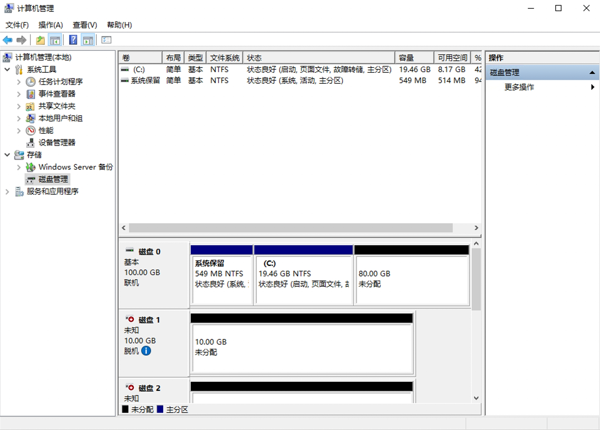
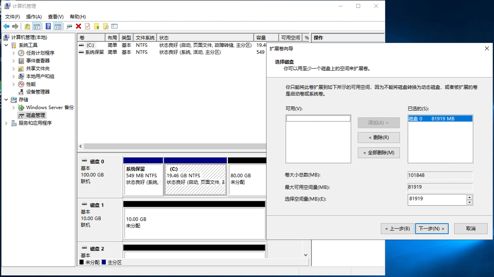
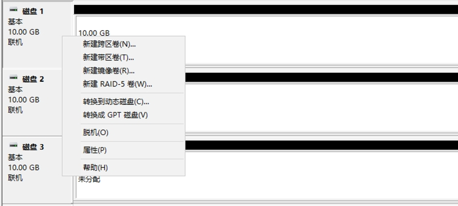
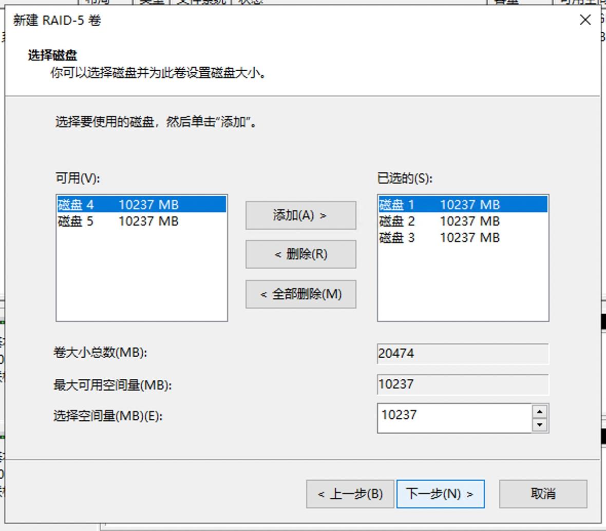
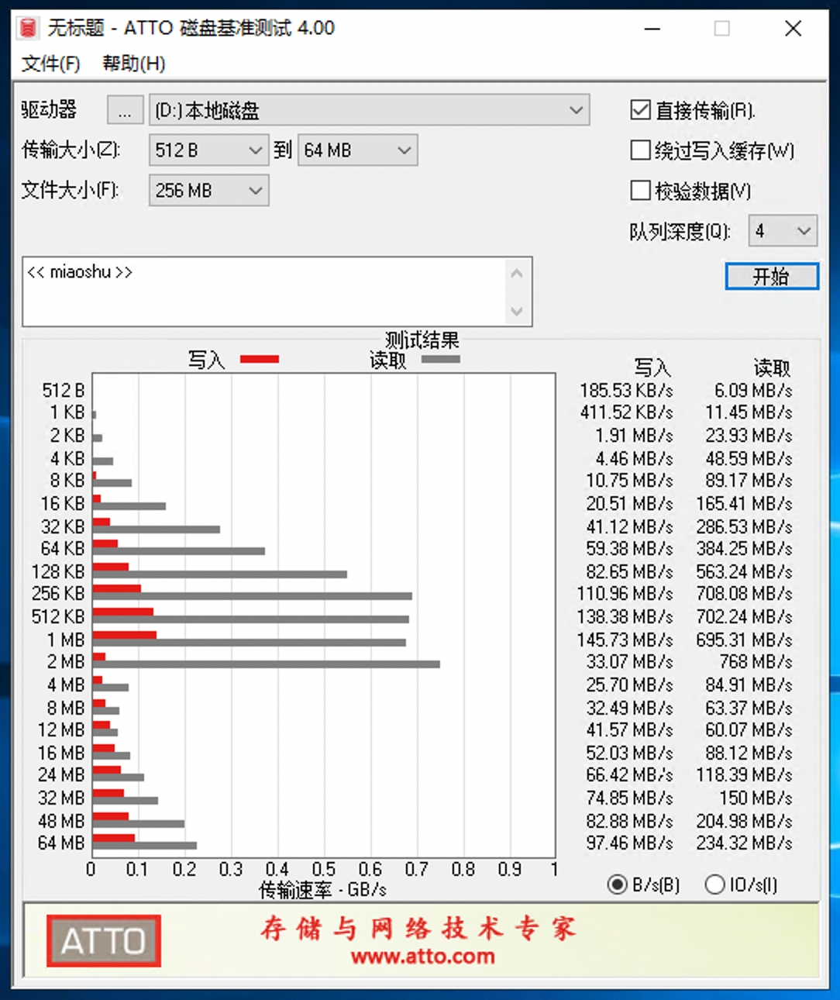
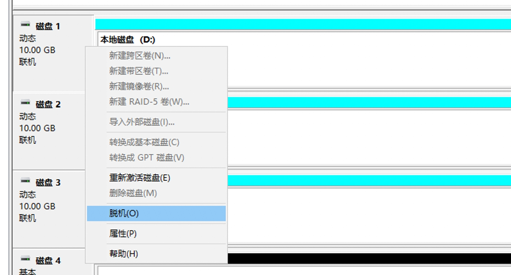
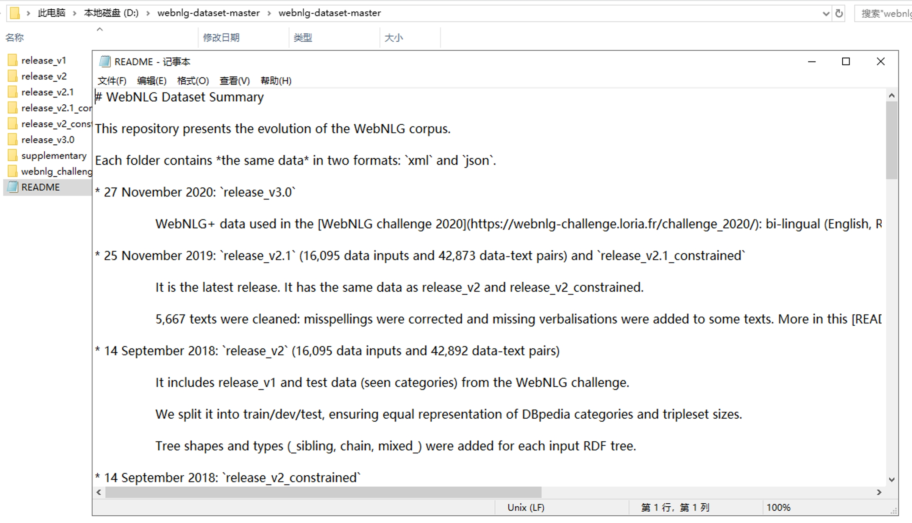

# Lab01 RAID阵列
本指导书是实验过程的一个示例，供不熟悉实验环境的同学参考，无需严格按照指导书中的步骤来进行实验 :)

## 实验内容
本实验通过软件 RAID 管理磁盘：

* 通过工具查看磁盘列表
* [仅Windows] C 盘扩展卷，检查其它磁盘是否联机，联机并初始化磁盘
* [仅Ubuntu] 使用LVM扩展根目录`/`的容量
* 创建RAID阵列，测试读写文件并模拟磁盘损坏，观察有什么情况发生，数据是否损坏或者丢失？
  * 尝试RAID 0
  * 尝试RAID 1
  * 尝试RAID 5
* [选做] 控制变量，测试RAID阵列的读写速率，并结合理论分析实验结果
* [选做] 自行设计与扩展，体会 RAID 0 1 5 10 等方案下，在遇到磁盘损坏故障、冗余备份的效果等
* [选做] 思考题：
  * 为什么及在什么条件下选择用 RAID
  * RAID & 分布式存储 & 集中存储的区别

其中，选做的题目不计入本实验的总得分，仅额外加分

实验报告模板分别是`lab01_win.md`和`lab01_ubuntu.md`，供参考使用，最后请将实验报告按 `lab01-学号-姓名.pdf` 的命名格式提交
## 实验准备
### Windows下连接Windows 10虚拟机
使用系统自带的“远程桌面连接”即可
### MacOS下连接Windows 10虚拟机
使用Microsoft Remote Desktop连接，云平台课程资源页提供该软件的下载
### Windows下连接Ubuntu虚拟机
一般来讲，Windows 10（及以上）自带的cmd.exe都自带ssh client，打开cmd后直接`ssh foo@x.x.x.x`即可登录

为了更好的使用体验，推荐下载使用 [Windows Terminal](https://aka.ms/terminal)

当然，你也可以使用 [termius](https://termius.com/) 或者其他工具（如 Xshell等）进行多个ssh连接的管理
### MacOS下连接Ubuntu虚拟机
使用系统自带的Terminal.app登录即可

为了更好的使用体验，推荐使用 [iterm2](https://iterm2.com/) 登录

当然，你也可以使用 [termius](https://termius.com/) 进行多个ssh连接的管理
### 校外连接Ubuntu虚拟机
在云平台的虚拟机列表中点击“连接”即可

### Ubuntu虚拟机联网
虚拟机已内置联网登录工具
```bash
buaalogin config
buaalogin login
```
### 重要提醒
请登录实验虚拟机后，及时更改虚拟机密码，以避免以下情况发生：

- 未意识到登录了他人的虚拟机， 帮助别人完成了实验工作
- 自己的虚拟机被别人登录，已经做完的实验被破坏

## Windows环境
点击桌面上的“计算机管理”，在左侧菜单栏打开“计算机管理-存储-磁盘管理”


右键点击C盘，选择“扩展卷”，即可把C盘所在磁盘上未分区的80GB空间合并至C盘内


右键点击未分配的磁盘，看到可以选择创建跨区卷、带区卷、镜像卷、RAID-5卷，它们分别对应不做条带化的RAID 0、条带化的RAID 0、RAID 1、RAID 5，这里以RAID 5为例


选择阵列中包括的磁盘，下一步选中“快速格式化”，最后确认转化为动态磁盘，即可创建阵列


点击桌面上的“ATTO 磁盘基准测试”，选择RAID 5阵列所在的盘符，测试读写速度


在RAID 5阵列上保存文件，将其中的一块磁盘脱机，模拟磁盘损坏，文件仍然可以正常查看




## Ubuntu环境
实验全程在root权限下进行
```bash
sudo -i
```
### 使用LVM为根目录扩容
查看虚拟机上的磁盘列表，其中有sdb~sdf共五块磁盘可以供本次实验使用，sda是系统所在的磁盘，容量为50GB
```bash
$ lsblk -d
sda     8:0    0   50G  0 disk 
sdb     8:16   0   10G  0 disk 
sdc     8:32   0   10G  0 disk 
sdd     8:48   0   10G  0 disk 
sde     8:64   0   10G  0 disk 
sdf     8:80   0   10G  0 disk
```
查看根目录`/`的容量，为15GB，说明sda磁盘上有空闲空间没有利用上
```bash
$ df -lh /
Filesystem                         Size  Used Avail Use% Mounted on
/dev/mapper/ubuntu--vg-ubuntu--lv   15G  4.9G  9.1G  35% /
```
使用`fdisk`命令给空闲的磁盘空间分区

在`Command (m for help):`后面输入`n`，一路回车，默认按磁盘最大容量分区

在`Command (m for help):`后面输入`t`，输入`4`选择新创建的分区，输入`31`选择Linux LVM分区类型

最后在`Command (m for help):`后面输入`w`保存
```bash
$ fdisk /dev/sda
Command (m for help): n
Partition number (4-128, default 4): 
First sector (33552384-104857566, default 33552384): 
Last sector, +/-sectors or +/-size{K,M,G,T,P} (33552384-104857566, default 104857566): 

Created a new partition 4 of type 'Linux filesystem' and of size 34 GiB.

Command (m for help): t
Partition number (1-4, default 4): 4
Partition type (type L to list all types): 31

Changed type of partition 'Linux filesystem' to 'Linux LVM'.

Command (m for help): w
The partition table has been altered.
Syncing disks.
```
创建物理卷（PV），命名格式一般为`磁盘名+分区号`
```bash
pvcreate /dev/sda4
```
查看卷组（VG）列表，Ubuntu在系统安装时已创建好了一个默认的卷组，如下所示
```bash
$ vgdisplay
  --- Volume group ---
  VG Name               ubuntu-vg
  ...
```
将刚创建的物理卷加入卷组
```bash
vgextend ubuntu-vg /dev/sda4
```
查看逻辑卷（LV）列表，Ubuntu系统安装在默认逻辑卷上
```bash
$ lvdisplay
  --- Logical volume ---
  LV Path                /dev/ubuntu-vg/ubuntu-lv
  ...
```
将逻辑卷扩容，然后为文件系统（ext4类型）扩容
```bash
lvextend -l +100%FREE /dev/ubuntu-vg/ubuntu-lv
resize2fs /dev/ubuntu-vg/ubuntu-lv
```
查看根目录容量，已扩容至49GB
```bash
$ df -lh /
Filesystem                         Size  Used Avail Use% Mounted on
/dev/mapper/ubuntu--vg-ubuntu--lv   49G  4.9G   42G  11% /
```
### RAID阵列搭建
安装mdadm工具
```bash
apt-get install mdadm
```
`mdadm`命令的常用参数及作用如下
|  参数  |  作用  |
|  :----:  | :----: |
|-a	|检测设备名称
|-n | 指定设备数量 |
|-l	|指定RAID级别|
|-C	|创建|
|-v	|显示过程|
|-f	|模拟设备损坏|
|-r	|移除设备|
|-Q	|查看摘要信息|
|-D	|查看详细信息|
|-S	|停止RAID磁盘阵列|

用命令创建 RAID 1，看到如下输出即为成功
```bash
$ mdadm -Cv /dev/md1 -a yes -n 2 -l 1 /dev/sd{b,c}
mdadm: chunk size defaults to 512K
mdadm: Defaulting to version 1.2 metadata
mdadm: array /dev/md1 started.
```
将创建好的RAID 1阵列格式化为ext4文件系统
```bash
mkfs.ext4 /dev/md1
```
查看RAID 1阵列的摘要信息，可以看到两块10GB的磁盘组成的RAID 1阵列容量约为10GB
```
$ mdadm -Q /dev/md1
/dev/md1: 9.99GiB raid1 2 devices, 0 spares. Use mdadm --detail for more detail.
```
将RAID 1阵列临时挂载到`/mnt/raid1`目录下，测试文件读写
```bash
mkdir -p /mnt/raid1/
mount /dev/md1 /mnt/raid1
echo 'Hello, world!' > /mnt/raid1/hello
cat /mnt/raid1/hello
```
测试写文件速率，由于`dd`命令在计算时单位换算有误，因此我们自己计算出实际值为$8 \times 300000 \div 1024 \div 9.462=247.70MB/s$
```bash
$ time dd if=/dev/zero of=/mnt/raid1/test.bdf bs=8k count=300000
300000+0 records in
300000+0 records out
2457600000 bytes (2.5 GB, 2.3 GiB) copied, 9.46088 s, 260 MB/s

real    0m9.462s
user    0m0.159s
sys     0m2.525s
```
测试读文件速率，实际值为$8 \times 1309568 \div 1024 \div 37.837=270.40MB/s$
```bash
$ time dd if=/dev/md1 of=/dev/null bs=8k
1309568+0 records in
1309568+0 records out
10727981056 bytes (11 GB, 10 GiB) copied, 37.836 s, 284 MB/s

real    0m37.837s
user    0m0.456s
sys     0m7.154s
```
模拟阵列中的一块磁盘损坏（注意：此方法仅适用于RAID 1、RAID 5、RAID 10，模拟RAID 0损坏的方法见下一节）
```bash
$ mdadm /dev/md1 -f /dev/sdb
mdadm: set /dev/sdb faulty in /dev/md1
```
再次读取文件，发现文件完好无损
```bash
$ cat /mnt/raid1/hello
Hello, world!
```
删除该阵列，释放磁盘空间
```bash
umount /mnt/raid1 
mdadm -S /dev/md1
mdadm --zero-superblock /dev/sd{b,c}
```
同理可创建RAID 0、RAID 5、RAID 10等阵列
```bash
mdadm -Cv /dev/md0 -a yes -n 2 -l 0 /dev/sd{b,c}
mdadm -Cv /dev/md5 -a yes -n 5 -l 5 /dev/sd{b,c,d,e,f}
mdadm -Cv /dev/md10 -a yes -n 4 -l 10 /dev/sd{b,c,d,e}
```
### 模拟RAID 0阵列中磁盘损坏
在创建阵列之前，需要先给待使用的磁盘分区，以`/dev/sdb`为例

在`Command (m for help):`后面输入`n`，一路回车，默认按磁盘最大容量分区

最后在`Command (m for help):`后面输入`w`保存
```bash
$ fdisk /dev/sdb
Command (m for help):
```
新分区名称默认为`/dev/sdb1`

同理，为`/dev/sdc`也创建一个分区`/dev/sdc1`

在这两个分区上创建RAID 0阵列
```bash
mdadm -Cv /dev/md0 -a yes -n 2 -l 0 /dev/sd{b1,c1}
```
再使用fdisk删除分区：`fdisk /dev/sdb`

在`Command (m for help):`后面输入`d`，然后在`Command (m for help):`后面输入`w`保存

更新分区表并重启
```bash
partprobe
reboot
```
重启后发现RAID 0阵列已损坏
```bash
$ mdadm -Q /dev/md0
mdadm: cannot open /dev/md0: No such file or directory
```
