# Lab02 虚拟化实验

## 实验目标

1. 实施计算虚拟化，安装配置环境，熟悉计算虚拟化的概念，理解基本操作，掌握基础知识。
2. 理解集中管理对于虚拟化的作用，通过部署集中vCenter体验集群的设置，分布式交换机的设置，了解主机从不同网络进行迁移的实际需求。

## 实验内容

1. 按照实验指南的指导，完成实验。
2. 按照实验报告模板，撰写实验报告，将重要的实验步骤截图，填入实验报告中，并回答相应问题。

本次实验以小组形式进行，虚拟机已分发至每组第一位同学的账户中，**每组一台**虚拟机，实验报告每个人都需要提交，同组的实验报告内容可以一致

请在云平台作业提交截止时间之前，将作业提交到云平台，命名为：`lab02-学号-姓名.pdf`的格式。

### Hypervisor

我们知道，一台计算机一般有以下的结构：

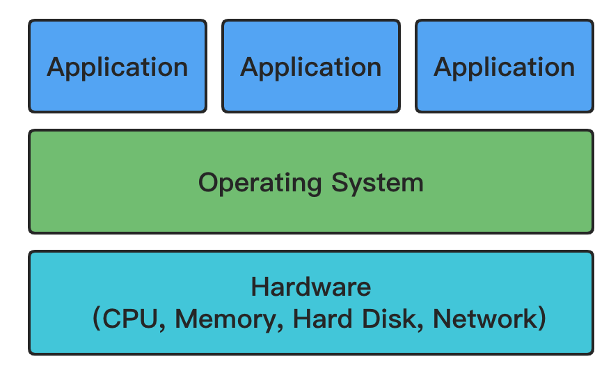

操作系统负责管理硬件资源（CPU，内存，硬盘等），并向上提供相应的系统调用，供具体的应用程序使用。

而我们平常提到的操作系统的虚拟化，本质上就是要模拟出一套硬件（包括虚拟CPU，虚拟内存，虚拟硬盘等），然后在这一套虚拟的硬件的基础上部署客户操作系统。客户操作系统完全不需要做任何修改，即可在这个“虚拟的机器”中顺利执行。但客户操作系统的运行结果（比如接收键盘输入，输出图像和声音等），最终都是要靠原始的“实实在在”的硬件（物理机）来完成的。也就是说，需要有那么一个结构，能够将这个“虚拟的机器”的行为翻译到物理机的行为（比如将虚拟CPU的指令翻译到物理机的CPU指令）。负责做这件事情的结构被称为Hypervisor，又称为虚拟机监控器（virtual machine monitor，缩写为 VMM）。

根据工作方式的不同，Hypervisor分为以下两种。


第一种是我们比较熟悉的情况，本质上就是在主操作系统（Host Operating System）上安装了一个虚拟化软件，它来负责充当虚拟机的管理者，并通过主操作系统的系统调用来完成对物理机硬件的使用。VMware Workstation、Virtual Box、Qemu等都属这类虚拟化软件。除了这个虚拟化软件之外，主操作系统上还会运行其他“正常”的应用程序，比如，你在用VMware Workstation的同时还能听歌聊天等。

第二种Hypervisor则直接舍弃了主操作系统（因为毕竟隔着一层，性能会有损失），而是直接把Hypervisor部署在硬件上。在这种情况下，物理机变成了更纯粹的“为虚拟化而生”的机器。Hypervisor能够直接与硬件沟通，其实在某种程度上也承担了主操作系统的角色（管理硬件），因此，我们也可以把这种Hypervisor看作是一种为虚拟化特制的操作系统。这其中典型的就是VMware ESXi。

因为我们不可能要求每位同学都制备一套硬件来安装学习VMware ESXi，所以需要首先使用VMware Workstation来模拟出一套硬件。但VMware Workstation仅仅起一个前置作用，在实际的实验中并不会涉及到。请大家首先理清这层关系。

## 实验指南

### 0. 安装VMware Workstation

使用分配的虚拟机的桌面上的安装包安装即可。

安装完成后需重启机器。

打开VMware Workstation时， 选择试用即可。

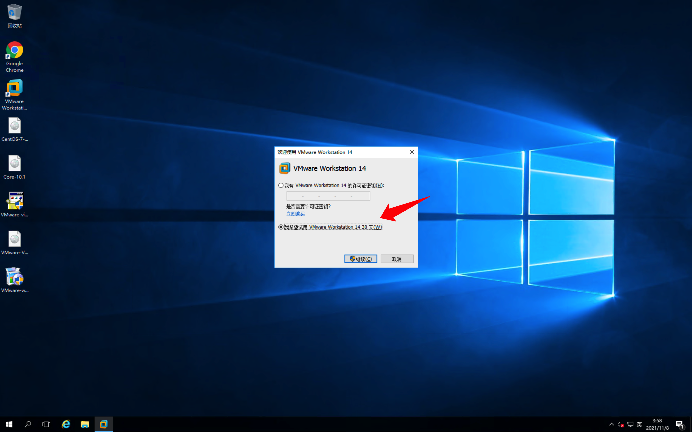

### 1. 安装VMware ESXi

使用桌面上的ESXi镜像`VMware-VMvisor-Installer-6.7.0.update03-19898906.x86_64-DellEMC_Customized-A18.iso`创建虚拟机。

注意选择客户操作系统的类型。


虚拟机创建完成后，直接打开电源即可启动ESXi操作系统的安装流程，这一过程可能需要等待较长时间。

安装流程中总是保持默认选项即可，其中设置的root密码应至少包含字母、数字和特殊符号，并且请务必牢记设置的root密码。

在此流程中，可能需要使用使用到某些快捷键，这些快捷键可能会首先被你本机的操作系统捕获，在本机的系统设置中暂时屏蔽该快捷键即可。


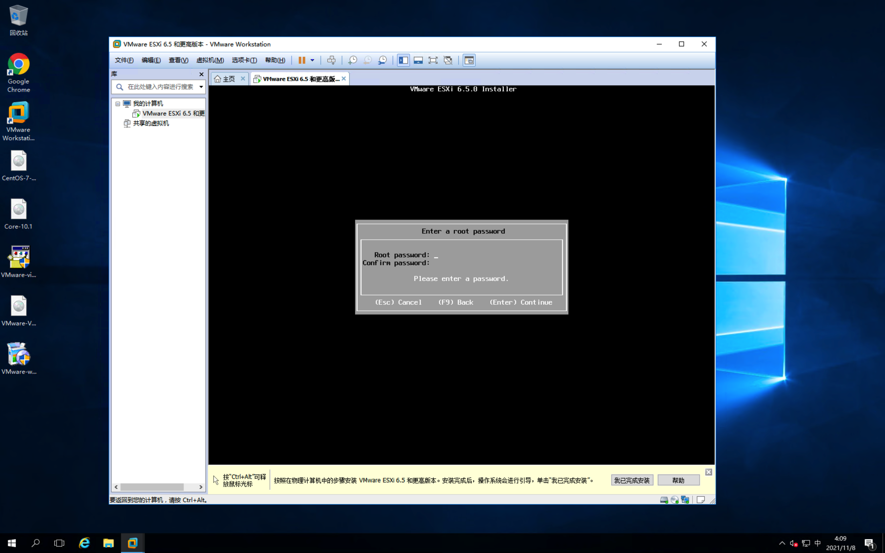

安装完成后，可以看到如下界面。

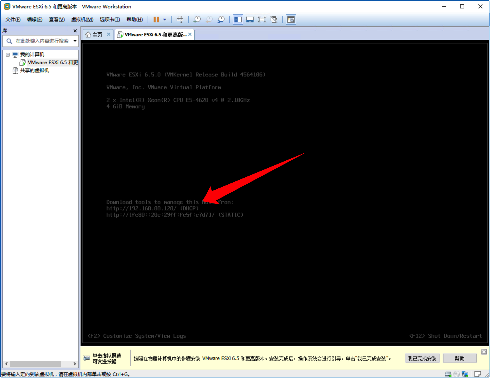

可以看到，ESXi系统获得了一个IPv4地址`192.168.80.128`，并且这个地址是通过`DHCP`的方式获得的。这里用到的DHCP服务器其实是VMware Workstation内置的。也就是说，`192.168.80.128`这个地址只有在安装VMware Workstation的机器上才是有效的。

### 2. 访问ESXi

可以直接使用浏览器访问ESXi。访问的地址就是ESXi的地址，用户名和密码与vSphere Client的相同。

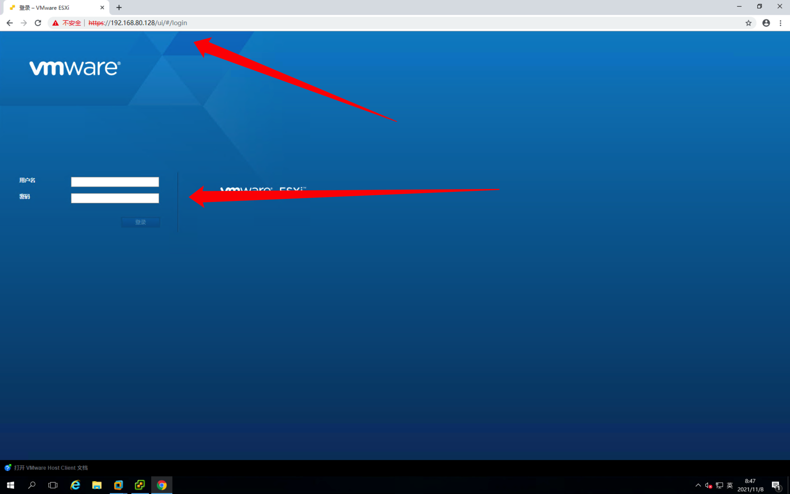

如下图所示，可以为ESXi分配许可证。

可用的KEY：

```
0A65P-00HD0-3Z5M1-M097M-22P7H
```

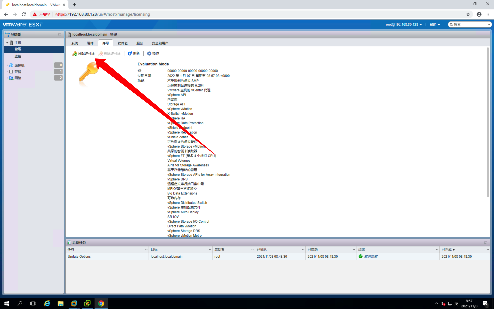

### 3. 观察和体验vSphere Client提供的功能

Client侧界面主要包含导航器、主体内容和任务事件这三部分。

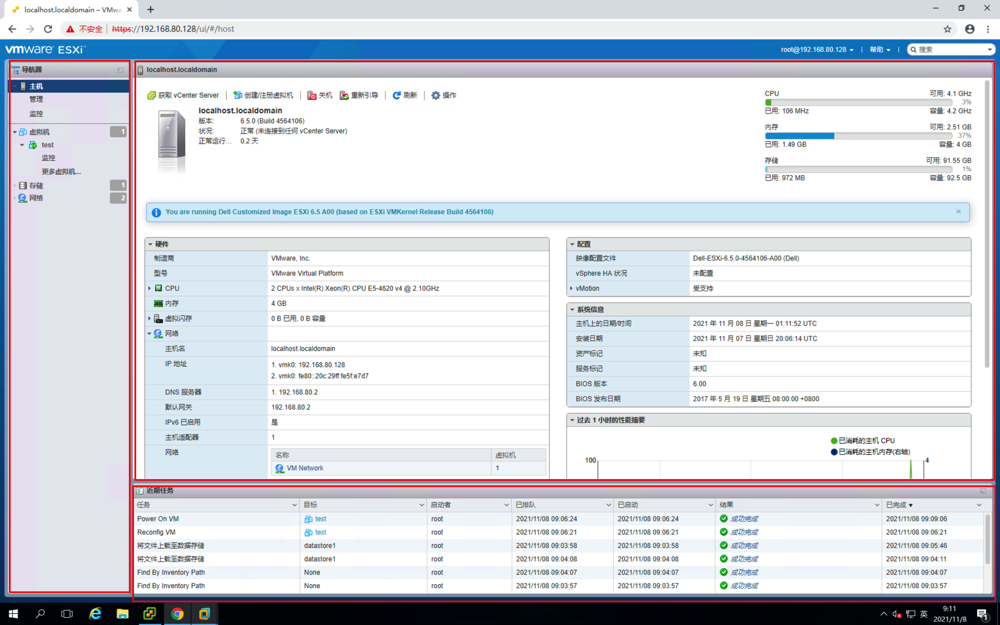

请浏览左侧导航栏的不同模块和不同模块下不同选项卡的内容，对ESXi提供的功能有个大致的了解。

其中，存储部分可以查看ESXi虚拟机可访问的数据内容。

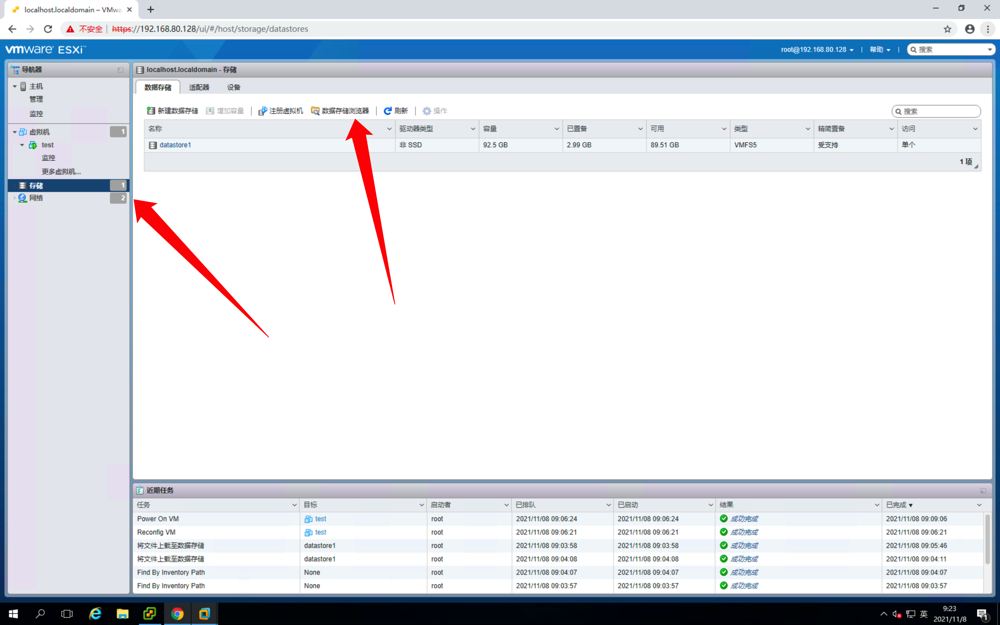

可以通过使用“数据存储浏览器”查看、下载、上传、下载“存储”中的文件。

### 4. 新建和安装虚拟机

ESXi最主要的功能就是对虚拟机的管理。

vSphere Client和Web端都有显著的入口供用户创建虚拟机。

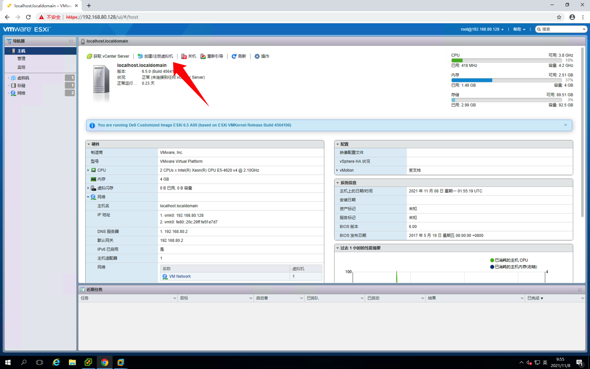

创建虚拟机的流程与使用VMware Workstation创建虚拟机没有太大区别，按照创建向导进行即可。

在创建过程的“自定义设置”阶段，需要手动配置CD/DVD驱动器，插入桌面上的CentOS或Tiny Core Linux的安装镜像，以使虚拟机在开机时，能自动进入安装镜像的安装引导界面。

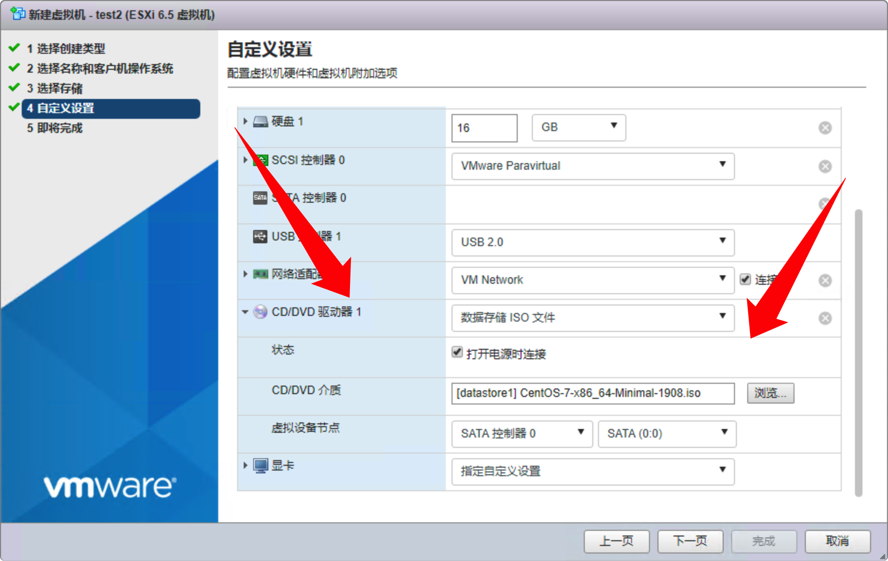

当然，你也可以在虚拟机创建完成后，打开电源之前，手动编辑虚拟机配置，添加对应的镜像文件。

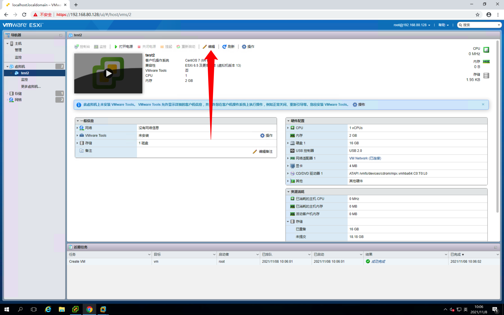

完成后，打开虚拟机电源，即可进入操作系统的安装引导流程。

### 5. 虚拟机文件系统格式和种类

添加虚拟机后，可以在“存储”中看到每台虚拟机中包含的文件内容。

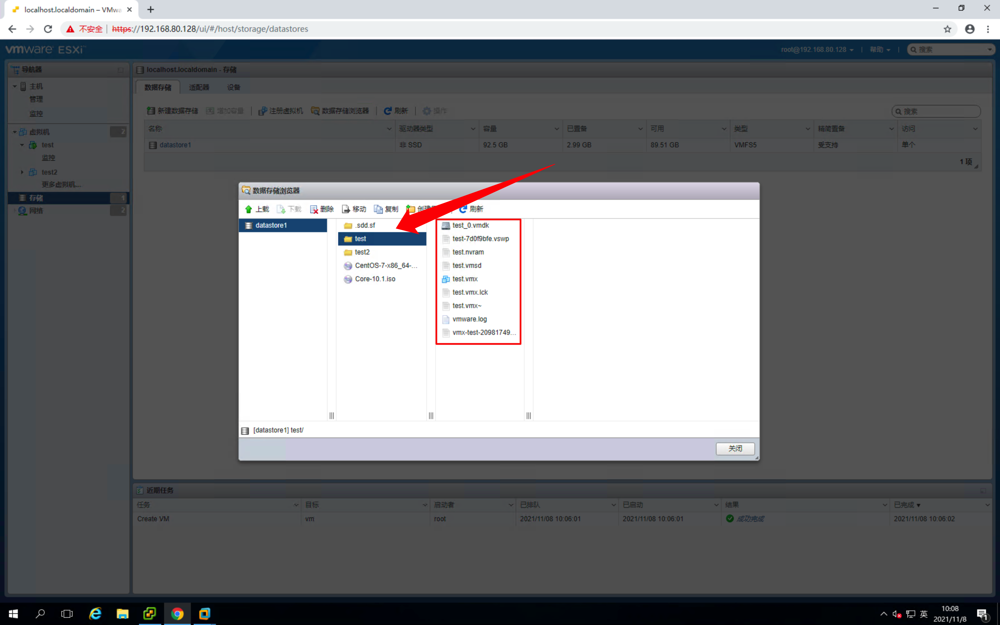

了解这些不同格式的文件和含义和作用。

### 6. 虚拟机导出

关闭虚拟机电源后，即可将虚拟机导出。

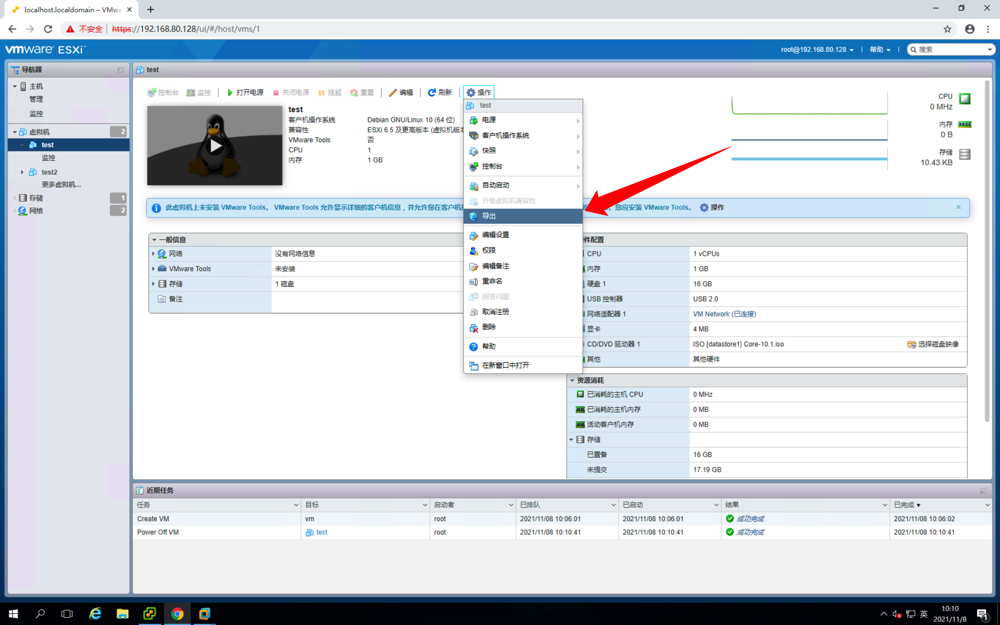

观察导出文件格式与虚拟机正常文件的区别。

### 7. VMware Tools（选做）

可以在如下图所示的虚拟机控制台的“操作”选项中找到“安装VMware Tools”的选项。

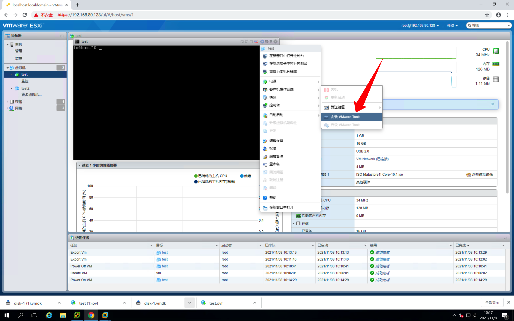

点击“安装VMware Tools”后，ESXi会给虚拟机挂载一个包含了安装脚本的光盘。根据安装的操作系统的不同，具体的安装方式也有区别。对于Linux系统，可以在`/dev`目录下找到该光盘，并将其挂载到文件系统中，然后进入其中，执行安装脚本。

### 8. 角色和用户（选做）

可以在Web端创建不同的角色和用户，根据角色的不同，用户将获得不同的权限。尝试使用不同的用户账号登录Client，以体验权限限制带来的差异。


### 9. 创建与配置集群（选做）

后面这两部分实验内容比较复杂，有兴趣的同学可以选择尝试。

在上面的实验中，我们进行了ESXi的部署，并使用ESXi创建了一些虚拟机。在实际应用中，往往需要多个ESXi主机组成集群，来提供更多的资源，或者提高可用性。在接下来的实验中，我们将使用vCenter Server管理多个ESXi主机，来管理所有的虚拟机和ESXi“物理机”集群。

1. 在VMware Workstation中新建一个新的ESXi虚拟机。该虚拟机内存可以给大一些，比如14G，磁盘大小也可以大一些，比如100G。以方便后续在其上安装vCenter Server。

    可以在VMware Workstation中给机器开大内存和大容量磁盘。

    因为内存和磁盘是虚拟的，所以即使本机物理内存和磁盘容量不够，也把握得住。

    如果后续实验中，确实出现了内存或磁盘容量不够的情况，请联系助教扩容。

2. 点击打开vCenter Server安装包`VMware-VCSA-all-6.7.0-19832974.iso`，可以看到README文件，其中包含着具体的安装指引。**之后的安装步骤，如无特殊说明，无需改动默认选项，直接下一步即可。**
    

3. 我们刚刚启动的只是一个安装器程序，vCenter Server本质上还是要安装在一个特定的ESXi主机中。所以，在选择安装目标时，需要填入刚才新建的那个内存和磁盘容量都比较大的ESXi虚拟机的相关信息。
    

4. 在最后的网络配置这里，选择`DHCP`
    

5. 安装完成后，浏览器访问虚拟机地址或者使用vSphere Client均可访问到vCenter。
   

6. 创建数据中心。

7. 添加主机。把本次实验创建的两个ESXi主机都添加进去。在添加主机时会弹出安全警示，选择“是”继续添加即可。输入主机的用户名和密码，一路默认即可（一定要禁用锁定模式）。
    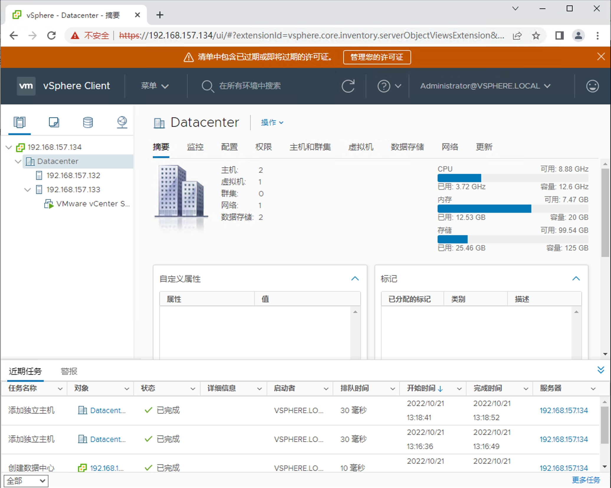


### 10. 分布式交换机（选做）

在两台ESXi主机上分别启动一台Tiny Core Linux虚拟机，使用`ifconfig`命令查看这两台虚拟机的IP地址，使用`ping`命令测试两台机器之间的网络是否连通。

默认情况下，vCenter会在两台主机上创建虚拟交换机，以保证虚拟机之间的网络通信。


如果你的集群出现网络不通的情况，可以查找相关资料，在配置好的集群上，创建分布式虚拟交换机。并分别在不同的主机上部署虚拟机，实现它们之间的网络互通。


## 实验报告模板

```markdown
# Lab02 虚拟化实验

> 班级：
> 学号：
> 姓名：

---

## 实验内容

### 1. 安装VMware ESXi


### 2. 访问ESXi


#### ESXi分配许可证


### 3. 观察和体验vSphere Client提供的功能


### 4. 新建和安装虚拟机


### 5. 虚拟机文件系统格式和种类


#### 不同格式的文件和含义和作用


### 6. 虚拟机导出


#### 导出文件格式与虚拟机正常文件的区别


### 7. VMware Tools（选做）


### 8. 角色和用户（选做）


### 9. 创建与配置集群（选做）


### 10. 分布式虚拟交换机（选做）


```
