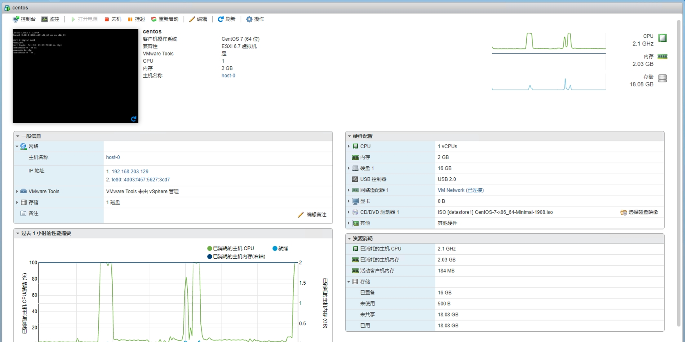

# Lab02 虚拟化实验

## 实验目标

1. 实施计算虚拟化，安装配置环境，熟悉计算虚拟化的概念，理解基本操作，掌握基础知识。
2. 理解集中管理对于虚拟化的作用，通过部署集中 vCenter 体验集群的设置，分布式交换机的设置，了解主机从不同网络进行迁移的实际需求。

## 实验内容

1. 参考实验指导书完成实验。
2. 按照实验报告模板，撰写实验报告，填入截图，回答相应问题。

本次实验以小组形式进行，虚拟机已分发至每组第一位同学的账户中，**每组一台**虚拟机，实验报告由每组一位同学提交即可。

请在云平台作业提交截止时间之前，将作业提交到云平台，命名为：`lab02-组号.pdf`的格式。

供参考的分工方式：
* 组员 A 负责搭建 2 台 ESXi 主机，完成**思考题1、2**
* 组员 B 负责新建 CentOS，完成**任务1**和**思考题3、4**
* 组员 C 负责安装 vCenter，完成**任务2**

### 知识回顾

我们知道，一台计算机一般有以下的结构：


操作系统负责管理硬件资源（CPU，内存，硬盘等），并向上提供相应的系统调用，供具体的应用程序使用。

而我们平常提到的操作系统的虚拟化，本质上就是要模拟出一套硬件（包括虚拟 CPU，虚拟内存，虚拟硬盘等），然后在这一套虚拟的硬件的基础上部署客户操作系统。客户操作系统完全不需要做任何修改，即可在这个“虚拟的机器”中顺利执行。但客户操作系统的运行结果（比如接收键盘输入，输出图像和声音等），最终都是要靠原始的“实实在在”的硬件（物理机）来完成的。

也就是说，需要有那么一个结构，能够将这个“虚拟的机器”的行为翻译到物理机的行为（比如将虚拟 CPU 的指令翻译到物理机的 CPU 指令）。负责做这件事情的结构被称为 Hypervisor，又称为虚拟机监控器（virtual machine monitor，缩写为 VMM）。

根据工作方式的不同，Hypervisor分为以下两种。


第一种是我们比较熟悉的情况，本质上就是在主操作系统（Host Operating System）上安装了一个虚拟化软件，它来负责充当虚拟机的管理者，并通过主操作系统的系统调用来完成对物理机硬件的使用。VMware Workstation、Virtual Box、Qemu 等都属这类虚拟化软件。除了这个虚拟化软件之外，主操作系统上还会运行其他“正常”的应用程序，比如，你在用 VMware Workstation 的同时还能听歌聊天等。

第二种 Hypervisor 则直接舍弃了主操作系统（因为毕竟隔着一层，性能会有损失），而是直接把 Hypervisor 部署在硬件上。在这种情况下，物理机变成了更纯粹的“为虚拟化而生”的机器。 Hypervisor 能够直接与硬件沟通，其实在某种程度上也承担了主操作系统的角色（管理硬件），因此，我们也可以把这种 Hypervisor 看作是一种为虚拟化特制的操作系统。这其中典型的就是 VMware ESXi。

因为我们不可能要求每位同学都制备一套硬件来安装学习 VMware ESXi，所以需要首先使用 VMware Workstation 来模拟出一套硬件。但 VMware Workstation 仅仅起一个前置作用，在实际的实验中并不会涉及到。请大家首先理清这层关系。

## 实验指南

### 0. 安装 VMware Workstation

使用分配的虚拟机的桌面上的安装包安装即可。

安装完成后需重启机器。

打开VMware Workstation时， 选择试用即可。


### 1. 安装 VMware ESXi

使用桌面上的 ESXi 镜像 `VMware-VMvisor-Installer-6.7.0.update03-19898906.x86_64-DellEMC_Customized-A18.iso` 创建虚拟机，创建过程中基本保持默认配置即可。

注意选择客户操作系统的类型。


虚拟机创建完成后，直接打开电源即可启动 ESXi 操作系统的安装流程，这一过程可能需要等待较长时间。

安装流程中总是保持默认选项即可，其中设置的 root 密码应至少包含字母、数字和特殊符号，并且请务必牢记设置的 root 密码。

在此流程中，可能需要使用使用到某些快捷键，这些快捷键可能会首先被你本机的操作系统捕获，在本机的系统设置中暂时屏蔽该快捷键即可。


安装完成后，可以看到如下界面。


可以看到，ESXi 系统获得了一个 IPv4 地址 `192.168.80.128`，并且这个地址是通过 `DHCP` 的方式获得的。这里用到的 DHCP 服务器其实是 VMware Workstation 内置的。也就是说，`192.168.80.128` 这个地址只可以在你的实验环境内访问，桌面上已经给大家准备了 Chrome 浏览器。

### 2. 访问 ESXi

直接使用浏览器访问 ESXi。访问的地址就是 ESXi 的地址，用户名和密码与上一步设置的相同。


在继续之前，先为 ESXi 分配一个许可证。

可用的KEY：

```
0A65P-00HD0-3Z5M1-M097M-22P7H
```


### 3. 观察和体验 vSphere Client 提供的功能

Client 侧界面主要包含导航器、主体内容和任务事件这三部分。


请浏览左侧导航栏的不同模块和不同模块下不同选项卡的内容，对 ESXi 提供的功能有个大致的了解。

其中，存储部分可以查看 ESXi 虚拟机可访问的数据内容。可以通过使用“数据存储浏览器”来查看、下载、上传、下载“存储”中的文件。


**思考题1：你需要通过 SSH 连接到这台 ESXi 主机的终端来进行运维，在哪里开启这个功能？（截图作答）**

### 4. 新建和安装虚拟机

ESXi 最主要的功能就是对虚拟机的管理。可以看到显著的入口供用户创建虚拟机。


创建虚拟机的流程与使用 VMware Workstation 创建虚拟机没有太大区别，按照创建向导进行即可。

在创建过程的“自定义设置”阶段，需要手动配置 CD/DVD 驱动器，插入桌面上的 CentOS-7 安装镜像，以使虚拟机在开机时，能自动进入安装镜像的安装引导界面。


当然，你也可以在虚拟机创建完成后，打开电源之前，手动编辑虚拟机配置，添加对应的镜像文件。


完成后，打开虚拟机电源，即可进入操作系统的安装引导流程。

**任务1：CentOS 安装完成后，修改主机名为 `host-<组号>`，打开控制台并将浏览器截图**

通过下列命令修改主机名（把组号替换成自己的），重启后生效
```bash
hostnamectl set-hostname host-<组号>
```

### 5. 虚拟机文件系统格式和种类

添加虚拟机后，可以在“存储”中看到每台虚拟机中包含的文件内容。了解这些不同格式的文件和含义和作用。


### 6. 虚拟机导出

关闭虚拟机电源后，即可将虚拟机导出。观察导出文件格式与虚拟机正常文件的区别。


**思考题2：vmx, vmdk, vswp 文件的作用分别是什么？**

### 7. VMware Tools

先通过浏览器访问 [gw.buaa.edu.cn](gw.buaa.edu.cn) 使你的实验环境联网，然后在 CentOS 上通过 `yum` 安装开源的 VMware Tools
```bash
yum install -y open-vm-tools
```

安装后重启 CentOS，可以看到面板上读取到了它的更多信息（安装之前只能看到 CPU 使用率）



**思考题3：ESXi 如何获取到该虚拟机的 CPU 使用率？**

**思考题4：ESXi 如何获取到该虚拟机的 IP 地址？**

### 8. 创建与配置集群

在上面的实验中，我们进行了 ESXi 的部署，并使用 ESXi 创建了虚拟机。在实际应用中，往往需要多个 ESXi 主机组成集群，来提供更多的资源，或者提高可用性。在接下来的实验中，我们将使用 vCenter Server 管理多个 ESXi 主机，来管理所有的虚拟机和 ESXi “物理机”集群。

1. 与前面的步骤一致，在 VMware Workstation 中新建一个新的 ESXi 虚拟机。该虚拟机内存可以给大一些，比如 14G，磁盘大小也可以大一些，比如 100G。以方便后续在其上安装 vCenter Server。

2. 点击打开 vCenter Server 安装包 `VMware-VCSA-all-6.7.0-19832974.iso`，打开 `vcsa-ui-installer\win32\install` 进行安装。也可以打开 `readme-zh-CN.txt` 查看具体的安装指引，**之后的安装步骤，如无特殊说明，无需改动默认选项，直接下一步即可。**
    

3. 我们刚刚启动的是一个安装器程序，将 vCenter Server 安装在一个特定的 ESXi 主机中。所以，在选择安装目标时，需要填入刚才新建的那个内存和磁盘容量都比较大的 ESXi 虚拟机的相关信息。
    

4. 设置磁盘时，需要勾选上 Enable Thin Disk Mode
   
   
5. 在最后的网络配置这里，需要手动选择 `DHCP`
    

6. 设置登录时的用户名和密码
   

7. 安装完成后，在浏览器上通过 vCenter 虚拟机地址来访问（用户名一般为 `administrator@vsphere.local`）。
   

8. 新建数据中心。

9.  添加主机。把本次实验创建的两个 ESXi 主机都添加进去。在添加主机时会弹出安全警示，选择“是”继续添加即可。输入主机的用户名和密码，一路默认即可（**一定要禁用锁定模式**）。
    

**任务2：将你的 vSphere Client 界面截图**

## 实验报告模板

```markdown
# Lab02 虚拟化实验

> 组号：
| | 学号 | 姓名 |
|------|------|------|
|  1  |  |  |
|  2  |  |  |
|  3  |  |  |

---

## 实验内容
**思考题1：你需要通过 SSH 连接到这台 ESXi 主机的终端来进行运维，在哪里开启这个功能？（截图作答）**

**任务1：CentOS 安装完成后，修改主机名为 `host-<组号>`，打开控制台并将浏览器截图**

**思考题2：vmx, vmdk, vswp 文件的作用分别是什么？**

**思考题3：ESXi 如何获取到该虚拟机的 CPU 使用率？**

**思考题4：ESXi 如何获取到该虚拟机的 IP 地址？**

**任务2：将你的 vSphere Client 界面截图**

```
